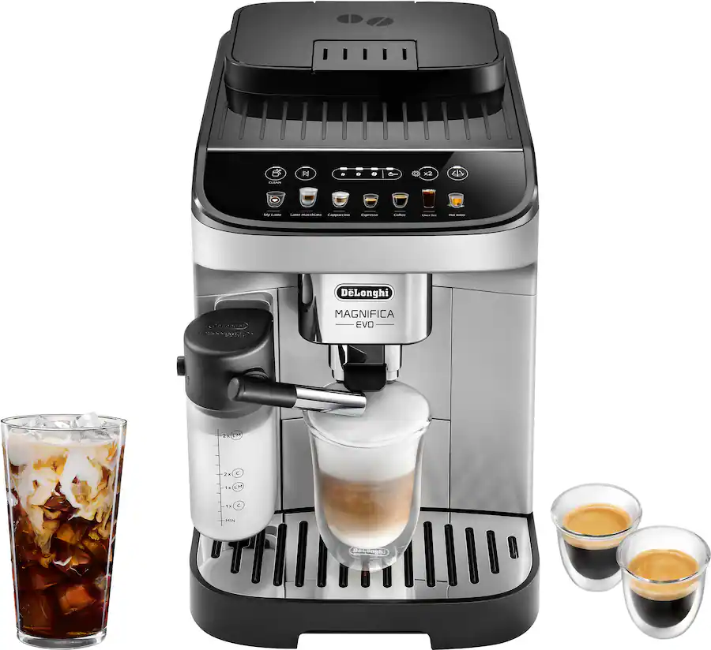

# Virtual Machine and Cloud Service Usage at Echolab

If you have to run an interactive website for user studies, you can use virtual machines (VMs) provided by the tech staff in CS\@VT. The current practice for obtaining virtual machines (VMs) involves a direct request process that is managed internally, specifically by the professor. Students cannot make the request.

Additionally, it is noted that some other labs utilize third-party services such as AWS for their computational needs. Although we have not used such an option given that none of our website was needed for a large-scale deployment.

 

# Coffee machine

