# **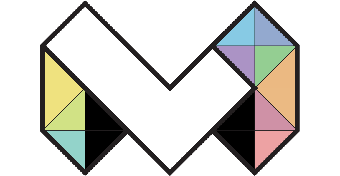**

# **Makeability Lab Handbook**

By [Professor Jon Froehlich](https://jonfroehlich.github.io/) and lab members\
Allen School of Computer Science and Engineering\
University of Washington

Welcome to the [Makeability Lab](https://makeabilitylab.cs.washington.edu/)! 👋 We are so happy that you’re here. Let’s do great things together!

This handbook is intended to establish lab principles, values, and expectations. When you join our group (woohoo!), you are expected to read it. If you’re just considering the Makeability Lab, awesome! This document should help you understand *who* we are and *whether* our lab is a good match for your personality and interests.

The handbook is a working document. We value your comments, suggested edits, and constructive criticisms. As with the lab itself, this handbook is ours—we get to define who we are and what we want to be. This is both a collective opportunity and a collective responsibility. Being part of a lab, pursuing a PhD, and having a healthy advisor-advisee relationship requires significant work and investment.

If something is unclear, it’s likely confusing to others too—so, please ask questions and/or suggest edits so we can collectively improve the handbook.

This handbook is a start and not an end—and hopefully will provoke self-reflection and opportunities for dialogue between us. Please also see our list of [Resources](#mental-health), the [Allen School Graduate Student Handbook](https://www.cs.washington.edu/academics/phd/handbook), and the [PhD Process webpage](https://www.cs.washington.edu/academics/phd/process).

Let’s do it!

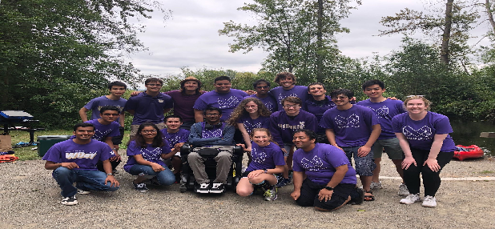\
Figure. A picture from our 2019 Makeability Lab retreat with high school, undergrad, and grad Makeability Lab members and collaborators where we kayaked, played ultimate frisbee and party games, and ate potluck.

## **Makeability Lab links**

You can find out more about our lab and research on our [lab website](https://makeabilitylab.cs.washington.edu/%20) and [Twitter](https://twitter.com/makeabilitylab).

## **Acknowledgements**

This lab handbook was inspired and informed by:

* PhD syllabi and student advising documents from other HCI professors, including [Eric Gilbert](https://docs.google.com/document/d/11D3kHElzS2HQxTwPqcaTnU5HCJ8WGE5brTXI4KLf4dM/edit), [Mor Naaman](https://stechlab.github.io/phd-syllabus/), [Tiego Guerreiro](https://docs.google.com/document/d/1aDw6lPcFfu1IUTPwS5Nv_vBPUv0JLH0AHETaloUc-AE/edit), [Sarita Yardi Schoenebeck](https://yardi.people.si.umich.edu/advising.html)

* The article *[How to Write a Lab Handbook](https://thebiologist.rsb.org.uk/biologist-features/how-to-write-a-lab-handbook)* by Samuel Mehr and his curated collection of lab handbooks on [GitHub](https://github.com/samuelmehr/labhandbooks)

Thank you to Leah Findlater, Steven Goodman, Emma McDonnell and lab alumni Matt Mauriello, Seokbin Kang, and Majeed Kazemitibaar for their feedback and comments.

**** The Makeability Logo was designed by Makeability Lab member and maker extraordinaire [Liang He](http://www.lianghe.me/).

## **License**

This handbook is licensed under [CC BY-NC 4.0](https://creativecommons.org/licenses/by-nc/4.0/)  similar to those by [Aly Lab](https://github.com/alylab/labmanual), [Gilbert Syllabus](https://docs.google.com/document/d/11D3kHElzS2HQxTwPqcaTnU5HCJ8WGE5brTXI4KLf4dM/edit), *etc.*

# **Table of Contents**

**[Makeability Lab Handbook	1](#makeability-lab-handbook)**

[Makeability Lab links	2](#makeability-lab-links)

[Acknowledgements	2](#acknowledgements)

[License	2](#license)

**[Table of Contents	2](#table-of-contents)**

**[HCI at UW	7](#hci-at-uw)**

[DUB and DUB Seminar	7](#dub-and-dub-seminar)

[HCI PhD Programs at UW	8](#hci-phd-programs-at-uw)

[HCI-Related Masters Programs at UW	8](#hci-related-masters-programs-at-uw)

[Industry Partnerships	9](#industry-partnerships)

[Temporary advising	9](#temporary-advising)

[Choosing a research group/advisor	9](#choosing-a-research-group/advisor)

**[The Makeability Lab Mission and Core Values	10](#the-makeability-lab-mission-and-core-values)**

[Research Mission	10](#research-mission)

[Our Disciplinary Home	11](#our-disciplinary-home)

[Core Values	11](#core-values)

**[My Expectations for Makeability Lab PhD Students	14](#my-expectations-for-makeability-lab-phd-students)**

**[Prospective Makeability Lab PhD Students	15](#prospective-makeability-lab-phd-students)**

**[Meetings	16](#meetings)**

[Project Meetings	17](#project-meetings)

[1:1 Meetings	18](#1:1-meetings)

**[What do I (Jon) do?	19](#what-do-i-\(jon\)-do?)**

[Research	19](#research)

[Teaching	19](#teaching)

[My Teaching Load	20](#my-teaching-load)

[Service	20](#service)

**[What do you do?	20](#what-do-you-do?)**

[Timeline	20](#timeline)

[General Exam	21](#general-exam)

[Research	22](#research-1)

[Picking a topic	22](#picking-a-topic)

[Ideation Strategies	23](#ideation-strategies)

[Short research pitch sheets	24](#short-research-pitch-sheets)

[Research contributions	26](#research-contributions)

[Research Methods	30](#research-methods)

[Analyzing Data	32](#analyzing-data)

[User Study Recruitment	33](#user-study-recruitment)

[Undergraduate Research and Mentorship	33](#undergraduate-research-and-mentorship)

[Applying for the Allen School BS/MS Program in the Allen School	34](#applying-for-the-allen-school-bs/ms-program-in-the-allen-school)

[Coursework	34](#coursework)

[Seminars	35](#seminars)

[Research Credit Classes	36](#research-credit-classes)

[Building Online Visibility	36](#building-online-visibility)

[Attending Workshops and Conferences	37](#attending-workshops-and-conferences)

[Travel Grants	37](#travel-grants)

[Internships	38](#internships)

[When should you intern?	38](#when-should-you-intern?)

[Obtaining an internship	39](#obtaining-an-internship)

[External Academic Rotations	39](#external-academic-rotations)

[Service	39](#service-1)

**[Your Job Search	40](#your-job-search)**

[Your Job Packet	40](#your-job-packet)

[Example Tenure-Track Job Packets	40](#example-tenure-track-job-packets)

[Academic Job Talks	41](#academic-job-talks)

[Example Job Talks	41](#example-job-talks)

[My Job Talks	42](#my-job-talks)

**[Makeability Lab Resources	42](#makeability-lab-resources)**

[Communication	42](#communication)

[Lab Space	43](#lab-space)

[Lab Access	43](#lab-access)

[HCI/UbiComp Lab Spaces	44](#hci/ubicomp-lab-spaces)

[The Ubicomp Lab (CSE 605)	44](#the-ubicomp-lab-\(cse-605\))

[Figure. Pictures of the Ubicomp Lab workspace (CSE605) and neighboring fabrication space (CSE615). You can access CSE615 via CSE605.	44](#a-collage-of-photos-of-cse-605-and-cse-615.-this-image-contains-two-rows-of-photos.-the-upper-row-shows-four-pictures-of-the-room-cse-605-where-graduate-students-sit.-the-second-row-shows-five-photos-of-the-workshop-room-\(cse-615\),-including-equipment-such-as-3d-printers-and-laser-cutters-and-workbenches.-figure.-pictures-of-the-ubicomp-lab-workspace-\(cse605\)-and-neighboring-fabrication-space-\(cse615\).-you-can-access-cse615-via-cse605.)

[The FabLab (CSE2 G15)	44](#the-fablab-\(cse2-g15\))

[Allen Center HCI Lab (CSE 591)	46](#allen-center-hci-lab-\(cse-591\))

[Gates Center HCI Lab (CSE2 283)	46](#gates-center-hci-lab-\(cse2-283\))

[Equipment and Software	47](#equipment-and-software)

[Software	47](#software)

[Laptops	48](#laptops)

[Other Hardware	48](#other-hardware)

[File Server	48](#file-server)

[Hyak	49](#hyak)

[Laptops for UGrads	49](#laptops-for-ugrads)

[Lab Website	49](#lab-website)

**[Lab Photos	49](#lab-photos)**

[Lab GitHub	49](#lab-github)

[Lab Logos	50](#lab-logos)

[Lab IRB Applications	50](#lab-irb-applications)

[Accessing CSE Linux Servers	50](#accessing-cse-linux-servers)

[Mac/Linux	50](#mac/linux)

[Windows	51](#windows)

**[Funding	51](#funding)**

[Fundraising	52](#fundraising)

[Funding Types	53](#funding-types)

[Annual Reports	53](#annual-reports)

[No Cost Extensions	54](#no-cost-extensions)

[PhD Student Costs	54](#phd-student-costs)

[Summer Funding	57](#summer-funding)

[Fellowships	57](#fellowships)

[Industry Fellowship Statements	58](#industry-fellowship-statements)

[Resources	58](#resources)

[The NSF GRFP	58](#the-nsf-grfp)

[RAships	59](#raships)

[TAships	60](#taships)

[Selecting a TAship	60](#selecting-a-taship)

[TA for me!	60](#ta-for-me!)

[Other popular courses to TA for HCI PhD students	61](#other-popular-courses-to-ta-for-hci-phd-students)

[Funding personnel	61](#funding-personnel)

[Purchases and Reimbursements	62](#purchases-and-reimbursements)

**[Assessing and reviewing each other	62](#assessing-and-reviewing-each-other)**

[Allen School Review of Progress	63](#allen-school-review-of-progress)

[The Student Form	63](#the-student-form)

[The Faculty Form	64](#the-faculty-form)

[Annual review letter to me	64](#annual-review-letter-to-me)

**[Letters of Recommendation	65](#letters-of-recommendation)**

[Requesting a letter of recommendation from me	66](#requesting-a-letter-of-recommendation-from-me)

[PhD students mentoring ugrads and LoRs	68](#phd-students-mentoring-ugrads-and-lors)

[Ugrad research classes: CSE498 and CSE499	68](#ugrad-research-classes:-cse498-and-cse499)

**[Writing papers	69](#writing-papers)**

[Where do we publish?	70](#where-do-we-publish?)

[How to write HCI research papers	71](#how-to-write-hci-research-papers)

[Jon’s quick writing tips	71](#jon’s-quick-writing-tips)

[Makeability Lab Writing Style Guide	72](#makeability-lab-writing-style-guide)

[Writing Introductions	72](#writing-introductions)

[Writing Discussions	74](#writing-discussions)

[Resources on paper writing	75](#resources-on-paper-writing)

[TODO: need more on writing process.	75](#todo:-need-more-on-writing-process.)

[Authorship order and inclusion criteria	75](#authorship-order-and-inclusion-criteria)

[Determining authorship	76](#determining-authorship)

[Writing rebuttals	76](#writing-rebuttals)

**[Preparing and giving talks	77](#preparing-and-giving-talks)**

[Conference Talk Tips/Tricks	78](#conference-talk-tips/tricks)

[Resources	78](#resources-1)

**[Writing Reviews	79](#writing-reviews)**

[Example Reviews	79](#example-reviews)

[Resources	80](#resources-2)

**[Making research videos	80](#making-research-videos)**

[Uploading and sharing videos	81](#uploading-and-sharing-videos)

[Intro sequence	81](#intro-sequence)

[Adding captions	81](#adding-captions)

**[Preparing and presenting posters	82](#preparing-and-presenting-posters)**

[Good and Bad Poster Designs	83](#good-and-bad-poster-designs)

[What tools to use?	84](#what-tools-to-use?)

[Where to print a poster?	84](#where-to-print-a-poster?)

[Resources	84](#resources-3)

**[Misc FAQ	85](#misc-faq)**

[Should I pursue the thesis option in the BS/MS program and will you supervise my BS/MS thesis?	85](#should-i-pursue-the-thesis-option-in-the-bs/ms-program-and-will-you-supervise-my-bs/ms-thesis?)

**[Work-life balance	85](#work-life-balance)**

[My Work-life Balance Strategies	86](#my-work-life-balance-strategies)

[Apple screen time	86](#heading=h.kfvh62s7qd94)

[Consistent work hours	86](#consistent-work-hours)

[Limited push notifications	86](#limited-push-notifications)

[Unsubscribe to mailing lists	86](#unsubscribe-to-mailing-lists)

[Vacation	87](#vacation)

**[Mental Health	87](#mental-health)**

[Some mental health strategies	87](#some-mental-health-strategies)

[“Feelgood” folder	87](#“feelgood”-folder)

[Your work is not your worth or identity	87](#your-work-is-not-your-worth-or-identity)

**[Leaving the lab	88](#leaving-the-lab)**

[Joining another research group	88](#joining-another-research-group)

[Preemptively leaving graduate school	88](#preemptively-leaving-graduate-school)

[Staying in touch	89](#staying-in-touch)

**[Resources	89](#resources-4)**

[Other Lab Handbooks	89](#other-lab-handbooks)

[PhD Advice / Guidance	90](#phd-advice-/-guidance)

**[Makeability Lab Handbook	3](#heading=h.8ujobe9wrqh)**

#

#

# **HCI at UW**

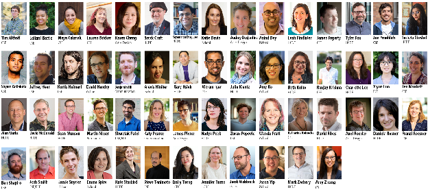\
Figure. HCI-related faculty at UW split across departments, including the Allen School, HCDE, the iSchool, Art+Design, Communication, and less prevalently, Electrical Engineering, Mechanical Engineering, Architecture, Medicine, and more. Image from 2025 (things may have changed).

The Makeability Lab is proudly part of the broader Human-Computer Interaction (HCI) community at UW—one of the top HCI research institutions in the world[^1], with leading scholars in nearly every subdiscipline from accessibility and health informatics to social computing and disinformation. UW is also one of the largest and most intellectually diverse HCI/design communities: 50+ faculty and 150 students across the [Allen School](https://www.cs.washington.edu/), [HCDE](https://www.hcde.washington.edu/), the [iSchool](https://ischool.uw.edu/), [Art+Design](https://art.washington.edu/), [Communication](https://com.uw.edu/), and less prevalently, Electrical Engineering, Mechanical Engineering, Medicine, and more. You can and should leverage this enormous pool of people and expertise: take classes, seek or spur cross-disciplinary collaborations, get to know this amazing community!

## **DUB and DUB Seminar**

Because UW HCI is so large and spread across departments, [DUB](https://dub.washington.edu/) was created to bring all-things-HCI together on campus. We meet once a week for [DUB Seminar](https://dub.washington.edu/seminar.html) (virtual during COVID) and host an annual retreat in the fall. DUB also hosts various social activities at conferences.

If you’re at UW and interested in HCI and/or a Makeability Lab member, you should sign up for the DUB mailing list and DUB Slack. See DUB’s [“Getting Involved” page](https://dub.washington.edu/gettinginvolved.html).

## **HCI PhD Programs at UW**

DUB is not a degree granting institution. Instead, you can apply for and pursue an HCI PhD within one of our constituent UW schools or departments. Most commonly, this would be in the [Allen School](https://www.cs.washington.edu/), [HCDE](https://www.hcde.washington.edu/), the [iSchool](https://ischool.uw.edu/), or [Communication](https://com.uw.edu/)—each department has their own application process, coursework requirements, and unique culture. There is also a strong culture of cross-departmental advising.

If you’re considering applying for a PhD in HCI at UW, please carefully investigate potential departments, research groups, and advisors.

## **HCI-Related Masters Programs at UW**

In addition to PhDs, UW offers a variety of HCI-related terminal[^2] MS programs, each with their own flavor, foci, constraints, and opportunities. Typically, students in these programs do not have time for academic research although some may choose to engage via independent studies or [Directed Research Groups](https://www.hcde.washington.edu/research/directed). Indeed, we have had some success in working with and benefiting from these students in our research (see our [alumni list](https://makeabilitylab.cs.washington.edu/people/))—they are time constrained but incredibly talented and creative.

The MHCI+D website provides a [helpful comparison tool](https://mhcid.washington.edu/related-degrees/) between HCI MS programs. Others have written their [own reflections](https://www.quora.com/What-is-the-main-difference-between-these-two-programs-at-University-of-Washington-Human-Computer-Interaction-and-Design-vs-Human-Centered-Design-and-Engineering) about differences.

* **[Master of HCI and Design at University of Washington (MHCI+D)](https://mhcid.washington.edu/).** A one year, cohort-based MS program with a studio-learning model. Students attend full time. I have served on the MHCI+D Executive Committee for multiple years, taught HCID521 Prototyping Studio, and was the Faculty Chair from 2021-2024.

* **[Master of Science in Human Centered Design & Engineering (MS HCDE)](https://www.hcde.washington.edu/ms).** A two-year MS program with a flexible schedule to enable industry professionals to attend.

* **[iSchool Master of Science in Information Management (MIM)](https://ischool.uw.edu/programs/msim).** Offers both one- and two-year programs depending on relevant professional experience and career goals with specialization tracks in areas like data science, user experience, and information architecture.

* **[Master of Design (MDes).](https://art.washington.edu/design/design-mdes)** A two-year, terminal-degree program aimed at artists/designers who are interested in pursuing academic careers or deepening their practice by engaging in advanced research and scholarship.

## **Industry Partnerships**

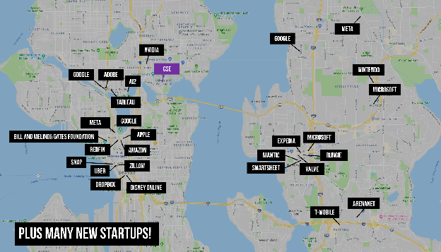\
Figure. A selected map of leading technology and non-profit companies only a short bike ride or bus ride away from UW. Image from 2023.

UW HCI also benefits from the vibrant technology industry and startup culture in the Seattle area. UWers frequently collaborate with industry partners at Google, Facebook, AI2, Adobe, Apple, Microsoft, and beyond—all partially enabled and sustained by close proximity. Such industry presence in Seattle also makes it easy to do off-cycle internships or to take a class led by an industry expert.

## **Temporary advising**

When you start as an Allen School PhD student, you will be assigned a temporary advisor. This assignment is based on your specific preferences (a form you fill out), load balancing amongst faculty, and alignment with faculty interests. As the Allen School [temporary advisor guide](https://www.cs.washington.edu/students/newgrad/advisors) outlines, the temporary advisor has administrative, research, and mentoring roles—all in *support* of you. What classes to take and when? How to pursue research and with who? How is the transition going to graduate school? In many cases, temporary advisors become permanent advisors but sometimes not. If you’re an Allen School PhD student, the faculty care most about finding the best fit for *you* in our PhD program and will help you think about short-term and long-term advising.

## **Choosing a research group/advisor**

If you’re a prospective PhD student or, perhaps, already at UW and thinking about joining the Makeability Lab, I hope this handbook is useful in learning about our group, my advising style, and mutual expectations. Please read it carefully and feel free to ask me questions.

Additionally, I wanted to share other resources about selecting PhD advisors since it’s one of the most important factors in your PhD experience.[^3] You can use these resources as a guide when applying to graduate programs, attending visit days, and ultimately deciding on a PhD program.

* [Questions to Ask for New PhD Students Going Through Rotations](https://twitter.com/SusannaLHarris/status/1441519349206962176?s=20), [Susanna Harris, PhD](https://twitter.com/SusannaLHarris). Founder of @PhD\_Balance.

* [Questions to Ask a Prospective PhD Advisor on Visit Day](https://blog.ml.cmu.edu/2020/03/02/questions-to-ask-a-prospective-ph-d-advisor-on-visit-day-with-thorough-and-forthright-explanations/), Andrew Kuznetsov. See also this [helpful poster version](https://drive.google.com/file/d/1o2ZTrUQYDXKbMlcmSH8lE-MW5vOX77PR/view) and two relevant Twitter threads ([thread1](https://twitter.com/mldcmu/status/1234494649877790726), [thread2](https://twitter.com/andrewkuznet/status/1102631559432159232)).

To add to the above, I suggest seeking out current and former students of a lab for their honest thoughts—those that graduated, those that did not, and those that left to a different group.

From my website logs, I have realized that a fair amount of inbound traffic comes from [csrankings.org](http://csrankings.org/#/index?all\&us). I would like to caution prospective students in using this website for assessing and analyzing interdisciplinary researchers in fields like HCI and accessibility. For a rationale, please see this article by Professor Mark Guzdial:

* [Why I Don’t Recommend CSRankings.org: Know the Values You Are Ranking On](https://cacm.acm.org/blogs/blog-cacm/248078-why-i-dont-recommend-csrankingsorg-know-the-values-you-are-ranking-on/fulltext), Mark Guzdial, Communications of the ACM.

Moreover, much of our research involves large, collaborative projects with complex system building+evaluation. CSRankings diminishes these contributions by computing a weighted score for each paper that divides by the number of co-authors.

# **The Makeability Lab Mission and Core Values**

The Makeability Lab is part of the Allen School and broader UW HCI (“DUB”) community. Below, we describe our research mission and core values.

## **Research Mission**

Our research mission is to:

*Design, build, and study interactive tools and techniques that address pressing societal challenges*.

Towards this mission, we are inspired by and take direction from the [UN’s Sustainable Development Goals](http://www.engineeringchallenges.org/) and the [NAE’s Grand Challenges for Engineering](http://www.engineeringchallenges.org/). Our lab has done significant work in environmental sustainability, accessibility, and STE(A)M education.

To achieve impact, we collaborate across disciplines with a focus on identifying long-term, ambitious research problems that can also provide immediate, practical utility such as [Project Sidewalk](https://projectsidewalk.org/), a publicly deployed research system that has resulted in over 1 million crowdsourced urban accessibility labels, and [SoundWatch](https://makeabilitylab.cs.washington.edu/project/soundwatch/), a research prototype available on the Google Play Store. I am particularly interested in the intersection of multiple grand challenge goals: for example, how accessible sidewalks can also generally improve public health and environmentally sustainable transportation choices (*e.g.,* walking, biking).

Typically, our lab’s research involves inventing or reappropriating methods to sense physical or behavioral phenomena, leveraging techniques in computer vision (CV) and machine learning (ML) to interpret and characterize this data, then building and evaluating interactive software or hardware tools uniquely enabled by these approaches. For example,

* [Project Sidewalk](http://projectsidewalk.org) combines Crowd+AI approaches to scalably map and assess sidewalk accessibility from online imagery,

* [SoundWatch](https://makeabilitylab.cs.washington.edu/project/soundwatch/) uses always-available microphones and real-time machine learning to provide sound notifications to people who are deaf or hard of hearing,

* [MakerWear](https://makeabilitylab.cs.washington.edu/projects/makerwear/) integrates digitally fabricated computational modules with e-textiles to support custom wearable creation, and

* [ARMath](https://makeabilitylab.cs.washington.edu/project/armath/) uses real-time computer vision and augmented reality interfaces to enable children to discover mathematical concepts in familiar, ordinary objects.

Often this work is grounded in formative studies of/with key stakeholders to advance understanding of problem spaces and inform our solutions—for example, Hara *et al.*’s interview study examining assistive location-based technologies ([CHI’16](https://makeabilitylab.cs.washington.edu/media/publications/Hara_TheDesignOfAssistiveLocationBasedTechnologiesForPeopleWithAmbulatoryDisabilitiesAFormativeStudy_2016.pdf)) or Findlater *et al*.’s survey of Deaf and hard-of-hearing individuals’ preferences for sound awareness technologies ([CHI’19](https://makeabilitylab.cs.washington.edu/media/publications/Findlater_DeafAndHardOfHearingIndividualsPreferencesForWearableAndMobileSoundAwarenessTechnologies_2019.pdf)).

I am broadly interested in HCI research that has a social impact focus. Our research together will have its own flavor, conveying both your unique interests and skills.

## **Our Disciplinary Home**

Although an interdisciplinary group, the Makeability Lab sits within the [UW Allen School of Computer Science](https://www.cs.washington.edu/). I can also advise students in [Urban Design and Planning](https://urbdp.be.uw.edu/) within the College of Built Environments, where I am Core Faculty, and I commonly work with PhD students in the [iSchool](https://ischool.uw.edu/) and [HCDE](https://www.hcde.washington.edu/).

## **Core Values**

The following Makeability values represent who we are and continually strive to be. They help define and unify us.

**Mutual respect and support.** The Makeability Lab is founded on mutual respect, trust, and support. We respect and support one another through our words and actions. If someone makes you uncomfortable, please let me know immediately. If I am the source of discomfort, I would hope that you could approach me—either in the moment or afterwards. If you don’t feel comfortable reaching out to me, you can involve our [grad advising staff](https://www.cs.washington.edu/academics/phd/advising). Alternatively, you could fill out this [anonymous Makeability Lab feedback form](https://forms.gle/bS4oqmEkhABBP9gT8) or a similar [feedback form](https://feedback.cs.washington.edu/) run by the Allen School.

**Trust.** Trust allows us to take risks, be vulnerable, and cooperate more efficiently[^4]. It is foundational to any relationship—personal or professional. We must trust each other and our labmates. A challenge for all of us, however, is that trust is *earned* through interaction, experience, and observation. Let us invest in our relationships, be patient, and earn this trust.

**Elevate others.** How can you make others better as a result of your presence? In the Makeability Lab, we try to elevate others, not diminish them. Your presence in the lab should lift us higher. For example, show interest in other’s work and well being, be constructive and kind in your critiques, volunteer to help review paper drafts, talks, and scholarship applications.

**Community engagement.** Our research is driven by the needs of people, communities, and society. Our intention should always be to *work with* and *contribute* to these communities.

**Togetherness.** Research and graduate school can feel insular. But we are in this together. Seek help. Offer help. Be there for one another. My most fulfilling and exciting collaborations in graduate school were with fellow students—working closely together, learning from one another, and challenging each other to do great work and be better.

**Psychological safety.** We engender and nurture a [psychologically safe](https://www.strategy-business.com/article/How-Fearless-Organizations-Succeed) environment. All members are free to speak up, to try and fail, to be who they are. This does not mean that we must all agree or provide unequivocal praise but that people feel supported in taking risks and speaking up.

**Culture of excellence.** You are part of one of the top HCI research institutions in the world. In all parts of our work, we strive for excellence and hold ourselves to the highest standards, while acknowledging that, in some cases, perfection is the enemy of done.

**Passionate.** We are passionate about what we do and are grateful for the opportunity.

**Our best effort.** We push ourselves and each other to do the very best that we can.

**Accountability.** We hold ourselves accountable. Make commitments to yourself and to your team and meet those commitments. If you struggle, seek help. Be dependable, reliable, and responsible.

**Work-life balance.** We value the richness of life and make time for our friendships, families, and hobbies.

**Feedback.** Feedback is essential to learning, mentorship, research, and innovation. It allows one party to critically reflect on an artifact, process, or experience and help others do better, think differently, and improve. We should constantly be seeking feedback—from me, from your labmates, from your peers, and from critical external stakeholders.

**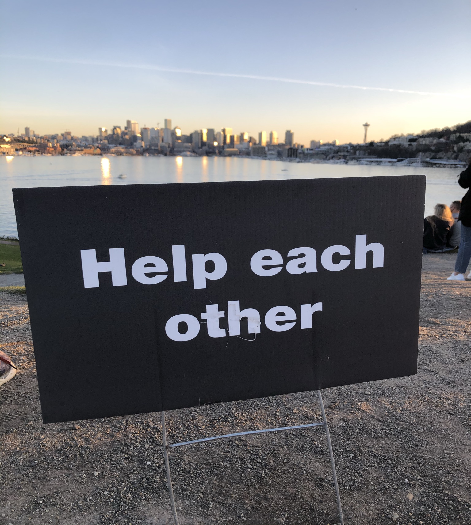**\
Figure. A picture reflects a core value in our lab: “Help each other.” Picture by Jon E. Froehlich shot at Gasworks Park during the COVID pandemic.

**Research is collaborative.** We work on cross-disciplinary problems. Understand and assess the limitations of your own knowledge and seek out domain experts—whether it be in technical sub-fields of CS like machine learning or in other disciplines like disability studies, geography, or public health.

**Open science.** We believe strongly in open science. With some exception, our papers should include all data, code, and supplementary materials necessary to support replication and transparency.[^5]

**Integrity.** Science is nothing without integrity.[^6] We hold ourselves to the highest standards of rigor and honesty.

# **My Expectations for Makeability Lab PhD Students**

You are here to learn, to grow as a researcher, a mentor, and a teacher, and to develop and build skills for a future career (whether in industry or academia). I am here to help you, to mentor you, and to teach you. I want you to succeed. But this is *your* career and *your* PhD.

I expect you to uphold the values above and to take responsibility for your progress through the PhD program. I expect you to work hard, to meet your commitments, and to manage your time responsibly. I find that I work best with students who are intrinsically driven, who challenge and push themselves to learn, to grow, and to attain ambitious goals, who self-set and meet a high standard of excellence and work quality, who work towards making consistent progress from week-to-week, and who are organized and strong communicators.

I will help you at each stage of your PhD. As you progress, you will need to demonstrate your ability to lead a research project from end-to-end. I will help you scope a dissertation that is appropriate to your career goals. The process should be rewarding but it will not always be easy. It will take time, dedication, and hard work.

My time is valuable as is yours. I will commensurately invest in students who invest in themselves.

If you have a particular need or workstyle that is not being met, I encourage you to let me know. Every student is different. Let’s work together to help you reach your PhD and career goals.

# **Prospective Makeability Lab PhD Students**

We are honored with your interest! Becoming one of my PhD students is a big deal: a 5-6 year commitment for both of us. This subsection is intended to help express *what* I’m looking for in a PhD student and to establish alignment and expectations. Note: as a general rule, I do not evaluate or interview prospective graduate students until I see their full materials in the [Allen School PhD application system](https://www.cs.washington.edu/academics/graduate/phd-program/phd-admissions/how-apply/) (*e.g.,* research statement, letters of rec).

If you are interested in joining the Makeability Lab with me as your PhD advisor, I expect the following:

* **Read this handbook.** Before you email me, read relevant portions of this handbook, including [HCI at UW](#hci-at-uw), [The Makeability Lab Mission and Core Values](#the-makeability-lab-mission-and-core-values), and [My Expectations for ML PhD Students](#my-expectations-for-makeability-lab-phd-students).

* **Familiarize yourself with current lab research.** Review our [current projects](https://makeabilitylab.cs.washington.edu/projects/) and [papers](https://makeabilitylab.cs.washington.edu/publications/). In particular, you might benefit from reading our vision pieces such as about [Geo-visual AI Agents](https://makeabilitylab.cs.washington.edu/media/publications/Froehlich_DoesTheCafeEntranceLookAccessibleWhereIsTheDoorTowardsGeospatialAiAgentsForVisualInquiries_ICCVWorkshop2025.pdf) and the [Future of Urban Accessibility: The Role of AI](https://makeabilitylab.cs.washington.edu/media/publications/Froehlich_TheFutureOfUrbanAccessibilityTheRoleOfAi_ASSETS2024.pdf) to get a sense of our broader research trajectories. Generally, we focus on Human-AI systems, augmented reality, and urban computing, often in the domains of sustainability, accessibility, health, and education.

* **Your technical background.** We are a Human-AI research lab with a heavy focus on prototyping and engineering. While we conduct diverse types of research in the lab, including formative qualitative studies, our primary aim is technical innovation (aka [“Systems HCI” contributions](https://faculty.washington.edu/wobbrock/pubs/interactions-16.pdf)). I am particularly interested in recruiting students who share a passion for creative invention, rapid prototyping, and just love 💖 to make innovative things. You should be a builder with a demonstrated track record of making creative (and possibly AI-infused) things.

* **Prior experience.** I have also increasingly shifted to accepting students who already have an MS and/or a few years working experience. While there are exceptions (indeed, some of our best performing PhDs have been directly out of undergrad), I find that students with an MS or prior work experience have the maturity and time management skills necessary to excel at a PhD.

* **Your prior research record.** Moreover, I look for applicants with prior research experience and an established publication record—a first-authored paper is preferred but co-authorship is also fine. I am unlikely to accept any prospective student who does not have at least one previously co-authored published work ideally at a top-tier HCI venue such as ACM CHI, UIST, ASSETS, IMWUT (but any established record is appreciated). If you do not yet have such experience, I recommend pursuing a research MS to establish a publication record and re-applying.

* **Your initial email.** I receive too many emails to respond to each individually (though I often try). The best emails provide a brief introduction to your background and interests, specific connections to our lab’s work (this is critical, if you don’t take the time to understand and specifically connect with our lab’s work beyond a surface level, you will not receive a response), and explain your prior research and your role within it (Was it your idea? How did you contribute? Did you write the paper?). Please attach your CV. If you do not hear back from me, please feel free to ping me again (I don’t mind). Note: if you use a template email or an AI-generated email, you will not receive a response.

* **Interview.** The Allen School requests that we interview every prospective student (a practice I was already pursuing independently). This interview has mutual benefits: it gives us a chance to meet and discuss ideas and learn about our shared interests. I ask that you prepare a slide deck introducing yourself, your interests and career goals, and your prior research experience. Once accepted to our PhD program, we will also have many follow-up conversations to help you determine if the Allen School and the Makeability Lab is the right place for you (but best to try and capture that as early as possible in the process!)

* **Contribute!** Perhaps the best way to make a positive impression is to join [one of our open source projects](https://github.com/makeabilitylab) and begin making valuable contributions. You can literally do this today! Just make sure you actually have the time to contribute and finish what you start.

If you do not feel your background meets our requirements or is not a good fit for our lab, feel free to reach out to ask. We realize that applying to graduate programs is expensive. It is unlikely that you will be accepted into the Makeability Lab without fulfilling the above.

# **Meetings**

We have three types of regularly scheduled meetings in the Makeability Lab, each of which support us and our projects in different ways.

1. **Lab meetings.** Weekly 60 min lab meetings to share status updates, provide feedback, give practice talks, provide tutorials, and generally build lab rapport. These meetings are reserved for PhD students, postdocs, and research scientists to enable us to discuss supervisory and mentorship issues.
2. **1:1 meetings.** Weekly 45-minute 1:1 meetings to discuss research progress, coursework, and general opportunities and challenges.
3. **Project meetings.** Weekly or biweekly 30-60 minute project meetings led by the lead PhD(s) on the project. All project members can be invited—including high school and ugrads (though scheduling conflicts may prevent regular attendance); I defer to the lead PhD student to make these decisions. Note: Jon may not be able to regularly attend these project meetings and will, instead, provide guidance during the 1:1s.

While valuable both functionally and socially, meetings are *expensive* in terms of personnel time as well as the disruptive cost to focused work. Thus, we must use meetings wisely. If you are not prepared to meet or have no significant agenda items—which may happen due to the natural ebb and flow of graduate school (*e.g.,* you are studying for course finals)—I am always happy to cancel a meeting and interact asynchronously over email. As alumnus Majeed Kazemitabaar said, “*on MakerWear, we had great over-the-email collaborations that were very productive, including feedback on GitHub issues, sending video updates for demos and critique. We used meetings for brainstorming, designing studies, and to tackle high-level challenges.”*

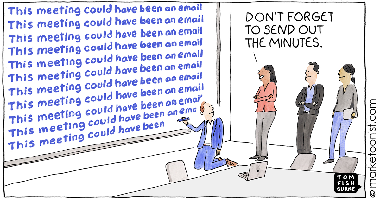

## **Project Meetings**

Project meetings are led by the lead PhD student (or students). Before the meeting, the lead student(s) should prepare an agenda—soliciting agenda items from team members—and send it via email the day prior to the meeting (or early like \~5am on the day of). To help ensure that you think about timing and prioritization, the agenda should ideally have time allocations per bullet item to ensure that we adequately cover all topics. The lead student(s) will use these pre-arranged allocations to keep the meeting on track.

Meetings should begin with surfacing the prior week’s agenda items and current statuses. For this, it’s helpful to have ongoing notes with clear action items and outcomes.

From experience, we’ve found that it’s useful to send status updates from all team members via email or Slack before the meeting so that the meetings can interactively focus on issues and open questions. Some meetings become so status update heavy that they become unidirectional. When preparing for a project meeting, think about challenges you would like feedback on.

## **1:1 Meetings**

In 1:1 meetings (or 1:2 meetings for co-advised students), you have your advisor’s focused attention for 30 minutes. This is a valuable opportunity and a time to discuss roadblocks, map out plans, and seek advice. Please take full advantage! I have found that how students approach these meetings, their preparedness, and their ability to run them successfully correlates strongly with success. Thirty minutes is not a long time but it is enough time, if you are prepared.

To help you prepare for 1:1s and to help maximize our time together, I request two things:

1. Create a bullet-pointed agenda that you send the night before we meet. Agendas should roughly follow this structure; however, other structures are possible[^7] (we can work together on finding a structure that works best for you):

   1. **Key goal for the meeting.** Identify at least one key goal for this week’s meeting
   2. **General update.** How are things going? How do you feel? How can I help?
   3. **Accomplishments for the week.** During this time, we will use the previous week’s status document to contextualize discussion. This is critical for continuity.
   4. **Roadblocks/challenges.** What are your blockers? What is slowing you down?
   5. **Goals and next steps.** What are your action items? What are my action items?
2. For the meeting itself, please use Google Docs, Google Slides, a Miro board or some other tool to structure the meeting and take notes. Having a tangible resource to guide the meeting (and for notes) helps us stay on track and also results in better feedback.

The most effective meetings tend to be those with artifacts I can review and contribute to—sketches of ideas, mockups, paper outlines, initial analyses, early findings. In contrast, it is typically *not* the best use of my time to look over paper drafts—this requires deep, focused attention, which is not possible during a meeting. Thus, please send any writings beforehand so I can carefully read them on my own time and provide written feedback (asynchronously), which we can review, as necessary, during the meeting.

# **What do I (Jon) do?**

Like all tenure-track faculty, my job is split between three primary roles: research, teaching, and service[^8]—each which could be full-time jobs in their own right. To provide greater insight into my everyday work life, I briefly cover all three below.

## **Research**

My research time is largely spent on envisionment, fundraising, project management, mentorship, reading literature, writing (both papers and proposals), and providing feedback and guidance to students. I treasure time when I can actually code or build things  (*e.g.,* like [analysis scripts](https://github.com/makeabilitylab/accessibility-literature-survey) or [Project Sidewalk dev](https://github.com/ProjectSidewalk)) but these moments are rare. Typically, the “on-the-ground” research is conducted by you—building systems, running interview protocols, performing data analysis—all with my feedback and support.

I look forward to collaborating closely with you on your research from ideation and design mocks to study planning, analysis, and writing. Throughout, we should have strong communication and tight feedback loops. For example, I expect weekly status update emails—in the form of a Google Doc or Slide deck, for example—accompanied with our weekly 1:1s and active participation in our lab and project meetings. You can expect that I will carefully review and comment on artifacts you share with me (*e.g.,* draft study protocols, design mocks). I prefer *more* communication to *less*. Do not hesitate to reach out.

## **Teaching**

“*If you want to master something, teach it.*” -Richard Feyman[^9]

Teaching is a privilege and one of the most impactful things I do in my professorial life both “in the classroom” and via advising and mentorship. Teaching is also part of your PhD journey—both informally as you mentor and support your peers as well as junior students and more formally as a Teaching Assistant (TA) in undergrad and graduate courses.

The more I teach classes, the more I understand and appreciate the synergistic link to research. It helps me think. It helps me learn. It forces me to dive deeply into a subject, organize topics thematically, and stay abreast of the most recent technology developments and research. Every time I teach a course, I learn new things—not just about the course topic but about how to be a better instructor and how to improve my curriculum.

### *My Teaching Load*

Allen School faculty appointments require teaching three courses per year; however, many faculty only teach twice/year. How come? Because of teaching releases. Faculty members can achieve releases either by “buying out” (using research funds to pay the department so we can focus on research that quarter) or via university service (*e.g.,* appointments with heavy workloads like an Associate Dean in the College or Director position within the Allen School).

## **Service**

Service is not only critical to sustaining community and scientific practice but also provides many professional benefits: it expands your professional network, provides opportunities to develop new skills, and allows you to work with and learn from other people. One of my favorite parts of service is the opportunity to work on new, meaningful challenges and meet and work with new people.

In a [later section](#service-1), I highlight potential service opportunities for you as a PhD student. For my academic service, I typically focus on giving back to my research community, my department, and/or my university. This may come in many forms from reviewing papers to leading Allen School initiatives to serving on organizational or editorial committees for conferences or journals. For example, in 2021-22, I am in the following service roles:

* Faculty Chair of [MHCI+D](https://mhcid.washington.edu/) and on the MHCI+D admissions committee

* Allen School Faculty Undergraduate Program Coordinator and on the ugrad admissions committee

* Associate Director of [CREATE](https://create.uw.edu/)

* Posters/Demo Co-Chair of [ASSETS’21](https://assets21.sigaccess.org/)

* General Chair of [ASSETS’22](https://assets22.sigaccess.org/)

I also routinely review for the top conferences and journals in our field, including CHI, ASSETS, IMWUT, UIST, and TACCESS. For several years, I was an Associate Editor of IMWUT.

# **What do you do?**

Your responsibilities are similarly multi-faceted—research, coursework, teaching, mentorship, service, internships—but the emphases differ and will shift as you progress through the program.

## **Timeline**

Every student is different, every timeline is different. However, you must make consistent progress to succeed. To help guide you, the Allen School suggests the following target milestones:

* [Qualifying Evaluation](https://www.cs.washington.edu/academics/phd/process/quals) or “Quals” after **two full years**, which includes a coursework and a research project requirement. For your quals project, you must prepare an oral presentation open to all members of the department with required attendance by the primary and secondary advisors. All quals talks are scheduled for 90 minutes by default, which includes a 30-40 minute talk, questions from the audience and advisors, and a closed session (if needed); however, the time allocations are up to the PhD student and the advisor.

* [General Exam](https://www.cs.washington.edu/academics/phd/process/generals) after **three full years or 1.25 years after Quals**, which includes a written research proposal (20 pages max) and a presentation for an examining committee.

* [Final Exam](https://www.cs.washington.edu/academics/phd/process/dissertation) by the **end of year five**, which includes a completed dissertation and oral defense with an examining committee. In practice, this is often in Year 6.

Here’s a visualization of the Allen School timeline:

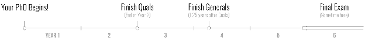

To contextualize the above timeline, I’ve enumerated some of my expectations and tips:

* Your first year is one of significant life transition: moving cities, *becoming* a grad student, learning about research, making new friendships, starting new life routines, taking classes. Be kind to yourself. Find a rhythm that works for you.

* If you have a disability and feel comfortable disclosing, please let me know. Together, we can work with [Disability Resources for Students (DRS)](https://depts.washington.edu/uwdrs/) and the [Disability Services Office (DSO)](https://hr.uw.edu/dso/) along with Allen School grad advising to ensure that your needs are being met.

* You should attempt to involve yourself immediately in research with the goal of being a co-author on a paper submission **within your first 9 months**. You will begin learning the flow and process of research and other intangibles, building rapport with fellow students, and developing skills necessary to take on a first-authored paper project for your first summer. Often this experience will lead to new research ideas that could be a PhD topic.

* For your first summer, you could intern or lead a research project. If funding exists, I prefer the latter as it will further enable us to work closely together, allow you to make progress towards quals, and hopefully result in a first-authored submission to a fall deadline, *e.g.,* CHI (in September) or to IMWUT (in November). Read more on [Internships here](#internships).

* You should then generally aim for \~2-3 papers per year; however, your focus should be on quality not quantity[^10]. Not all of these papers need to be first-authored.

* Most students will TA at least a few quarters in their first two years as they complete their classes and begin research. The Allen School requires that all PhD students TA at least twice. Read more about [TAing here](#taships).

## **General Exam**

The [Allen School PhD Program Handbook](https://www.cs.washington.edu/academics/graduate/phd-program/handbook/) describes the [General Exam requirements](https://www.cs.washington.edu/academics/graduate/phd-program/handbook/degree-requirements/requirements/generals/), which begins with a “charge” and concludes with a report and a presentation. The Makeability Lab has [its own “charge” document](https://docs.google.com/document/d/1tJSR3F23gq8iSrb6wJlm4Opki3UqjsCvfm9HO8Wc43A/edit?tab=t.0), which we slightly modify for each PhD student.

## **Research**

According to the *[Oxford English Dictionary](https://www-oed-com.offcampus.lib.washington.edu/view/Entry/163432?rskey=TUALks\&result=1\&isAdvanced=false#eid),* research is the “*systematic investigation or inquiry aimed at contributing to knowledge of a theory or topic by careful consideration, observation, or study of a subject*.”  But HCI is a multi-faceted, interdisciplinary field with roots in engineering, sociology, cognitive science, and design and has many different study methods, epistemic sub-cultures, and accepted ways to advance knowledge. Consequently, HCI research can feel, well, amorphous. This is particularly true in a research lab like ours, which focuses on cross-disciplinary topics and actively collaborates with domain experts, scientists, and partners in areas outside CS and HCI.

To begin to understand the ways in which we make HCI research contributions, I suggest Professor Wobbrock and Kientz’s treatise on the subject, which distills seven research contribution types in HCI ([Interactions, 2016](http://faculty.washington.edu/wobbrock/pubs/interactions-16.pdf)) and a related article by Bødker *et al.* entitled *Nine Questions for HCI Researchers in the Making* ([Interactions, 2016](https://interactions.acm.org/archive/view/july-august-2016/nine-questions-for-hci-researchers-in-the-making)). Because much of our work in the Makeability Lab involves building and evaluating novel systems, I also recommend Professor Fogarty’s workshop paper on *Code and Contribution in Interactive Systems Research* ([CHI’17 Workshop](https://homes.cs.washington.edu/~jfogarty/publications/workshop-chi2017-codeandcontribution.pdf)).

### *Picking a topic*

Many first-year students feel pressured or the need to propose research projects. You shouldn’t. Instead, I suggest spending your first year *learning, discovering,* and *absorbing*—seek out experiences that strengthen your skills, immerse you in topics, and provide tangible research opportunities. It is hard to propose a research project worth pursuing; one that is rich, novel, and has the potential of impact—all which require a familiarity with literature and some level of research expertise.

That doesn’t mean you shouldn’t *try* to propose topics—I would *love* to hear your ideas. You have something the rest of us don’t: a freshness and inexperienced eye. This may lead to new, unexpected paths! But it does mean you shouldn’t feel the pressure to propose your own, publication-worthy research topic in your first year[^11]. Alternatively, when you begin graduate school, I suggest joining a pre-existing project or working on something that your advisor suggests then using those experiences to prepare yourself for greater research autonomy as you progress. Graduate school is a growing process!

But how should you go about ideating and selecting a topic?

I recall hearing an interview question [Desney Tan](https://www.microsoft.com/en-us/research/people/desney/) asked candidates at Microsoft Research: “*What are the biggest open challenges in your field?*” and, depending on your answer, a follow-up might be: “*Why aren’t you working on them?*” Such questions may feel intimidatingly heavyweight but I think the essence is to work on what matters and focus on impact. The question, at first, is not *“How do we solve the problem?”* but rather “*Are we working on the right problem*.” As [Professor Igarashi states](https://www-ui.is.s.u-tokyo.ac.jp/~takeo/writings/siggraph.html), “*if you find a good goal, your work is mostly done. If a wrong goal is set, you are destined to fail*.” Though impact is exceedingly hard to predict, if you’re working on important problems, you are more likely to have an impact (and, regardless, you’ll feel more satisfied in your day-to-day work).

### *Ideation Strategies*

In Greenberg \*et al.’\*s *[Sketching User Experiences: The Workbook](https://alliance-primo.hosted.exlibrisgroup.com/permalink/f/kjtuig/CP71185020590001451)*, the authors enumerate a number of brainstorming and ideation strategies. I’m particularly fond of thinking about the ideation process as a tree where you begin with a problem and brainstorm solutions (see figure below)—as many ideas as possible at first. The tree width corresponds to the breadth and diversity of ideas (attempting to get the right design) and the tree depth corresponds to the iteration of ideas (attempting to get the design right). The ideation and prototyping process is generative: ideas beget other ideas—some of which are derivations, others which are new limbs on the tree. At some point in a research/design process, one must switch from broadening ideas to converging and iterating on top ideas. This process relates to Paul Laseau’s notion of elaboration and reduction in design: generate as many ideas as possible, these are opportunities then reduce to ideas worth pursuing via iteration and refinement.

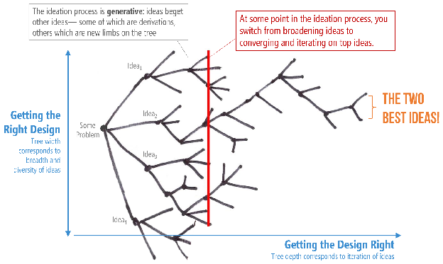

Figure. A figure based on [Greenberg](https://alliance-primo.hosted.exlibrisgroup.com/permalink/f/kjtuig/CP71185020590001451) *[et al](https://alliance-primo.hosted.exlibrisgroup.com/permalink/f/kjtuig/CP71185020590001451)*[.’s Sketching User Experiences: The Workbook](https://alliance-primo.hosted.exlibrisgroup.com/permalink/f/kjtuig/CP71185020590001451), which describes the ideation process as a tree. Figure created by Jon Froehlich for his HCI/design courses and informed also by [Tohidi](https://doi.org/10.1145/1182475.1182487) *[et al.](https://doi.org/10.1145/1182475.1182487)*[, NordiCHI’06](https://doi.org/10.1145/1182475.1182487). See [this slide deck](https://www.dropbox.com/s/66gzb6i7bciz2hr/HCID501_L04-Ideation.pptx?dl=0).

As [Professor Igarshi emphasizes](https://www-ui.is.s.u-tokyo.ac.jp/~takeo/writings/siggraph.html)[^12], “*The best way to come up with a \[promising research topic] is to come up with many possibilities, examine them carefully, and pick the best one. You must list 100 possible research ideas first, carefully investigate the possibility of 30, implement 10, and pick the most successful one in the end. You must understand that 100 good ideas are discarded in the process of producing one paper.*” Two-time Nobel prize winner Linus Pauling agrees: *“The best way to have a good idea is to have lots of ideas.*”

But how long should you spend ideating? Sometimes, you are in a context that is inherently timeboxed—for example a summer internship. Other times, it may feel open ended. Together, we should work through this process. For example, when I interned with [John Krumm](https://www.microsoft.com/en-us/research/people/jckrumm/) at Microsoft Research, I remember feeling anxious to quickly select and start working on a research topic. With only a 12-week internship, I feared spending too much time on the brainstorming phase[^13]. What’s worse, by week two, it seemed that all the other interns had already downselected and were actively pushing towards a research paper. Thankfully, with John’s support, we spent time compiling ideas and finally decided to pursue end-to-end route prediction using GPS data. John’s view—and that shared by our group manager at the time [Eric Horvitz](http://erichorvitz.com/)—was that the upfront cost of brainstorming ideas and conceptualizing problem spaces was worth it compared to selecting an inferior or low-impact problem. Our resulting paper, *[Route Prediction from Trip Observations](https://www.microsoft.com/en-us/research/wp-content/uploads/2016/12/sae-route-prediction-camera-ready-v3.pdf)*, now has over 300 citations and is cited across fields from ubiquitous computing to the automotives. The project was not only successful, it greatly stretched my skillset—the first “big data” project that I worked on, which developed my skills in data cleansing and machine learning.

### *Short research pitch sheets*

When thinking about topics, your inspiration may come from anywhere: drawing on your own experience, reading research literature or one of our lab’s papers, random thoughts when taking a walk or shower.

When proposing a topic, I request that you put together a one-page pitch sheet (often called “one pagers” in the lab though they often extend to two pages). Here, you should address the following questions:

* What is the problem you are solving and why does it matter?

* What have others done in this space & what are the benefits/drawbacks of those approaches?

* What is your proposed solution? (Your approach)

* How will you evaluate your solution? (Your study method)

* What are your expected research contributions? Said contributions must be contextualized and differentiated with the research literature and state-of-the-art industry systems.

Though I wrote these questions myself, they are not particularly unique but rather foundational to the beginning of any research project. They share similarities, for example, with [Heilmeier’s Catechisms](https://www.darpa.mil/work-with-us/heilmeier-catechism), a list by George H. Heilmeier, former DARPA director (1975-1977), to help agency officials think through and evaluate proposed research. Similarly, Professor Judy Olson poses [Ten Questions](https://drive.google.com/drive/folders/16KI8_Fxj94efHpZv3xnu4TO3ufuya4pU) to ask and answer before starting a project.

Notably, to address these questions, you need to perform an in-depth analysis of the existing research literature and, when relevant, industry solutions. You simply cannot pursue a topic without first knowing the literature and situating your expected research contributions within it. At its core, the pitch sheet is an *argument* to convince us of the value of an idea, the limitations of and/or opportunities enabled by prior work, and how we will advance knowledge/understanding in a space. This must be contextualized in the literature.

To help you construct your pitch sheets, here are some examples, which we share with permission:

* **[Co-designing interactive machine learning for sound awareness](https://docs.google.com/document/d/18PQ_m5cMFGD-oS0Xj7P5JbME25VpwBq5qPOcT8QezIw/edit),** 2020, which led to [Toward User-Driven Sound Recognizer Personalization with People who are d/Deaf or Hard of Hearing](https://makeabilitylab.cs.washington.edu/media/publications/Goodman_TowardUserDrivenSoundRecognizerPersonalizationWithPeopleWhoAreDDeafOrHardOfHearing_IMWUT2021.pdf), IMWUT 2021

* **[3D-Printed Energy](https://docs.google.com/document/d/1eJyFRtlV2D-4GSD4lnB_312eGj7cbUuMQkIRPvG3_Sc/edit?usp=sharing)**, 2019, Liang He

* **[HomeSound Field Deployment](https://docs.google.com/document/d/1-tl6VmtKUoise0B9IO3igLJlvB-J63yGec9mWmAXhnI/edit#heading=h.tzkv85goqspk),** 2019, Dhruv Jain, which led to [HomeSound: An Iterative Field Deployment of an In-Home Sound Awareness System for Deaf or Hard of Hearing Users](https://makeabilitylab.cs.washington.edu/media/publications/Jain_HomesoundAnIterativeFieldDeploymentOfAnInHomeSoundAwarenessSystemForDeafOrHardOfHearingUsers_CHI2020.pdf), CHI 2020

* **[Defining a design space for haptics and visuals on a smartwatch](https://docs.google.com/document/d/1OXiG9_6tVuKSJp4wOsrMIc-i2Woe6x9u6p5l9jPZQdE/edit),** 2019, which led to [Evaluating Smartwatch-based Sound Feedback for Deaf and Hard-of-hearing Users Across Contexts](https://makeabilitylab.cs.washington.edu/media/publications/Goodman_EvaluatingSmartwatchBasedSoundFeedbackForDeafAndHardOfHearingUsersAcrossContexts_CHI2020.pdf), CHI 2020

* **[Lattice-based Generative Design for Wearables](https://docs.google.com/document/d/1DKtI7DjyggBde2G3eIOrWRjjaSM2WIQMzcw8jpKHanU/edit?usp=sharing)**, 2019, Liang He, which we pursued for \~2 quarters but eventually dropped due to limitations 3D-printable conductivity materials, available work cycles, and skillset matches on the team

* **[Social Thermography](https://docs.google.com/document/d/1Wd0uoS8MI2bK-AmyVZPjaI1Lc7JFWLKhu1KOwxU1yU8/edit)**, 2016, Matthew Mauriello, which led to [A Large-Scale Analysis of YouTube Videos Depicting Everyday Thermal Camera Use](https://makeabilitylab.cs.washington.edu/media/publications/Mauriello_ALargeScaleAnalysisOfYoutubeVideosDepictingEverydayThermalCameraUse_2018.pdf), MobileHCI 2018

* **[Temporal Thermographic Analysis](https://docs.google.com/document/d/10LKDQmWUZedKUYJiqp8urFtd3dpa6drL-YpmET1j2XA/edit)**, 2017, which led to [Thermporal: An Easy-to-Deploy Temporal Thermographic Sensor System to Support Residential Energy Audits](https://makeabilitylab.cs.washington.edu/media/publications/Mauriello_ThermporalAnEasyToDeployTemporalThermographicSensorSystemToSupportResidentialEnergyAudits_2019.pdf), CHI 2019

Additionally, here are some short research proposals that I’ve written (or co-written), which are more refined than necessary for your pitch sheets but convey a similar flavor:

* [Combining Crowdsourcing and Computer Vision for Street-level Accessibility](https://drive.google.com/file/d/15Rqy4cO0k27ctC__2UTMJKxRyx89tei2/view?usp=sharing), 2012, Google Faculty Research Award, Jon E. Froehlich and David Jacobs

* [Wearable Sound Awareness Support for the Deaf and Hard of Hearing](https://drive.google.com/file/d/1azU-cLdCUI0kOhyLjFbX54Ifq63k0Lmt/view?usp=sharing), 2016, Google Faculty Research Award, Leah Findlater and Jon E. Froehlich

* [PrototypAR: Prototyping Complex Systems with Paper Craft and Augmented Reality](https://drive.google.com/file/d/1z6lLtqA3ClhbtnjM0sJ8vpwJqnAsYCRZ/view?usp=sharing), 2018, UW Reality Lab, Jon E. Froehlich

* [Social Tensions with Always-available AR for Accessibility](https://drive.google.com/file/d/1I9YIU5MYtPiK_o7qiESTdvppOClXtt0e/view?usp=drive_link), 2020, Meta Research Award , PIs: Froehlich and Findlater

* [RAMP: Semi-automatically Scanning and Adapting Indoor Accessibility Barriers using LiDAR, Computer Vision, and Mobile Fabrication](https://drive.google.com/file/d/1pNLpX0KAkl2d9D-gRTQbl_XMKzCkPlD-/view?usp=drive_link), 2023, CREATE Research Award, PI: Jon E. Froehlich; Co-PIs: Xia Su and Daniel Campos Zamora

* [Unseen City Canvases: Scaling Nonvisual Access to Public Art via Vision-Language Models and an Accessible Interactive Web App](https://drive.google.com/file/d/1Wr4xzrEqzSFTyqRXU9VUYiY88PgIej1w/view?usp=drive_link), 2026, CREATE Research Award, PI: Froehlich, Co-PI: Findlater. PhD Students: Jared Hwang & Lucy Jiang

### *Research contributions*

In their [Interactions, 2016](http://faculty.washington.edu/wobbrock/pubs/interactions-16.pdf) article, Wobbrock and Kientz enumerate seven research contributions in HCI with examples. Below, we provide a similar analysis but of Makeability Lab work, which not only illustrates the variety of work that we do and research methods that we employ but also particular tendencies/patterns in our work (*e.g.,* use of design probes to formatively explore a space, high number of artifact contributions with holistic, qualitative evaluations, *etc.*).

As you work on your own research, you need to identify key research questions, how to examine these questions (study method), and expected research contributions. In many cases, you can model your study plan and research paper on prior work from our group—if no match exists, look more broadly at the research literature to inform your planning and writing.

**Artifact contributions.** “*HCI is driven by the creation and realization of interactive artifacts*. *Artifacts, often prototypes, include new systems, architectures, tools, toolkits, techniques, sketches, mockups, and envisionments that reveal new possibilities, enable new explorations, facilitate new insights, or compel us to consider new possible futures.*” Importantly, how an artifact research contribution is demonstrated and validated depends on the type of artifact and its goal. For example, new input and interaction techniques like a new mouse cursor design ([UIST’10](https://doi.org/10.1145/1866029.1866055)), a new keyboard entry technique ([CHI’03](https://doi.org/10.1145/642611.642630)), or a new 3D selection technique ([UIST’06](https://doi.org/10.1145/1166253.1166257)) often require precise, experimental evaluations to isolate and understand human performance benefits. In contrast, new systems, architectures, tools, and toolkits are often evaluated more holistically, perhaps through qualitative usability studies or field deployments.

* A key type of artifact contribution in the Makeability Lab are systems papers with formative design inquiries and summative evaluations. For example, with MakerWear ([CHI’17](https://makeabilitylab.cs.washington.edu/media/publications/Kazemitabaar_MakerwearATangibleApproachToInteractiveWearableCreationForChildren_CHI2017.pdf)), we conducted iterative formative design sessions with children, educators, and children’s museum employees during our design process, incorporating feedback, and then evaluating a final prototype with multi-day sessions in after-school programs. Similarly, with ARMath ([CHI’20](https://makeabilitylab.cs.washington.edu/media/publications/Kang_ArmathAugmentingEverydayLifeWithMathLearning_CHI2020.pdf)) we ran participatory design sessions with teachers and children before creating and evaluating a final prototype in a field deployment at a local children’s museum. Here are some additional examples:

  * **SoundWatch, ASSETS’20.** Jain, D., Ngo, H., Patel, P., Goodman, S., Findlater, L., Froehlich, J. E. (2020). SoundWatch: Exploring Smartwatch-based Deep Learning Approaches to Support Sound Awareness for Deaf and Hard of Hearing Users. *Proceedings of ASSETS 2020*. [PDF](https://makeabilitylab.cs.washington.edu/media/publications/Jain_SoundwatchExploringSmartwatchBasedDeepLearningApproachesToSupportSoundAwarenessForDeafAndHardOfHearingUsers_ASSETS2020.pdf) | [DOI](https://doi.org/10.1145/3373625.3416991)

  * **HomeSound, CHI’20.** Jain, D., Mack, K., Amrous, A., Goodman, S., Wright, M., Findlater, L., Froehlich, J. E. (2020). HomeSound: An Iterative Field Deployment of an In-Home Sound Awareness System for Deaf or Hard of Hearing Users. *Proceedings of CHI 2020*. [PDF](https://makeabilitylab.cs.washington.edu/media/publications/Jain_HomesoundAnIterativeFieldDeploymentOfAnInHomeSoundAwarenessSystemForDeafOrHardOfHearingUsers_CHI2020.pdf) | [DOI](https://doi.org/10.1145/3313831.3376758)

  * **ARMath, CHI’20.** Kang, S., Shokeen, E., Byrne, V., Norooz, L., Bonsignore, E., Williams-Pierce, C., Froehlich, J. E. (2020). ARMath: Augmenting Everyday Life with Math Learning. *Proceedings of CHI 2020*. [PDF](https://makeabilitylab.cs.washington.edu/media/publications/Kang_ArmathAugmentingEverydayLifeWithMathLearning_CHI2020.pdf) | [DOI](https://doi.org/10.1145/3313831.3376252)

  * **PrototypAR, IDC’19.** Kang, S., Norooz, L., Bonsignore, E., Byrne, V., Clegg, T. L., Froehlich, J. E. (2019). PrototypAR: Prototyping and Simulating Complex Systems with Paper Craft and Augmented Reality. *Proceedings of IDC 2019*. [PDF](https://makeabilitylab.cs.washington.edu/media/publications/Kang_PrototyparPrototypingAndSimulatingComplexSystemsWithPaperCraftAndAugmentedReality_2019.pdf) | [DOI](https://doi.org/10.1145/3311927.3323135).

  * **Project Sidewalk, CHI’19.** Saha, M., Saugstad, M., Maddali, T., Zeng, A., Holland, R., Bower, S., Dash, A., Chen, S., Li, A., Hara, K., Froehlich, J. E. (2019). Project Sidewalk: A Web-based Crowdsourcing Tool for Collecting Sidewalk Accessibility Data at Scale. *Proceedings of CHI 2019*. [PDF](https://makeabilitylab.cs.washington.edu/media/publications/Saha_ProjectSidewalkAWebBasedCrowdsourcingToolForCollectingSidewalkAccessibilityDataAtScale_CHI2019.pdf) | [DOI](https://doi.org/10.1145/3290605.3300292)

  * **Thermporal, CHI’19.** Mauriello, M. L., McNally, B., Froehlich, J. E. (2019). Thermporal: An Easy-to-Deploy Temporal Thermographic Sensor System to Support Residential Energy Audits. *Proceedings of CHI 2019*. [PDF](https://makeabilitylab.cs.washington.edu/media/publications/Mauriello_ThermporalAnEasyToDeployTemporalThermographicSensorSystemToSupportResidentialEnergyAudits_2019.pdf) | [DOI](https://doi.org/10.1145/3290605.3300343)

  * **MakerWear, CHI’17.** Kazemitabaar, M., McPeak, J., Jiao, A., He, L., Outing, T., Froehlich, J. E. (2017). MakerWear: A Tangible Approach to Interactive Wearable Creation for Children. *Proceedings of CHI 2017*. [PDF](https://makeabilitylab.cs.washington.edu/media/publications/Kazemitabaar_MakerwearATangibleApproachToInteractiveWearableCreationForChildren_CHI2017.pdf) | [DOI](https://doi.org/10.1145/3025453.3025887)

  * **SharedPhys, IDC’16.** Kang, S., Norooz, L., Oguamanam, V., Plane, A., Clegg, T. L., Froehlich, J. E. (2016). SharedPhys: Live Physiological Sensing, Whole-Body Interaction, and Large-Screen Visualizations to Support Shared Inquiry Experiences. *Proceedings of IDC 2016*. [PDF](https://makeabilitylab.cs.washington.edu/media/publications/Kang_SharedphysLivePhysiologicalSensingWholeBodyInteractionAndLargeScreenVisualizationsToSupportSharedInquiryExperiences_IDC2016.pdf) | [DOI](https://doi.org/10.1145/2930674.2930710)

  * **BodyVis, CHI’15.** Norooz, L., Mauriello, M. L., Jorgensen, A., McNally, B., Froehlich, J. E. (2015). BodyVis: A New Approach to Body Learning Through Wearable Sensing and Visualization. *Proceedings of CHI 2015*. [PDF](https://makeabilitylab.cs.washington.edu/media/publications/Norooz_BodyvisANewApproachToBodyLearningThroughWearableSensingAndVisualization_CHI2015.pdf) | [DOI](https://doi.org/10.1145/2702123.2702299)

  * **Social Fabric Fitness, CHI’14.** Mauriello, M. L., Gubbels, M., Froehlich, J. E. (2014). Social Fabric Fitness: The Design and Evaluation of Wearable E-Textile Displays to Support Group Running. *Proceedings of CHI 2014*. [PDF](https://makeabilitylab.cs.washington.edu/media/publications/Mauriello_SocialFabricFitnessTheDesignAndEvaluationOfWearableETextileDisplaysToSupportGroupRunning_CHI2014.pdf) | [DOI](https://doi.org/10.1145/2556288.2557299)

* System with lab-based evaluation

  * **TouchCam, IMWUT’17.** Stearns, L., Oh, U., Findlater, L., Froehlich, J. E. (2017). TouchCam: Realtime Recognition of Location-Specific On-Body Gestures to Support Users with Visual Impairments. *ACM IMWUT December 2017*. [PDF](https://makeabilitylab.cs.washington.edu/media/publications/Stearns_TouchcamRealtimeRecognitionOfLocationSpecificOnBodyGesturesToSupportUsersWithVisualImpairments_ACMIMWUTDECEMBER2017.pdf) | [DOI](https://doi.org/10.1145/3161416)

* System with proof-by-demonstration

  * **Ondulé, UIST’19.** He, L., Peng, H., Lin, M., Konjeti, R., Guimbretière, F., Froehlich, J. E. (2019). Ondulé: Designing & Controlling 3D Printable Springs. *Proceedings of UIST 2019*. [PDF](https://makeabilitylab.cs.washington.edu/media/publications/He_Ondul%C3%A9DesigningAndControlling3DPrintableSprings_UIST2019.pdf) | [DOI](https://doi.org/10.1145/3332165.3347951).

* Output technique with lab-based experimental evaluation

  * Hong, J., Pradhan, A., Froehlich, J. E., Findlater, L. (2017). Evaluating Wrist-Based Haptic Feedback for Non-Visual Target Finding and Path Tracing on a 2D Surface. *Proceedings of ASSETS 2017*. [PDF](https://makeabilitylab.cs.washington.edu/media/publications/Hong_EvaluatingWristBasedHapticFeedbackForNonVisualTargetFindingAndPathTracingOnA2DSurface_2017.pdf) | [DOI](https://doi.org/10.1145/3132525.3132538).

* Sensing technique with controlled evaluations

  * Cohn, G., Gupta, S., Froehlich, J. E., Larson, E., Patel, S. (2010). GasSense: Appliance-Level, Single-Point Sensing of Gas Activity in the Home. *Proceedings of Pervasive 2010*. [PDF](https://makeabilitylab.cs.washington.edu/media/publications/GasSense_Appliance-Level_Single-Point_Sensing_of_Gas_Activity_in_the_Home_FyTf3oA.pdf) | DOI.

  * Froehlich, J. E., Larson, E., Campbell, T., Haggerty, C., Fogarty, J., Patel, S. (2009). HydroSense: infrastructure-mediated single-point sensing of whole-home water activity. *Proceedings of Ubicomp 2009*. [PDF](https://makeabilitylab.cs.washington.edu/media/publications/HydroSense_infrastructure-mediated_single-point_sensing_of_whole-home_water_activity_kBiItdu.pdf) | DOI

* Design probes with mixed-methods study

  * Goodman, S., Kirchner, S., Guttman, R., Jain, D., Froehlich, J. E., Findlater, L. (2020). Evaluating Smartwatch-based Sound Feedback for Deaf and Hard-of-hearing Users Across Contexts. *Proceedings of CHI 2020*. [PDF](https://makeabilitylab.cs.washington.edu/media/publications/Goodman_EvaluatingSmartwatchBasedSoundFeedbackForDeafAndHardOfHearingUsersAcrossContexts_CHI2020.pdf) | [DOI](https://doi.org/10.1145/3313831.3376406).

  * Hara, K., Chan, C., Froehlich, J. E. (2016). The Design of Assistive Location-based Technologies for People with Ambulatory Disabilities: A Formative Study. *Proceedings of CHI 2016*. 1757–1768. [PDF](https://makeabilitylab.cs.washington.edu/media/publications/Hara_TheDesignOfAssistiveLocationBasedTechnologiesForPeopleWithAmbulatoryDisabilitiesAFormativeStudy_2016.pdf) | [DOI](https://doi.org/10.1145/2858036.2858315)

  * Jain, D., Findlater, L., Gilkeson, J. H., Holland, B., Duraiswami, R., Zotkin, D., Vogler, C., Froehlich, J. E. (2015). Head-Mounted Display Visualizations to Support Sound Awareness for the Deaf and Hard of Hearing. *Proceedings of CHI 2015*. [PDF](https://makeabilitylab.cs.washington.edu/media/publications/Jain_HeadMountedDisplayVisualizationsToSupportSoundAwarenessForTheDeafAndHardOfHearing_CHI2015.pdf) | [DOI](https://doi.org/10.1145/2702123.2702393)

  * Froehlich, J. E., Findlater, L., Ostergren, M., Ramanathan, S., Peterson, J., Wragg, I., Larson, E., Fu, F., Bai, M., Patel, S., Landay, J. (2012). The Design and Evaluation of Prototype Eco-Feedback Displays for Fixture-Level Water Usage Data. *Proceedings of CHI 2012.* [PDF](https://makeabilitylab.cs.washington.edu/media/publications/Froehlich_TheDesignAndEvaluationOfPrototypeEcoFeedbackDisplaysForFixtureLevelWaterUsageData_2012.pdf) | [DOI](https://doi.org/10.1145/2207676.2208397).

* Algorithm and performance evaluation

  * Weld, G., Jang, E., Li, A., Zeng, A., Heimerl, K., Froehlich, J. E. (2019). Deep Learning for Automatically Detecting Sidewalk Accessibility Problems Using Streetscape Imagery. *Proceedings of ASSETS 2019*. [PDF](https://makeabilitylab.cs.washington.edu/media/publications/Weld_DeepLearningForAutomaticallyDetectingSidewalkAccessibilityProblemsUsingStreetscapeImagery_ASSETS2019.pdf) | [DOI](https://doi.org/10.1145/3308561.3353798)

  * Froehlich, J. E., Neumann, J., Oliver, N. (2009). Sensing and predicting the pulse of the city through shared bicycling. *Proceedings of IJCAI 2009*. [PDF](https://makeabilitylab.cs.washington.edu/media/publications/Sensing_and_predicting_the_pulse_of_the_city_through_shared_bicycling_5oJ1dSJ.pdf) | DOI

  * Froehlich, J. E., Krumm, J. (2008). Route Prediction from Trip Observations. *Proceedings of SAE 2008*. [PDF](https://makeabilitylab.cs.washington.edu/media/publications/Route_Prediction_from_Trip_Observations_p1hrOb7.pdf) | DOI.

Above, I emphasized that a common type of Makeability Lab systems paper includes both formative design and summative evaluation components: we typically conduct formative inquiries like interviews, early-stage co-design sessions, or surveys to inform the design of our technical systems. Often, we attempt to capture this design process in a single paper (such as [MakerWear](https://makeabilitylab.cs.washington.edu/media/publications/Kazemitabaar_MakerwearATangibleApproachToInteractiveWearableCreationForChildren_CHI2017.pdf), [ARMath](https://makeabilitylab.cs.washington.edu/media/publications/Kang_ArmathAugmentingEverydayLifeWithMathLearning_CHI2020.pdf), [SharedPhys](https://makeabilitylab.cs.washington.edu/media/publications/Kang_SharedphysLivePhysiologicalSensingWholeBodyInteractionAndLargeScreenVisualizationsToSupportSharedInquiryExperiences_IDC2016.pdf)) but often, especially for dissertation-level work, our design and evaluation research is split across multiple papers.

For example, in our sound awareness research, we began with a large-scale formative survey of 201 people who identify as d/Deaf or hard of hearing to investigate preferences for interactive sound awareness systems ([CHI’19](https://doi.org/10.1145/3290605.3300276)), which led to two major threads of design and development work:

* **Sound awareness systems in the home**, including first our Wizard-of-Oz formative study ([CHI’19](https://doi.org/10.1145/3290605.3300324)) followed by building and deploying an actual system called HomeSound ([CHI’20](https://doi.org/10.1145/3313831.3376758))

* **Watch-based solutions**, including a lab study of haptic and visualization feedback ([CHI’20](https://doi.org/10.1145/3313831.3376406)) followed by building and evaluating a watch system called SoundWatch ([ASSETS’20](https://doi.org/10.1145/3373625.3416991))

To me, this is the essence of research: ideas beget other ideas, research findings from one project lead to another, *etc.* And your dissertation will likely follow such a process to generate a body of knowledge.

**Empirical research contributions** provide “*new knowledge through findings based on observation and data gathering… In HCI, empirical contributions arise from a variety of sources, including experiments, user tests, field observations, interviews, surveys, focus groups, diaries, ethnographies, sensors, log files, and many others. Empirical research contributions are evaluated mainly on the importance of their findings and soundness of their methods*”

* Computational analysis of phenomena or behavior

  * Lathia, N., Smith, C., Froehlich, J. E., Capra, L. (2012). Individuals Among Commuters: Building Personalised Transport Information Services from Fare Collection Systems. *Pervasive and Mobile Computing (PMC) 2012*. [PDF](https://makeabilitylab.cs.washington.edu/media/publications/Lathia_IndividualsAmongCommutersBuildingPersonalisedTransportInformationServicesFromFareCollectionSystems_2012.pdf) | [DOI](https://doi.org/10.1016/j.pmcj.2012.10.007)

  * Froehlich, J. E., Neumann, J., Oliver, N. (2008). Measuring the Pulse of the City through Shared Bicycle Programs. *SensSys2008 Workshop: Urban, Community, and Social Applications of Networked Sensing Systems (UrbanSense)*. [PDF](https://makeabilitylab.cs.washington.edu/media/publications/Measuring_the_Pulse_of_the_City_through_Shared_Bicycle_Programs_odFWO7i.pdf) | DOI

* Experimental lab studies

  * Findlater, L., Zhang, J., Froehlich, J. E., Moffatt, K. (2017). Differences in Crowdsourced vs. Lab-based Mobile and Desktop Input Performance Data. *Proceedings of CHI2017*. 6813–6824. [PDF](https://makeabilitylab.cs.washington.edu/media/publications/Findlater_Differences_in_Crowdsourced_vs._Lab-based_Mobile_and_Desktop_Input_Performance_Data_2017.pdf) | [DOI](http://doi.acm.org/10.1145/3025453.3025820)

  * Findlater, L., Froehlich, J. E., Fattal, K., Wobbrock, J., Dastyar, T. (2013). Age-Related Differences in Performance with Touchscreens Compared to Traditional Mouse Input. *Proceedings of CHI 2013*. [PDF](https://makeabilitylab.cs.washington.edu/media/publications/Findlater_AgeRelatedDifferencesInPerformanceWithTouchscreensComparedToTraditionalMouseInput_CHI2013.pdf) | [DOI](https://doi.org/10.1145/2470654.2470703)

* Large-scale qualitative coding analysis of human behavior

  * Mauriello, M. L., McNally, B., Buntain, C., Bagalkotkar, S., Kushnir, S., Froehlich, J. E. (2018). A Large-Scale Analysis of YouTube Videos Depicting Everyday Thermal Camera Use. *Proceedings of MobileHCI2018.* [PDF](https://makeabilitylab.cs.washington.edu/media/publications/Mauriello_ALargeScaleAnalysisOfYoutubeVideosDepictingEverydayThermalCameraUse_2018.pdf) | [DOI](https://doi.org/10.1145/3229434.3229443).

* Online survey

  * Findlater, L., Chinh, B., Jain, D., Froehlich, J. E., Kushalnagar, R., Lin, A. C. (2019). Deaf and Hard-of-hearing Individuals’ Preferences for Wearable and Mobile Sound Awareness Technologies. *Proceedings of CHI 2019.* [PDF](https://makeabilitylab.cs.washington.edu/media/publications/Findlater_DeafAndHardOfHearingIndividualsPreferencesForWearableAndMobileSoundAwarenessTechnologies_2019.pdf) | [DOI](https://doi.org/10.1145/3290605.3300276).

* Interview study

  * Saha, M., Chauhan, D., Patil, S., Kangas, R., Heer, J., Froehlich, J. E. (2020). Urban Accessibility as a Socio-Political Problem: A Multi-Stakeholder Analysis. *CSCW 2020*. [PDF](https://makeabilitylab.cs.washington.edu/media/publications/Saha_UrbanAccessibilityAsASocioPoliticalProblemAMultiStakeholderAnalysis_CSCW2020.pdf) | [DOI](https://doi.org/10.1145/3432908)

  * Mauriello, M. L., Norooz, L., Froehlich, J. E. (2015). Understanding the Role of Thermography in Energy Auditing: Current Practices and the Potential for Automated Solutions. *Proc. of CHI 2015*. [PDF](https://makeabilitylab.cs.washington.edu/media/publications/Understanding_the_Role_of_Thermography_in_Energy_Auditing_Current_Practices_and_the_Potential_for_Automated_Solutions_YntnX9Y.pdf) | DOI (Also has field observation + design probes).

* Mixed-methods qualitative study

  * Goodman, S., Liu, P., Jain, D., McDonnell, E., Froehlich, J. E., Findlater, L. (2021). Toward User-Driven Sound Recognizer Personalization with People who are d/Deaf or Hard of Hearing. *Proceedings of IMWUT 2021*. [PDF](https://makeabilitylab.cs.washington.edu/media/publications/Goodman_TowardUserDrivenSoundRecognizerPersonalizationWithPeopleWhoAreDDeafOrHardOfHearing_IMWUT2021.pdf) | [DOI](https://doi.org/10.1145/3463501)

* Auto-ethnography

  * Jain, D., Desjardins, A., Findlater, L., Froehlich, J. E. (2019). Autoethnography of a Hard of Hearing Traveler. *Proceedings of ASSETS 2019*. [PDF](https://makeabilitylab.cs.washington.edu/media/publications/Jain_AutoethnographyOfAHardOfHearingTraveler_2019.pdf) | [DOI](https://doi.org/10.1145/3308561.3353800) (Could also be a method contribution as the paper argues for the increased use of autoethnography in accessibility research).

**Method contributions** provide new methods for how we conduct research—they may “*improve how we discover things, measure things, analyze things, create things, or build things*” and are often assessed based on their “*utility, reproducibility, reliability, and validity.*”

* Hiniker, A., Froehlich, J. E., Zhang, M., Beneteau, E. (2019). Anchored Audio Sampling: A Seamless Method for Exploring Children's Thoughts During Deployment Studies. *Proc. of CHI 2019*. [PDF](https://makeabilitylab.cs.washington.edu/media/publications/Hiniker_AnchoredAudioSamplingASeamlessMethodForExploringChildrenSThoughtsDuringDeploymentStudies_CHI2019.pdf) | [DOI](https://doi.org/10.1145/3290605.3300238)

* Consolvo, S., Harrison, B., Smith, I., Chen, M. Y., Everitt, K., Froehlich, J. E., Landay, J. (2007). Conducting In Situ Evaluations for and With Ubiquitous Computing Technologies. *International Journal of Human-Computer Interaction 2007*. [PDF](https://makeabilitylab.cs.washington.edu/media/publications/Conducting_In_Situ_Evaluations_for_and_With_Ubiquitous_Computing_Technologies_AaCa9ZJ.pdf) | DOI.

**Theoretical contributions** consist of “*new or improved concepts, definitions, models, principles, or frameworks. They are vehicles for thought. Whereas methodological contributions inform how we do things, theoretical contributions inform what we do, why we do it, and what we expect from it.*”

* Hekler, E., Klasnja, P., Froehlich, J. E., Buman, M. (2013). Mind the Theoretical Gap: Interpreting, Using, and Developing Behavioral Theory in HCI Research. *Proceedings of CHI 2013*. [PDF](https://makeabilitylab.cs.washington.edu/media/publications/Hekler_MindTheTheoreticalGapInterpretingUsingAndDevelopingBehavioralTheoryInHciResearch_CHI2013.pdf) | [DOI](https://doi.org/10.1145/2470654.2466452)

* Wobbrock, J., Kane, S. K., Gajos, K. Z., Harada, S., Froehlich, J. E. (2011). Ability-Based Design: Concept, Principles and Examples. *TACCESS 2011.* [PDF](https://makeabilitylab.cs.washington.edu/media/publications/Wobbrock_AbilityBasedDesignConceptPrinciplesAndExamples_TACCESS2011.pdf) | [DOI](https://doi.org/10.1145/1952383.1952384)

* Froehlich, J. E., Findlater, L., Landay, J. (2010). The Design of Eco-Feedback Technology. *Proceedings of CHI 2010*. [PDF](https://makeabilitylab.cs.washington.edu/media/publications/Froehlich_TheDesignOfEcoFeedbackTechnology_CHI2010.pdf) | [DOI](https://doi.org/10.1145/1753326.1753629) (Could also be a *Literature review contribution*).

**Literature review contributions** “*synthesize work done on a research topic with the goal of exposing trends and gaps.*”

* Mack, K., McDonnell, E., Jain, D., Wang, L. L., Froehlich, J. E., Findlater, L. (2021). What Do We Mean by “Accessibility Research”? A Literature Survey of Accessibility Papers in CHI and ASSETS from 1994 to 2019. *Proceedings of CHI 2021*. [PDF](https://makeabilitylab.cs.washington.edu/media/publications/Mack_WhatDoWeMeanByAccessibilityResearchALiteratureSurveyOfAccessibilityPapersInChiAndAssetsFrom1994To2019_CHI2021.pdf) | [DOI](https://doi.org/10.1145/3411764.3445412)

* Wang, L. L., Mack, K., McDonnell, E., Jain, D., Findlater, L., Froehlich, J. E. (2021). A bibliometric analysis of citation diversity in accessibility and HCI research. *Extended Abstracts CHI’21*. [PDF](https://makeabilitylab.cs.washington.edu/media/publications/Wang_ABibliometricAnalysisOfCitationDiversityInAccessibilityAndHciResearch_EXTENDEDABSTRACTSOFCHI2021.pdf) | [DOI](https://doi.org/10.1145/3411763.3451618)

**Reflective essays/Opinion contributions** provide a synthesis or reflection of a research area and may also be aimed at arguing a point or persuading the reader.

* Froehlich, J. E., Brock, A., Caspi, A., Guerreiro, J., Hara, K., Kirkham, R., Schoning, J., Tannert, B. (2019). Grand challenges in accessible maps. *Interactions*. [PDF](https://makeabilitylab.cs.washington.edu/media/publications/Froehlich_GrandChallengesInAccessibleMaps_2019.pdf) | [DOI](https://doi.org/10.1145/3301657)

* Goodman, S., Jain, D., Froehlich, J. E., Craft, B., Findlater, L. (2019). Social Tensions with Head-Mounted Displays for Accessibility. *CHI2019 Workshop Proceedings of SHMD*. [PDF](https://makeabilitylab.cs.washington.edu/media/publications/Goodman_SocialTensionsWithHeadMountedDisplaysForAccessibility_CHI2019WORKSHOPSHMD2019.pdf)

### *Research Methods*

Depending on your research questions and study goals, there are many different types of common research methods in HCI from surveys and interviews to interaction logging and lab-based experiments. As an introduction, I suggest reading Lazar *et al.’s* *[Research Methods in HCI](https://alliance-primo.hosted.exlibrisgroup.com/permalink/f/kjtuig/CP71258179800001451)* [(2017)](https://alliance-primo.hosted.exlibrisgroup.com/permalink/f/kjtuig/CP71258179800001451), which is available as an e-book from the library (I also have a hard copy in my office). Below, Makeability Lab students have kindly offered to share example study protocols and interview scripts. The folder containing these protocols is [here](https://drive.google.com/drive/folders/1OEThWEOPY9O_XnWbLnQ5y0KdtUo2bk1k); otherwise, click on the individual links below.

**Survey protocols**

* [An online survey protocol to gather preferences for sound awareness technologies (2018)](https://docs.google.com/document/d/1e5Vb0I93Cxgeyxk9xynrNQe-0wS3U4qs/edit?usp=sharing\&ouid=111759084570559606451\&rtpof=true\&sd=true), which led to Findlater *et al.’s* CHI’19 paper *Deaf and Hard-of-hearing Individuals’ Preferences for Wearable and Mobile Sound Awareness Technologies*. [PDF](https://makeabilitylab.cs.washington.edu/media/publications/Findlater_DeafAndHardOfHearingIndividualsPreferencesForWearableAndMobileSoundAwarenessTechnologies_2019.pdf) | [DOI](https://doi.org/10.1145/3290605.3300276).

**Interview protocols with design probe component**

Importantly, note how these protocols: (1) have text dedicated to the research team to help ground and contextualize questions (this text is often in a different color or font)—to be clear, this is not text intended to be spoken by the research facilitator during the session, it is scaffolding, background, and context for the research team; (2) typically also include the research goal and key research questions (again, to help the research team appropriately provide feedback on questions, ensure that the questions are well-scoped and directed, *etc.*); (3) use section headers to thematically organize the interview (these subheaders often become organizational frameworks for analysis and writing up the results as well); (4) are often refined through pilot studies often starting with “friendlies” (like a member of the lab or a peer at UW) before running an external pilot with the target user group).

* [Interview script + AI design probe](https://docs.google.com/document/d/1I9L00qgJSiCuAPSfBjT_ghNFWCuMwRDqkousjehba74/edit?tab=t.0) ([second script for in person](https://docs.google.com/document/d/1hZUcV-YmKQbsAyjK4TfwgXKKg_x8mIvYQuY1CaQ189M/edit?tab=t.0#heading=h.vurquy4ha8m2)) for mixed ability artwork (2024), which led to Chheda \*et al.’\*s ASSETS’24 Best Paper *Engaging with Children’s Artwork in Mixed Visual-Ability Families*. [PDF](https://makeabilitylab.cs.washington.edu/media/publications/Chheda-Kothary_EngagingWithChildrenSArtworkInMixedVisualAbilityFamilies_ASSETS2024.pdf) | [DOI](https://doi.org/10.1145/3663548.3675613)

* [Interview script + design probe of captioning design ideas (2021)](https://drive.google.com/file/d/1o68gZGeoM1dmqHSMX8egyti-pnhZh3DM/view?usp=share_link), which led to McDonnell *et al.’s* CSCW’21 paper on *Social, Environmental, and Technical: Factors at Play in the Current Use and Future Design of Small-Group Captioning*. [PDF](https://makeabilitylab.cs.washington.edu/media/publications/McDonnell_SocialEnvironmentalAndTechnicalFactorsAtPlayInTheCurrentUseAndFutureDesignOfSmallGroupCaptioning_CSCWPACMHCI2021.pdf) | [DOI](https://doi.org/10.1145/3479578)

* [Multi-stakeholder interview + visualization probe of urban accessibility data and visualization (2019)](https://drive.google.com/drive/folders/1wuHGIwurGiD9mq3lqhtN7wmydCr9gtQA?usp=sharing), which led to Saha *et al.*’s CSCW’20 paper *Urban Accessibility as a Socio-Political Problem: A Multi-Stakeholder Analysis.* [PDF](https://makeabilitylab.cs.washington.edu/media/publications/Saha_UrbanAccessibilityAsASocioPoliticalProblemAMultiStakeholderAnalysis_CSCW2020.pdf) | [DOI](https://doi.org/10.1145/3432908).

* [Formative interview + design probe of sound visualizations for the home to increase sound awareness for people who are Deaf or hard of hearing (2018)](https://drive.google.com/drive/folders/161EqLsszNMRTWJDErN-D-lmEi6iKzltK), which led to Jain *et al.*’s CHI’19 paper entitled *Exploring Sound Awareness in the Home for People who are Deaf or Hard of Hearing*. [PDF](https://makeabilitylab.cs.washington.edu/media/publications/Jain_ExploringSoundAwarenessInTheHomeForPeopleWhoAreDeafOrHardOfHearing_2019.pdf) | [DOI](https://doi.org/10.1145/3290605.3300324).

* [Interview script + design probe of assistive location-based technology (2015)](https://drive.google.com/drive/folders/1RkoZERYCekj7_NJtkOwrCFh5W8lDYKmw?usp=sharing), which led to Hara *et al.*’s CHI’16 paper *The Design of Assistive Location-based Technologies for People with Ambulatory Disabilities: A Formative Study*. [PDF](https://makeabilitylab.cs.washington.edu/media/publications/Hara_TheDesignOfAssistiveLocationBasedTechnologiesForPeopleWithAmbulatoryDisabilitiesAFormativeStudy_2016.pdf) | [DOI](https://doi.org/10.1145/2858036.2858315).

* [Interview script + design probe of thermography for energy auditing (2014)](https://drive.google.com/file/d/1eJFD5SdBSCPIm-jUG8bqujgq6X-O8oIx/view?usp=share_link), which led to Mauriello *et al.*’s CHI’15 paper *Understanding the Role of Thermography in Energy Auditing: Current Practices and the Potential for Automated Solutions*. [PDF](https://makeabilitylab.cs.washington.edu/media/publications/Mauriello_UnderstandingTheRoleOfThermographyInEnergyAuditingCurrentPracticesAndThePotentialForAutomatedSolutions_CHI2015.pdf) | [DOI](https://doi.org/10.1145/2702123.2702528). See also the design probe video: <https://youtu.be/KZqKiOgRHZY>

* Interview script + design probe for [Study 1](https://docs.google.com/presentation/d/1AlBCeCkXZP6sseiUM9FV2XMZHa3_rsFb/edit?usp=share_link\&ouid=111759084570559606451\&rtpof=true\&sd=true) and the script + scenarios [Study 2](https://docs.google.com/presentation/d/1bE_MyjWUU45uvtlu49kT1oX2Xc25bptW/edit?usp=share_link\&ouid=111759084570559606451\&rtpof=true\&sd=true) in our initial work exploring real-time sound awareness in a head-mounted display (Google Glass). The research was performed in 2014 when Dhruv Jain was a visiting student from IIT. This work led to Jain *et al.*’s CHI’15 paper *Head-Mounted Display Visualizations to Support Sound Awareness for the Deaf and Hard of Hearing*. [PDF](https://makeabilitylab.cs.washington.edu/media/publications/Jain_HeadMountedDisplayVisualizationsToSupportSoundAwarenessForTheDeafAndHardOfHearing_CHI2015.pdf) | [DOI](https://doi.org/10.1145/2702123.2702393). See also the [video](http://youtu.be/2jwWHcQv0s8).

**Qualitative field deployment with semi-structured interviews**

* [HomeSound field deployment (2019)](https://drive.google.com/drive/folders/1IcxMwCh78sfdIHRXVcCwQyVeYvRYngPt), which led to Jain *et al.’s* CHI’20 paper HomeSound: An Iterative Field Deployment of an In-Home Sound Awareness System for Deaf or Hard of Hearing Users. [PDF](https://makeabilitylab.cs.washington.edu/media/publications/Jain_HomesoundAnIterativeFieldDeploymentOfAnInHomeSoundAwarenessSystemForDeafOrHardOfHearingUsers_CHI2020.pdf) | [DOI](https://doi.org/10.1145/3313831.3376758).

* [Field study script + post-study semi-structured interview protocol (2018)](https://drive.google.com/drive/folders/1m8teSfhv2stlHBUkdtJbRfCROX87NwY1?usp=sharing), which led to Mauriello *et al.’s* CHI’19 paper *Thermporal: An Easy-To-Deploy Temporal Thermographic Sensor System to Support Residential Energy Audits*. [PDF](https://makeabilitylab.cs.washington.edu/media/publications/Mauriello_ThermporalAnEasyToDeployTemporalThermographicSensorSystemToSupportResidentialEnergyAudits_2019.pdf) | [DOI](https://doi.org/10.1145/3290605.3300343)

* [Interview script, field deployment instructions, and analysis codebook for smartphone-based thermography study (2016)](https://drive.google.com/drive/folders/1feTICQtE0GBEFpgMiisExPn7JrDOwokq?usp=sharing), which led to Mauriello *et al.*’s CHI’17 paper Exploring Novice Approaches to Smartphone-based Thermographic Energy Auditing: A Field Study. [PDF](https://makeabilitylab.cs.washington.edu/media/publications/Mauriello_ExploringNoviceApproachesToSmartphoneBasedThermographicEnergyAuditingAFieldStudy_2017.pdf) | [DOI](https://doi.org/10.1145/3025453.3025471)

**Field deployment data collection**

* [Sound data collection protocol using ProtoSound (2021)](https://docs.google.com/document/d/1AGa1yxLNwgc1p8HlG8OaOmdAe4BR8bx3/edit#heading=h.gjdgxs), which led to Jain *et al.*’s CHI’22 paper *ProtoSound: A Personalized and Scalable Sound Recognition System for Deaf and Hard-of-Hearing Users*. [PDF](https://makeabilitylab.cs.washington.edu/media/publications/Jain_ProtosoundAPersonalizedAndScalableSoundRecognitionSystemForDeafAndHardOfHearingUsers_CHI2022.pdf) | [DOI](https://doi.org/10.1145/3491102.3502020). See the [video](https://youtu.be/bDE95hKiLqw)!

### *Analyzing Data*

As you design your study, you should also be thinking about *what* types of data you will be collecting (*e.g.,* survey, interview; closed-form, open-form, Likert, etc.) and *how* to analyze that data. Many of our formative and system design papers have qualitative components: design probes, formative interviews, post-deployment interviews, and beyond. But how should we analyze that data?

Well, it depends 😊. And factors that will influence your analytical approach may include: the underlying research questions, the goals of your work, the type of data you’ve collected, the type of research contributions you aim to make, and even the publication venue (*e.g.,* to meet the norms of a given community). To help guide you, I suggest starting with McDonald, Schoenbebeck, and Forte’s excellent [CSCW’19 paper](https://dl.acm.org/doi/pdf/10.1145/3359174) surveying the norms and guidelines for qualitative research in CSCW and HCI practice.

Then, I suggest reading over some of the papers above—perhaps with an emphasis on the papers that use the study methods most closely related to those that you’re planning.

TODO: consider expanding this more on *how* to analyze data with some helpful pointers (both qual analysis and quant analysis). For now, best way to learn about this is to read the “Analysis” section of the papers linked above. For qual analysis: Mention Hruschka, D.J., Schwartz, D., et al. Reliability in Coding OpenEnded Data: Lessons Learned from HIV Behavioral Research. Field Methods 16 , 3 (2004), 307–331 and Spall, Sharon. "Peer debriefing in qualitative research: Emerging operational models." *Qualitative inquiry* 4.2 (1998): 280-292.

**Qualitative Analysis Resources**

* Nora McDonald, Sarita Schoenebeck, and Andrea Forte. 2019. [Reliability and Inter-rater Reliability in Qualitative Research: Norms and Guidelines for CSCW and HCI Practice](https://dl.acm.org/doi/10.1145/3359174). Proc. ACM Hum.-Comput. Interact. 3, CSCW, Article 72 (November 2019), 23 pages.\
  [PDF](https://drive.google.com/file/d/1WAcOGgips6W5MCQlT9Fkd4UcCPdHFXN6/view?usp=drive_link)

* Michael Muller. 2014. [Curiosity, creativity, and surprise as analytic tools: Grounded Theory method](https://link.springer.com/chapter/10.1007/978-1-4939-0378-8_2). In Ways of Knowing in HCI, Judith S. Olson and Wendy A. Kellogg (eds.). Springer, New York, NY, 25–48.\
  [PDF](https://drive.google.com/file/d/1qAeWKQYu7tDp8wUsYzIy9E_PPyC_AX1H/view?usp=drive_link)

* Virginia Braun and Victoria Clarke, Using Thematic Analysis in Psychology, Qualitative Research in Psychology 2006, 3: 77-101\
  [PDF](https://drive.google.com/file/d/1gMPwPR10dWRn8mgIAZOFhaMWif46iaNU/view?usp=drive_link)

### *User Study Recruitment*

To help you create user study recruitment materials, we have collected some [examples here](https://drive.google.com/drive/folders/1uUhqLkMhN66-SEl8pAk9Sdh9--7iea69). The type of recruitment you design and execute will depend on your study and the target audience.

## **Undergraduate Research and Mentorship**

A PhD is not just about developing research skills but leadership and people management skills as well. To this end, I encourage PhD students to seek out opportunities to mentor high school, ugrad, and MS students in research (at a developmentally appropriate time). Please chat with me first before taking on students in your research projects; I want to make sure that the timing and fit is right. Research mentorship is both an enormous privilege and responsibility. It also takes significant time and effort.

For undergraduate research, specifically, we ask that interested ugrads [apply here](https://forms.gle/HiqpbwX7DBNJkMQc6).

Undergraduate students work directly under the supervision of a PhD student  (see our [People page](https://makeabilitylab.cs.washington.edu/people/)) and join existing research projects. For those students interested in doing an honors thesis or an independent research project, they must first work and succeed in our lab on pre-existing research.

To help introduce students to the lab and hear about their work, we invite them to a lab meeting around **Week 8**, where we ask that they share out their research with the group and solicit feedback. Here are some examples from previous quarters (from [our GDrive](https://drive.google.com/drive/folders/1mz4ALEFXN2_bYU_5OdEZVNW7Wk9_bGTQ)):

* [Example 1](https://docs.google.com/presentation/d/12TMnrvduL_v8f5key5SWzOU45a00gig2/edit?usp=sharing\&ouid=109568695472870420850\&rtpof=true\&sd=true)

### *Applying for the Allen School BS/MS Program in the Allen School*

Many undergrads that work with us are interested in applying for the BS/MS program. As their PhD mentor and close collaborator, you are better suited to draft an initial letter of recommendation than I am, which I can then modify and update. This also gives you valuable experience in how to write a good letter and the types of attributes in students that help make them successful (so perhaps will further aid your student recruitment in the future).

To help you draft an initial letter, here are some [examples](https://drive.google.com/drive/folders/1hcvD25_PRFZ3JYCNzf_pTUXudw8sohRp)[^14] (confidential, please do not share). The letters are plaintext and typically \~3 paragraphs. (Note: these examples are for PhD students to help them craft BS/MS letters).

The [Allen School BS/MS form](https://admissions.cs.washington.edu/bsms/recommendations/) looks like the following (see Figure) and allows for a brief plaintext letter and a drop-down selection of *Not Recommended, Uncertain, Recommended, Strongly Recommended, and Most Strongly Recommended.* Recommendations are typically due at the end of June.

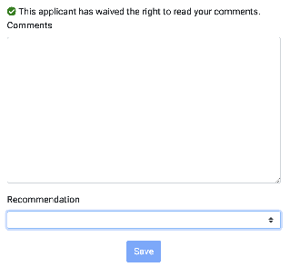

## **Coursework**

For the first ~2 years of the PhD program, you will take seven graduate courses across three of four groups (see [list here](https://www.cs.washington.edu/academics/phd/process#reqs)). Despite your best instincts and contrary to all previous educational experiences you’ve had, your grades are largely meaningless[^15]. Instead, what matters is *what* you learn in these courses and *how* these learnings translate to your research and career. With only 10-week quarters, classes are but a cursory introduction to material anyway.

In contrast, I expect you will learn more through performing research—reading literature, building systems, conducting data analysis, working with your peers, going on internships, and attending talks/conferences than you will from classes. Plus, this is the type of lifelong learning required for any research career. And ultimately, your time in graduate school will be assessed not by your grades but by your research performance and impact.

I am not against PhD coursework; I am a teacher after all! 😀 Benefits include: stretching your thinking, building initial skillsets, developing rapport with peers, and providing an awareness and knowledge of CS subdisciplines. Moreover, some of your course projects may lead to interesting research—indeed, both [BodyVis](https://makeabilitylab.cs.washington.edu/project/BodyVis/) and [HandSight](https://makeabilitylab.cs.washington.edu/project/handsight/) started this way! But it is a mistake to treat your PhD coursework similar to your undergrad experience: focus on learning, on advancing your skills, and, whenever possible, draw links to and double dipping with research.

Talk to fellow students (and me) for advice on which courses to take.

### *Seminars*

The Allen School has a rich history of offering 1-2 credit research seminars—which are focused on paper reading + discussion—and colloquiums, which include guest speakers and distinguished lecturers. Both the seminars and colloquiums are great opportunities to stretch your thinking, engage more deeply with new research topics, and, particularly for the seminars, learn how to analyze and discuss research texts.

However, your *time* is your most valuable asset. You must spend it wisely. There are simply too many possibilities. I encourage you to limit seminar attendance to one (possibly two) seminars per quarter and no more. While I value the benefits of seminars and you should definitely take them, my concern is “*death by a thousand cuts*”—you will simply become too bogged down by seminars, which require \~2-3 hours per week (\~1-2 hours to read and think about a paper and 1 hour to attend the seminar itself).

In short, I suggest:

* Attending DUB seminar (requires no prep, provides access to a breadth of HCI topics and speakers, and includes food)

* Finding one research seminar that best aligns with your interests and dedicate yourself to fully participating (read each paper, engage in discussion)

* For 1st-year PhD students, registering and attending CSE 519 and 520 (aka colloquium) is strongly encouraged by the Allen School

In addition, UW and its various colleges/departments often attract top scholars to give talks, so there will be a variety of unplanned talks that you will likely want to attend per quarter. We also suggest attending job talks, especially from senior PhD students, as they represent the culmination of graduate work, are often filled with exciting content, and demonstrate how to frame and present ~5 years of research. See our [Academic Job Talks](#academic-job-talks) section for more detail.

### *Research Credit Classes*

* **CSE 600: Independent Study or Research.** CR/NC only. For BSMS and pre-quals PhD students.

* **CSE 800: Doctoral Dissertation.** CR/NC only. For post-quals PhD students.

The grading system allows us to assign a numeric grade for 600/800 but these courses are established as Credit/No Credit. We have been asked **not** to be grading them using the numeric scale. Note that **CSE 700: Master's Thesis** also exists. We do not use this course as part of our grad curriculum so if someone is registered for CSE 700 it's likely a mistake. Email grad-advising\@cs for help if you notice this.

## **Building Online Visibility**

Science is a socio-technical process. As you develop research expertise and begin publishing, you need to make your work visible and findable.

All Makeability Lab students should have their **own up-to-date academic websites** with, at a minimum, a brief bio and list of publications (with downloadable links). To help design your site, please search for examples online and/or use existing templates. For example, [my academic site](https://jonfroehlich.github.io) is built in Jekyll using the [Minimal Mistakes](https://github.com/mmistakes/minimal-mistakes) theme. You can view my [design research here](https://github.com/jonfroehlich/jonfroehlich.github.io/blob/master/DesignResearch/DesignResearch.pptx)—I personally wanted to make a clean, easily maintainable site especially since most links point back to the [Makeability Lab website](https://makeabilitylab.cs.washington.edu/). As our research area is HCI, feel free to demonstrate your creativity and personality with your website design. However, remember that design is iterative and a basic, functional site is better than no site. At this point in my career, it was most important for me to make a functional, easy-to-update site. Your needs may differ.

I also suggest having professional social media accounts where you can follow the latest research developments in your area and build visibility through online interactions. I have benefited greatly from my [Twitter account](https://twitter.com/jonfroehlich) (back when Twitter was a thing) where I have connected with students, collaborators, and learned from and been inspired by researchers I otherwise would not. Additionally, some important SIGCHI discussions happen on Facebook in the [CHI Meta](https://www.facebook.com/groups/834637469921428/) group[^16]. If you are on Facebook, I recommend joining this group. Recently, there has been movement towards Mastodon and Bluesky as well, I’m <https://hci.social/@jonfroehlich> and <https://bsky.app/profile/jonfroehlich.bsky.social>. Our lab is: <https://bsky.app/profile/makeabilitylab.bsky.social>

Finally, we suggest creating **YouTube videos** of your researcher for broader impact and appeal. See [Videos](#making-research-videos) subsection. We have our own [Makeability Lab video page here](https://www.youtube.com/channel/UCHNCPwO7WDH-Q9QG66Inwdg).

## **Attending Workshops and Conferences**

Workshops and conferences are essential to academia—they provide interactive forums for academics and industry professionals to network, communicate recent findings, learn about emergent research, foster collaborations, and nurture a sense of community.[^17] For young scholars, these venues also provide an important opportunity to meet people and increase visibility.

Whenever possible, the Makeability Lab will financially support you to attend a workshop or conference if you have a first-authored paper (including travel, accommodation, registration, and per diem). In some cases, we will support participation even without a first-authored paper. In these cases, please email me to initiate a discussion and provide rationale for why attending would be valuable to your career.

When planning travel, please be frugal: register for early-bird conference deadlines (which are significantly discounted), search for the best travel and hotel rates, and look for other ways to save costs (consider, for example, applying to be a student volunteer and have your registration waived). We also ask that you search for a roommate, either a fellow UWer or, perhaps, another connection from the community. For lodging, airfare, per diem, and other travel-related policies, see the [UW Travel Services webpage](https://finance.uw.edu/travel/policyindex). We must follow official policy.

Please also see the [Reimbursement section](#purchases-and-reimbursements).

Serving as a student volunteer is a helpful way to save budget, participate in a conference without a first-authored paper, and network and work with other student volunteers. I am still friends with some of the people I SV’d with back in 2007 and 2008!

### *Travel Grants*

Both the Allen School and UW provide some travel grant opportunities. Our lab has been historically quite successful in receiving these grants.

The [Allen School Travel Grant application](https://www.cs.washington.edu/academics/phd/handbook/travel-grants) is available year-round and provides up to \$500 per individual request.

The UW also provides a [Travel Grant](https://depts.washington.edu/gpss/funding/travel-grants/) of up to $300 for travel in the US, $500 for international, and $300 for virtual attendance. Please read the [travel grant webpage](https://depts.washington.edu/gpss/funding/travel-grants/) and their [evaluation rubric](https://depts.washington.edu/gpss/wp-content/uploads/2021/09/Travel-Grants-Rubric-2020-2021-Updated.pdf). For the worktag information, [please see this document](https://docs.google.com/document/d/1L4G6qhXrIXMzRmFJxnHiMPHvqgzGruievQIpVESYxNE/edit).

## **Internships**

In the Makeability Lab, we strongly encourage internships. Internships allow you to experience industry-based research, learn from a new group and culture, work on new problems, forge an identity separate from your advisors, and expand your professional network—including both full-time employees as well as fellow interns.[^18] In CS, internships are plentiful and well-compensated—you may earn (nearly) as much in a 3-month internship as you do the rest of the academic year.

When I was a PhD student, I was fortunate to intern at Intel Research (3x), Microsoft Research, and Telefónica Research where I worked with and learned from an amazing set of folks including Mike Y. Chen, Ian Smith, Sunny Consolvo, Beverly Harrison, John Krumm, and Nuria Oliver. I also established or strengthened friendships with interns like Steven Dow, Saleema Amershi, Scott Saponas, Neal Lathia—who’ve all gone on to be tech leaders[^19]. These connections can last throughout your career!

Internships can potentially delay your graduation in that they may take you away from your dissertation research—an intellectual deviation which is incredibly fruitful and worthwhile. If you can manage this, I believe the career benefits outweigh the costs.

Some questions to ask yourself and reflect on:

* Why do you want to do a PhD internship with this specific company and group?

* Who will be your direct supervisor? This is critical as you will likely work closest with them, and they will fundamentally shape your experience and learning. Additionally, they may become an important advocate for your career—maybe a letter writer.

* How have previous interns fared in said group with said person? Can you reach out to them to discuss what their experience was like? What do research interns do? What are the expectations? What is the lab culture and supervisor like?

* What kind of internship do you want? Something purely research-focused with an expectation of executing research and producing a top-tier scientific publication with 10-12 weeks? Or something development focused like a research engineer?

### *When should you intern?*

While each student is different and should seek internships that align with their career goals, I generally recommend interning between years 2 and 5. If you intern too early, I think you lack experience to fully contribute to and benefit from a research lab (internships are short!). If you intern too late, you’ll want to be focused on finishing your dissertation work.

For your first summer in the PhD program (between years one and two), I recommend *not* interning and, instead, working closely with your advisor on a research project (contingent, of course, on funding availability). This has multiple benefits, including strengthening ties and work rapport with your advisor and lab colleagues and digging deeper into research that may be your quals or dissertation projects. In addition, for some top industrial research groups, they generally seek interns with research experience and a proven track record (*e.g.,* they are not particularly interested in training an intern from the ground-up—a privilege of top labs).

Obviously, as noted above, an internship can also provide greater financial stability and thus can and should always be considered.

### *Obtaining an internship*

Increasingly, PhD-level summer internship slots are filled in October. So, you need to start your search and application process early. I recommend the following:

* Compile an ongoing spreadsheet of industry researchers whose work inspires you and aligns with your interests. Attempt to connect with these researchers at conferences (I’m happy to make introductions).

* In October, discuss your internship goals and interests. Let’s work together to think of possibilities. Then, begin emailing said researchers about summer internship possibilities in their group. Keep the email short but make sure to include why you’re specifically interested in interning with that researcher and what value/skills you may bring to their group (try to make intellectual connections!)

## **External Academic Rotations**

Some students may also want to consider visiting another university to work with a separate academic research group. For example, Majeed Kazemitabar spent a quarter with Professor Björn Hartmann at UC Berkeley while I was on paternity leave. This led to [Bifröst](https://dl.acm.org/doi/abs/10.1145/3126594.3126658) published at UIST’17 and generated many new connections and opportunities for Majeed. The benefits of these visiting appointments are similar to PhD internships: they enable you to experience a new lab culture and project supervisor, expand your professional and personal network, and provide new opportunities for research projects and skill development. One challenge, however, is funding. So, if you would like to investigate and possibly pursue something like this, please discuss it with me.

## **Service**

Service is the backbone of science. Scientific publications, for example, are built on peer review, which requires qualified experts to voluntarily read and write assessments of submitted work. We expect all lab members to engage in service opportunities each quarter, including things like:

* **Within the Makeability Lab**, you can volunteer to work as our web administrator, social activities chair, or meeting coordinator.

* **Within the Allen School**, you can volunteer to help maintain, promote, and improve grad life and academic culture from being a [“Friday Breakfast Coordinator”](https://www.cs.washington.edu/students/orgs/gsc/officers/#fridaybreakfast) to helping review PhD applicants. Please see the [Graduate Student Officers](https://www.cs.washington.edu/students/orgs/gsc/officers/) page for more details.

* **Within UW,** you can volunteer to be on the [Graduate School Senate](http://depts.washington.edu/gpss/) or a [DUB Student Coordinator](https://dub.washington.edu/gettinginvolved.html#tab_coordinators). You could help run the DUB doctoral colloquium or participate in other campus-wide initiatives.

* **Within the research community,** as you gain experience and expertise, we expect you to routinely review papers and volunteer for organizing committees. Makeability Lab students have been web design co-chairs for UIST, accessibility co-chairs for ASSETS and CHI, and even poster/demo chairs at ASSETS. For junior students, a great way to get involved in a conference is as a student volunteer. For example, read about [student volunteering](https://chi2021.acm.org/organising/student-volunteering) at CHI and how to become one.

Taking on service responsibilities will help you grow as a leader and, especially for external service, improve your visibility in the community, which may lead to future opportunities. As Liang states, “*One reward of service is public exposure: people in the academic community get to know you and these connections are important. For example, I received my first CHI paper review request from Stefanie Mueller[^20]* *in 2015 because I had many interactions with her as a fellow student volunteer at CHI’14. Later, we collaborated on a computational fabrication literature visualization tool called* *[FabGalaxy](https://hcie.csail.mit.edu/fabpub/fabgalaxy/).*”

# **Your Job Search**

In your last year of graduate school, you will perform a “job search”—which will differ depending on what kind of position you seek: tenure-track faculty, teaching faculty, industry research, engineering, startup, *etc.* Although this formally happens in your Nth year, your job search culminates all of your prior experiences and builds off of the research connections, collaborations, and networks. If you’re interested in academia, I recommend [Professor Evan Peck’s article](https://medium.com/bucknell-hci/the-jobs-i-didnt-see-my-misconceptions-of-the-academic-job-market-9cb98b057422) on the nuances and opportunities across different types of universities.

## **Your Job Packet**

TODO: write about putting together research statement, teaching statement, and diversity statement and/or link to resources

### *Example Tenure-Track Job Packets*

Below, we provide publicly available job packets, which were collectively added by Makeability Lab members. While the job market is ever changing and has new types of emphases and requirements (*e.g.,* diversity statements), I am including my packet from 2010 in case it’s useful. If the following links go down, you can use <https://archive.org/> to find them (simply copy/paste the original url into Archive’s Wayback Machine prompt). Last updated: 2022.

* Dhruv Jain, 2022 ([Research](https://web.eecs.umich.edu/~profdj/job/Jain_Research_Broad.pdf)). Became Assistant Professor in CSE at UMich.

* Talia Ringer, 2020 ([Research](https://dependenttyp.es/materials/research.pdf) | [Teaching](https://dependenttyp.es/materials/teaching.pdf) | [Diversity](https://dependenttyp.es/materials/diversity.pdf)). Became Assistant Professor in CSE at UIUC.

* Toby Jia-Jun Li, 2020 ([Research](https://toby.li/files/Research%20Statement_Toby%20Li.pdf) | [Teaching](https://toby.li/files/Teaching%20Statement_Toby%20Li.pdf) | [Diversity](https://toby.li/files/Diversity%20Statement_Toby%20Li.pdf)). Became Assistant Prof. in CSE at UND.

* Anne Ross, 2020 ([Research](https://web.archive.org/web/20211020064059/https://homes.cs.washington.edu/~ansross/ResearchStatement.pdf) | [Teaching](https://web.archive.org/web/20211020080552/https://homes.cs.washington.edu/~ansross/TeachingStatement.pdf) | [Diversity](https://web.archive.org/web/20211020075456/https://homes.cs.washington.edu/~ansross/DiversityStatement.pdf)). Became Assistant Professor at Bucknell CS.

* Amy Pavel, 2020 ([Research](https://amypavel.com/docs/pavel-research.pdf) | [Teaching](https://amypavel.com/docs/pavel-teaching.pdf) | [Diversity](https://amypavel.com/docs/pavel-diversity.pdf)). Became postdoc at Apple Research then Assistant Professor at UT Austin.

* Amy Zhang, 2019 ([Research](https://homes.cs.washington.edu/~axz/papers/AZ_research_statement.pdf) | [Teaching](https://homes.cs.washington.edu/~axz/papers/AZ_teaching_statement.pdf) | [Diversity](https://homes.cs.washington.edu/~axz/papers/AZ_diversity_statement.pdf)). Became Assistant Professor in CSE at UW.

* Anhong Guo, 2019 ([Research](https://guoanhong.com/job/Research_AnhongGuo.pdf) | [Teaching](https://guoanhong.com/job/Teaching_AnhongGuo.pdf) | [Diversity](https://guoanhong.com/job/Diversity_AnhongGuo.pdf)). Became Assistant Prof. in CS at UMichigan.

* Yang Zhang, 2019 ([Research](https://hilab.dev/ResearchStatement_HiLab.pdf)). Became Assistant Professor in ECE at UCLA.

* [Stacy Branham, 2019](https://stacybranham.com/2019/12/18/blog-academic-job-market-pt-1-materials/). Became Assistant Professor in ICS at UC Irvine.

* [Denae Ford Robinson, 2018](http://denaeford.me/JobAppMaterials/). Became a researcher at Microsoft Research, Redmond.

* Arvind Satyanarayan, 2016 ([Research](https://arvindsatya.com/files/job-search/research-statement.pdf) | [Teaching](https://arvindsatya.com/files/job-search/teaching-statement.pdf)). Became Assistant Professor in CSAIL at MIT.

* Juho Kim, 2015 ([Research](https://juhokim.com/files/faculty-apps/JuhoKim-Research.pdf) | [Teaching](https://juhokim.com/files/faculty-apps/JuhoKim-Teaching.pdf) | [Diversity](https://juhokim.com/files/faculty-apps/JuhoKim-Diversity.pdf)). Became Assistant Prof. in iSchool at KAIST.

* [Jon E. Froehlich, 2010](https://web.archive.org/web/20130421012821/http://www.cs.umd.edu/~jonf/cv/JonFroehlich_JobPacket2010.pdf). Became Assistant Professor in CS at the UMD, College Park.

* [Björn Hartmann, 2008](https://people.eecs.berkeley.edu/~bjoern/app/). Became Assistant Professor in EECS at UC Berkeley.

## **Academic Job Talks**

Job talks are a unique type of talk: you have 45-50 minutes to describe your PhD research, its contributions and (potential for) impact, and to demonstrate your mastery of complex material and your ability to explain it either to a broad audience of students, staff, and faculty. Unlike conference talks, which are often attended by members within the same or similar discipline (*e.g.,* HCI, ubicomp), job talks are attended by entire departments across all sub-disciplines (*e.g.,* theory, machine learning, systems). Job talks are used not just to evaluate your research but your ability to explain it and, for better or worse, your potential as a teacher.

As with other parts of your job package, I am happy to work with you on your job talk. I would estimate that producing a high-quality job talk takes ~1.5-2 weeks, including initial outlining, drafting slides, giving practice talks, iterating, and giving more practice talks. To save some effort, you should be able to reuse previous slides from conference talks, dissertation proposal, *etc.* But know that a job talk is fundamentally different, so be careful to select the appropriate level of detail.

### *Example Job Talks*

To learn how to give a good job talk, it’s helpful to study examples—both the good and the bad.

As one helpful resource, the Allen School maintains an [archive](https://www.cs.washington.edu/events/colloquia/search) of all previous job talks dating back to 1996; however, they are not clearly marked as job talks and instead, are generically called colloquium talks. Moreover, not every talk includes a publicly accessible video. Still, if you know when a HCI scholar entered the job market, you may be able to find their Allen School job talk in the [archive](https://www.cs.washington.edu/events/colloquia/search). Other universities have similar archives or feeds of prior talks. And you might be able to find job talks on YouTube. So, start sleuthing and studying what makes for a good job talk!

Here are some helpful examples. Talks are in reverse chronological order:

* TODO: it would be really great to highlight some other excellent job talks here, let me know if you have some.

* **[Stefanie Mueller](https://www.cs.washington.edu/events/colloquia/search/details?id=2845)**[, Interacting with Personal Fabrication Machines](https://www.cs.washington.edu/events/colloquia/search/details?id=2845), Feb 25, 2016. Stefanie was a PhD student at Hasso Plattner institute in Germany and is now a professor at MIT.

* **[Chris Harrison](https://www.cs.washington.edu/events/colloquia/search/details?id=1318)**[, Interacting with Small Devices in Big Ways, Allen School Talk,](https://www.cs.washington.edu/events/colloquia/search/details?id=1318) Mar 7, 2013. Chris was a PhD student at CMU and his job search took him back to CMU as a professor.

* **[Michael Bernstein](https://www.cs.washington.edu/events/colloquia/search/details?id=1172)**[, Crowd-Powered Systems, Allen School Talk](https://www.cs.washington.edu/events/colloquia/search/details?id=1172), Feb 28, 2012. Michael was a PhD student at MIT and his job search resulted in a Stanford professorship.

### *My Job Talks*

I’ve prepared and given two sets of job talks: the first, for my original job search as a PhD student in 2010-2011, which resulted in my CS professorship at UMD and, second, for my job talk to return to UW as a professor in 2016-2017[^21]. These are two vastly different types of talks: one is from a student and the other is from a late-stage assistant professor.

* My original job talk from 2011 entitled *Sensing & Feedback of Everyday Activities to Promote Environmentally Sustainable Behaviors*. Here are the slides ([PPTX](https://makeabilitylab.cs.washington.edu/media/talks/Sensing_and_Feedback_of_Everyday_Activities_to_Promote_Environmentally_Sustainable_Behaviors_oMTV0bC.pptx), [PDF](https://makeabilitylab.cs.washington.edu/media/talks/Froehlich_SensingAndFeedbackToPromoteEnvironmentallySustainableBehaviors_VirginiaTechSeminar2012_Z4o4uFa.pdf)). I was fortunate to present the talk ~16-20 times. Here’s a [video from Columbia University](https://youtu.be/PZxtoy16mS4) and [another from the University of Michigan](https://youtu.be/yiBN4iu7hOk). For the latter, my laptop crashed (also, their screen recorder did not properly capture my slides).

* My UW job talk entitled *Making with a Social Purpose* ([video](https://youtu.be/c79axOoeRIs), [PPTX](https://makeabilitylab.cs.washington.edu/media/talks/Froehlich_OverviewTalk_v3.5-PostTalkEdits.pptx), [PDF](https://makeabilitylab.cs.washington.edu/media/talks/Froehlich_MakingWithASocialPurpose_2016.pdf)) from 2017.

# **Makeability Lab Resources**

As lab PI, I want to provide you with the resources and equipment necessary to do your research, fulfill your potential, and be successful. If you need something, please ask. I will work with you on a solution.

## **Communication**

We primarily use Slack and email for communication:

* **Mailing me.** If something is important and you want me to add it to my work queue (*e.g.,* give feedback on a design mock, review a paper draft), please email me at <jonf@cs.uw.edu>. You can also ping me on the Makeability Lab Slack. It’s best to include a deadline so I can prioritize when to provide feedback. Please follow-up if you do not hear back. I don’t mind!

* **Mailing lists.** We have multiple Makeability Lab mailing lists. For current PhD students, I will often email announcements or forward opportunities to <makeabilitylab-grad@cs.uw.edu>. We also have a general <makeabilitylab@cs.uw.edu> that goes to all active students (high school, ugrad, grad) and <makeabilitylab-alumni@cs.uw.edu>.

* **Slack.** For synchronous communication and more informal chats, we use Slack: [https://makeabilitylab.slack.com](https://makeabilitylab.slack.com/). If you’re on the Project Sidewalk team, please join both the Makeability Lab Slack and the Project Sidewalk Slack: <https://projectsidewalk.slack.com>.

* **Makeability Lab website.** We post all projects and papers to the [Makeability Lab website](#lab-website). When you join the lab, you should get added to the lab website.

## **Lab Space**

The Allen School is privileged with lab space, which brings choice and opportunity. Ideally, to build rapport between us, we would all work in the same lab space. I realize, however, that preferences and needs differ. For example, some of us work with hardware, others do not.

There are two hardware/fabrication lab spaces. You need to sign up for training to use this equipment. Email [Alexander Lefort](mailto:aalefort@cs.washington.edu) and sign up for the [fablab mailing list](https://mailman.cs.washington.edu/mailman/listinfo/fablab).

* The **Ubiquitous Computing Lab (Ubicomp Lab)** in the Allen Center (CSE 605 & 615). I moved my office to CSE642 specifically to be close to the UbiComp Lab. My preference is that you use this as your primary lab space given its proximity to my office and the opportunity to intermix with [UbiComp Lab](https://ubicomplab.cs.washington.edu/) students.

* The **FabLab** in the Gates Center (CSE2 G15)

And two HCI lab spaces:

* The **HCI Lab** in the Allen Center (CSE 591)

* The **HCI Lab** in the Gates Center (CSE2 283)

### *Lab Access*

To request lab access, send an email to <cardkey@cs.washington.edu> and CC me with the specific location (e.g., UbiComp Lab in CSE605) with a specific date range.

### *HCI/UbiComp Lab Spaces*

#### The Ubicomp Lab (CSE 605)

####  Figure. Pictures of the Ubicomp Lab workspace (CSE605) and neighboring fabrication space (CSE615). You can access CSE615 via CSE605.

The UbiComp Lab (CSE 605) has 21 assigned seats for research assistants and a connected fab lab (CSE 615) with 3D printers (*e.g,* Stratasys F370, F120, Form 3, and Ultimaker 3), laser cutters (*e.g.,* Glowforge), a reflow oven (LPKF ProtoFlow S), and soldering stations.

* To request a seat, please email me so I can work with Shwetak on lab assignments ([the seat chart is here](https://docs.google.com/spreadsheets/d/10UUThYXuY6JO0E-Qzcfw2uTfiYEIs68ELPVF-QbUrdc/edit#gid=0)).

* To request keycard access to the fab lab side (CSE615), please email <cardkey@cs.washington.edu> and CC me

#### The FabLab (CSE2 G15)

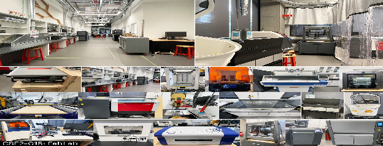\
Figure. Pictures of the FabLab in CSE2 (G15). You need training to use these spaces and some equipment requires additional training.

The FabLab (CSE2 G15) is not intended as a fulltime workspace but rather a place to drop in for specialized fabrication projects. Besides three desktop 3D printers (2 Ultimaker 3 extended and 1 Form 3) and a laser cutter (Glowforge), this lab offers more advanced equipment options. To name a few (see figure below): knitting machine Shima Seiki SWG091N2, Stratasys-FDM 3D printers F170/f120, Desktop Metal 3D Studio printer, Stratasys Objet 30 polyjet 3D printer, Trotec Speedy 300 laser cutter,  LPKF Protolaser S4 PCB laser cutter, ShopBot PRS-Alpha CNC router, Drill Press Powermatic PM2800B, and Tablesaw Sawstop JSS Pro. Please check the full list of equipment on [the official website of FabLab](https://fablab.cs.washington.edu/machines/). To use this equipment, please reach out to the lab manager Alexander Lefort (<aalefort@cs.washington.edu>) for training first.

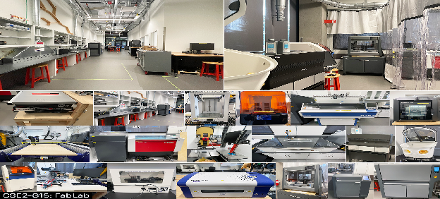\
Figure. Pictures of the FabLab equipment in CSE2 (G15).

#### Allen Center HCI Lab (CSE 591)

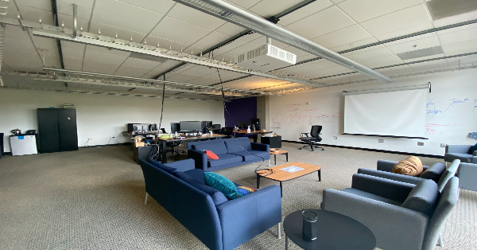Figure. A picture of the Allen Center HCI Lab (CSE591) with ideation spaces and a few desks for working..

The Allen Center HCI Lab (CSE 591) provides a casual and collaborative ideation space with a whiteboard, projection screen, and couches as well as eight desks for graduate students and postdocs. Currently, the lab is mostly inhabited by Professor Reinecke and Fogarty’s students.

#### Gates Center HCI Lab (CSE2 283)

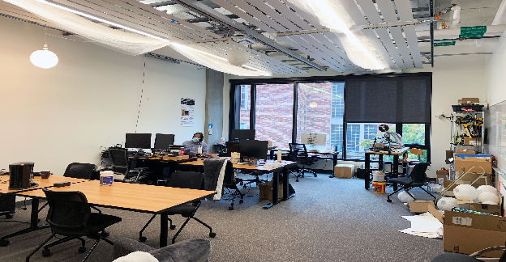\
Figure. A picture of the Gates Center HCI Lab (CSE2 283) with a hardware workshop, ideation spaces, and a few desks for working.

The Gates Center HCI Lab (CSE2 283) provides a casual and collaborative ideation space with a large whiteboard, a mini-workshop for tinkering on hardware projects, and couches as well as six desks for graduate students. Currently, the lab is mostly inhabited by Professor Mankoff’s students.

## **Equipment and Software**

By far, the most expensive lab costs are not equipment but people (as it should be!). Thus, from a raw productivity point-of-view, it only makes sense to supply you with the equipment you need to be successful. As my father always says, “*invest in the right tool for the job.*” Perhaps the most critical equipment resource is a laptop, discussed below. But we are happy to support you with other equipment if it’s necessary for your research (and we have the budget).

### *Software*

Most software that we commonly use in the lab is free: [VS Code](https://code.visualstudio.com/), [Git](https://git-scm.com/), and Google Drive.

We write most of our papers in Microsoft Word and Overleaf. You can get Office 365 (*e.g.,* Word, PowerPoint) through UW for free ([link](https://itconnect.uw.edu/tools-services-support/software-computers/productivity-platforms/microsoft-productivity-platform/)). For Overleaf, please remember to start your projects with your cs.uw\.edu accounts as the Allen School provides a professional account for all of us ([link](https://www.overleaf.com/edu/uw)). Note that you may need to email support\@cs to make sure you are appropriately added to the “CSE Group” for Overleaf. If not, you may not get Overleaf pro account features. Please ask on Slack #activegrads or #general if you’re confused.

For UI mockups and figure making for papers, students prefer [Figma](https://figma.com/) or Adobe Creative Suite. Unfortunately, the latter is expensive. If you only need to use Adobe tools infrequently—*e.g.,* to make a PDF accessible—then you can use the Adobe Creative Cloud machine in CSE622, which is a shared resource.

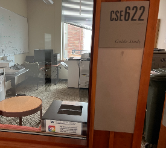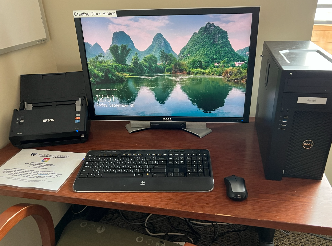

### *Laptops*

When you arrive as a first-year PhD student, the Allen School will provide you with a new, high-performance laptop. You will receive an email from the Allen School IT staff with options. In Fall’23, for example, this included either:

* **Mac Laptop (MacOS):** Macbook Pro 13", M2 chip with 8-core CPU and 19-core GPU ARM architecture, 16GB ram, 256GB SSD, webcam, bluetooth, 2560x1600, 3yr AppleCare+ for Schools warranty, Color: space gray. (As a comparison, in Fall’21, we offered a Macbook Pro 13", M1 chip w/8-core CPU & 8-core GPU ARM architecture, 16GB ram, 256GB SSD)

* **Lightweight PC Laptop (Win10/Linux):** Dell Latitude 5430, 14",12th gen, i7-1265U 3.60GHz (turbo to 4.8GHz), 32GB ram, 512GB SSD, webcam, bluetooth, 1920x1080 Intel Iris Xe graphics, 3yr warranty. (As a comparison, in Fall’21, we offered a Dell Latitude 5420, 14", 11th gen i7-1185G7 4C 4.0GHz (turbo to 4.8GHz), 16GB ram, 256GB SSD)

You also have the option of receiving \$1500 credit towards an “off-menu” choice and working with your PhD advisor (me) towards the purchase of an alternative. Please choose a device that works for you. If you’ve recently invested in a laptop, it may be worthwhile deferring for a year.

As you progress through the PhD program, it may be necessary to refresh your laptop. Again, I am happy to work with you on this via a case-by-case basis.

### *Other Hardware*

From Arduinos to AR Glasses, we are happy to support you with the equipment you need for your research. We also have equipment to share or borrow, which we track [here](https://docs.google.com/spreadsheets/d/1hcGdYMZGkV-_Yc1L2qZhdzOlP71nvI7FrsVtdBFtam4/edit#gid=0). Before ordering new equipment, please clear it with me.

### *File Server*

We have a Makeability Lab file server for storing large datasets and archiving projects. The server is accessible via any of the “research cycle” servers with a [CSE NetID](https://www.cs.washington.edu/lab/accounts), including: recycle.cs.washington.edu, bicycle.cs.washington.edu, and tricycle.cs.washington.edu. Once logged in, cd to /projects/makeabilitylab.

Note: to support open science, please consider putting your datasets either in our [Makeability Lab GitHub](https://github.com/makeabilitylab) or our [Hugging Face account](https://huggingface.co/makeabilitylab) rather than just on the file server (the file server is great as a backup).

## **Makeability Lab Servers**

We have two lab servers: makelab1 (acquired in 2019, 10TB) and makelab2 (acquired in 2025—40TB; 38TB effective) plus Hyak nodes.

|                 | `makelab1.cs.uw.edu`                        | `makelab2.cs.uw.edu`                        |
| :------------------- | :------------------------------------------ | :------------------------------------------ |
| **Hardware Model**   | Supermicro SYS-6029U-E1CR4                  | Supermicro SYS-620U-TNR                     |
| **Operating System** | Rocky Linux 9.8 (Kernel 5.14.0)             | Rocky Linux 9.8 (Kernel 5.14.0)             |
| **Processor (CPU)**  | Intel Xeon Silver 4214 @ 2.20GHz (48 cores) | Intel Xeon Silver 4310 @ 2.10GHz (48 cores) |
| **System RAM**       | 187 GB                                      | 188 GB                                      |
| **Graphics (GPU)**   | None / Not Detected                         | 1x NVIDIA A40 (48 GB VRAM)                  |

### *Hyak*

For machine learning experiments, we also have a Hyak node. PhD student, Jared Hwang, has [written up Hyak documentation for our lab](https://docs.google.com/document/d/1QJDKlZqjmgSloOOrXLbGLvTlA136suVYVDJdvGyjxHk/edit?tab=t.0#heading=h.2nsyqt83uxrn) and helps run the #hyak-use channel on the ML Slack.

### *Tillicum*

I have also just signed us up for [UW Tillicum](https://uwconnect.uw.edu/it?id=kb_article_view\&sysparm_article=KB0036077), which is UW’s “pay-as-you-go” GPU cluster.

### *Laptops for UGrads*

We often have a handful of laptops that we can lend to our ugrad RAs or visiting researchers. Check the [spreadsheet here](https://docs.google.com/spreadsheets/d/1hcGdYMZGkV-_Yc1L2qZhdzOlP71nvI7FrsVtdBFtam4/edit#gid=0). The [accounts and passwords are here](https://docs.google.com/document/d/1DOwHdb1LJ4O5EooHoY_R0MzDalpUzkmnnQWdRBXjaK8/edit).

## **Lab Website**

Our lab website is at <https://makeabilitylab.cs.washington.edu/> and is built in Django (Python). All code is open source and available on GitHub ([link](https://github.com/makeabilitylab/makeabilitylabwebsite)). We currently have over 100 open issues. If you like web development and/or have Django experience, we would greatly appreciate your help. 🙏

If you are a grad student or research scientist in our lab, you should:

* Make [project pages](https://makeabilitylab.cs.washington.edu/projects)

* Add in [news](https://makeabilitylab.cs.washington.edu/news/)

* Add your [publications](https://makeabilitylab.cs.washington.edu/publications/)

You can use the gradmin account (Slack us for the password). Xia Su is currently our lab website manager. He can help you!

## **Lab Photos**

Our lab history and time together is captured (in part) by our collection of photos and videos stored [here](https://drive.google.com/drive/folders/147mn1qd-Bw6duTxwjugnGQ0mwLg8zsYT?usp=sharing) (this is a private link for Makeability Lab members only).

## **Lab GitHub**

We use GitHub religiously for hosting and coordinating our research projects. Your code can begin in a private repo but should be released on the [Makeability Lab organization](https://github.com/makeabilitylab), when possible, when your research is published. One exception is Project Sidewalk, which exists [as its own GitHub organization](https://github.com/ProjectSidewalk).

Generally, we aim to support open science, which means releasing our code and datasets for scientific replicability and to enable future research. [README.md](http://README.md) should have clear instructions, compelling visuals, and descriptions on how to replicate the scientific work. Please also include a citation (*e.g.,* if you use our code, datasets, or ideas in our paper, please cite us as \<include bibtex>). Some good model repos are:

* [CookAR](https://github.com/makeabilitylab/CookAR)

* [RampNet](https://github.com/ProjectSidewalk/RampNet)

Kind reminder: you should *never* write research code without continuously backing it up (ideally, using a version control system like Git) but, in the worst case, Dropbox, GDrive, Box, iCloud, *etc.*

## **Lab Logos**

Here are links to logos for the [Makeability Lab](https://www.dropbox.com/sh/ol8u5o8sy4tw89g/AACTn2B61RVXYKs3zh4yWioJa?dl=0), the [Allen School and UW](https://www.dropbox.com/sh/iwdvv1ypc72avuu/AAAIk3lzWoxLyBkC26GuAEYsa?dl=0), and [UW CREATE](https://www.dropbox.com/scl/fo/7o1d2fbebi0kvmh2grcnu/h?rlkey=y9577tst7wfc2c3mz3w5ygeyz\&dl=0). The logos for Project Sidewalk are in the [Project Sidewalk Design GitHub repo](https://github.com/ProjectSidewalk/Design). Logos should be used on the first and last slide. Here are some [ideas/templates](https://www.dropbox.com/scl/fi/vfi48v4tma6wzmet77v68/MakeabilityLab-TalkBranding.pptx?rlkey=p38fu8uz23x22zruudpbbppax\&dl=0).

## **Lab IRB Applications**

All “human subjects” studies in our lab must be reviewed by [UW’s Institutional Review Board (IRB)](https://www.washington.edu/research/hsd/) in their Human Subjects Division. As a graduate student, you will lead the preparation of our IRB application with feedback and vetting from me. Fortunately, UW uses an online submission system called [Zipline](https://www.washington.edu/research/hsd/zipline/).

To assess whether your planned study needs IRB, the UW’s IRB website has a four-step process. See [Do I need IRB Review?](https://www.washington.edu/research/hsd/do-i-need-irb-review/) If in doubt, talk to me—I’ll probably encourage you to email (<hsdinfo@uw.edu>) or call the IRB offices directly.

To help you prepare your own IRB application, please see our [lab archive here](https://drive.google.com/drive/folders/1PU6bj_m5UPIfmrGOnkwD5JURqsvZyDW2?usp=share_link) (this is a private link for current Makeability Lab members).

## **Accessing CSE Linux Servers**

The Makeability Lab website, Project Sidewalk, and even your academic website runs on CSE Linux servers. It’s fastest and easiest to setup an SSH key to quickly SSH into these servers.

### *Mac/Linux*

On Mac or Linux, open up the terminal. Run:

\> ssh-keygen

Hit \<Enter> to accept the defaults (no passphrase needed). The key will be saved in \~/.ssh/id\_rsa and the public key in \~/.ssh/id\_rsa.pub.

Then, again in terminal, run:

\> ssh-copy-id user\@host

So, for example, I would run

> ssh-copy-id <jonf@recycle.cs.washington.edu>

Here, you’ll be asked to login for the final time with your password. Once this completes, you should be able to do this:

> ssh <jonf@recycle.cs.washington.edu>

And it will succeed without having to enter a password.

### *Windows*

On Windows, open up Windows Powershell and type:

\> ssh-keygen

Hit <Enter> to accept the defaults (no passphrase needed). The key will be saved in $env:USERPROFILE/.ssh/id\_rsa and the public key in $env:USERPROFILE

/.ssh/id\_rsa.pub.

Unlike on Mac/Linux, the command ssh-copy-id does not exist, so to move your key onto the server, you need to do something else:

\> type \$env:USERPROFILE\\.ssh\id\_rsa.pub | ssh {IP-ADDRESS-OR-FQDN} "cat >> .ssh/authorized\_keys"

So, in our case, we would type:

\> type \$env:USERPROFILE\\.ssh\id\_rsa.pub | ssh recycle.cs.washington.edu "cat >> .ssh/authorized\_keys"

The server recycle.cs.washington.edu will ask you to login one last time with a password. Once you do that, you should be able to login without one.

# **Funding**

Funding is critical to the viability and success of the Makeability Lab and to your PhD. I write grant proposals to fund my summer salary, your RAships (PhD salary, tuition, benefits, and stipend), lab equipment, and study costs (*e.g.,* participant remuneration). For budget numbers and eGC1s, please see the [SAGE admin tool](https://sage.admin.uw.edu/ngEra/uwnetid/sage/budgets) (internal only).

## **Fundraising**

*Update (2025): Science funding in the US is under attack and fundraising has never been more challenging and competitive. The UW and the Allen School have restricted spending and encouraged unprecedented frugalness. We must all work together to fund our lab and scientific advancements!*

Although I expect all lab members to contribute to fundraising, as the lab PI, it is ultimately my responsibility to obtain funding and manage lab finances. Writing research proposals, however, is difficult, time consuming, and effortful. What’s worse, the selection process is highly competitive and often unpredictable. It may take~6-8 weeks (or more!) to write a high-quality NSF proposal. As an example, I wrote my [NSF CAREER grant](https://www.nsf.gov/awardsearch/showAward?AWD_ID=1834629\&HistoricalAwards=false) in \~3 months—two full-time summer months in 2015 for the initial submission, which was rejected, and another \~4 weeks in 2016 on a full rewrite, which was thankfully accepted.

Despite funding competitiveness, I am grateful that our lab has a consistent and strong record of fundraising from the [NSF](https://www.nsf.gov/index.jsp)[^22], the DoD’s [Clinical and Rehabilitative Medicine Research Program](https://cdmrp.army.mil/dmrdp/jpc8crmrp), the [PacTrans Consortium](http://depts.washington.edu/pactrans/), [UW CREATE](https://create.uw.edu/), [UW’s Global Innovation Fund](https://www.washington.edu/globalaffairs/gif/), and [the UW Reality Lab](https://realitylab.uw.edu/) as well as corporate sponsors like Google, 3M, Facebook, Nokia, and Microsoft. I was also honored to receive a [Sloan Fellowship in 2017](https://news.cs.washington.edu/2017/02/27/uw-cses-ali-farhadi-and-jon-froehlich-win-sloan-research-fellowships/).

Like with research papers, I prefer submitting a fewer number of grants per year and focusing on *quality* rather than *quantity*.

I am happy to share any grant that I’ve written. If you are interested in grant writing and want to be involved in the process, please let me know.

Figure. We are grateful to our funding sponsors. Without funding, we could not perform our research. Image from 2024. See <https://makeabilitylab.cs.washington.edu/>.

### *Funding Types*

There are two types of research funds at UW: *grants* and *unrestricted gifts*[^23]. Grants are typically tied to specific projects while unrestricted gifts—often from corporate partners—are more permissive. Most of our lab money comes from grants. Universities charge a “tax” on all incoming research funds (this is fundamental to their business model but also allows a university to pay for staff personnel, buildings, services): the overhead rate on grants at UW is 55.5% and gifts is 5%.

Regardless, it is important that we respect these investments and utilize funding wisely.

## **Annual Reports**

As you might imagine, funding agencies like the NSF, NIH, or DOD have a reporting infrastructure to ensure that fundees are productive, spending the money as proposed (within some degree of flexibility), and to receive timely updates on research impacts and challenges. While occasionally onerous, these required reports are a good thing—they help the system stay accountable.

To help you understand what an annual report to a federal funding agency looks like, I’ve created an [NSF Annual Report Template](https://docs.google.com/document/d/1HqddhWBLbVBi_yyQ1lh7rxdv2oAfQLQiJnshhGvvthw/edit#) with copy/pasted form fields from the NSF Annual Report webform. The report is divided into five high-level sections: *accomplishments, products, participants* (*i.e.,* who was funded), *impact,* and *changes/problems*. Within each section, the NSF asks between 5-10 questions. Depending on the project, it can take my collaborators and I between 1-3 days to complete a report.

It is a privilege to receive government funding and other support for our research. Let us honor that funding and hold ourselves to the highest standards when completing the work.

## **No Cost Extensions**

NSF awards are eligible for extensions beyond the original expiration date; these extensions termed “no-cost extensions” require filing paperwork and NSF approval. From the [NSF webpage](https://www.nsf.gov/awards/request-a-change#no-cost-extensions-870):

*A no-cost extension extends a project period beyond the original project end date; there is no additional funding provided.*

*Your award may be eligible for a single grantee-approved no-cost extension for up to 12 months when there are unspent funds remaining in your award account and additional time is needed to successfully complete the original scope of the work.*

*Additional no-cost extensions and other special creativity extensions may be approved by NSF should your project meet certain criteria.*

*Consult* *[PAPPG VI.D.3.c](https://www.nsf.gov/policies/pappg/24-1/ch-6-nsf-awards#ch6D3c)* *for a detailed explanation of the circumstances that must be met for a no-cost extension.*

*Follow the* *[instructions on Research.gov](https://www.research.gov/common/robohelp/public/WebHelp/Notifications___Requests.htm)* *on how to submit a no-cost extension notification or request online.*

We have some [example no-cost extension requests here](https://docs.google.com/document/d/1xhObPrUI80DeQHoWZJOQybrMLbt5f__m11wtRhF72D4/edit?tab=t.0). Historically, the first request is generally accepted.

## **PhD Student Costs[^24]**

In the American university system, advisors pay students via Research Assistantships (RAs), which are typically funded by grants. In the Allen School, we offer three years of guaranteed funding via Teaching Assistantship (TA) or Research Assistantship (RA), excluding summers ([see policy](https://www.cs.washington.edu/academics/phd/handbook/funding#policies)). If I do not have RAship funding for you or you do not have a fellowship, you will TA (see [TAships](#taships) section).

If you TA or RA, you are an *Academic Student Employee* (ASE) and represented by the [United Auto Workers (UAW) union Local 4121](https://hr.uw.edu/labor/academic-and-student-unions/uaw-ase). Your salaries are negotiated by UAW. All salary information is published publicly here: [TA/RA Salaries](https://facstaff.grad.uw.edu/advising-resources/funding-management/administering-assistantships/ta-ra-salaries/). For example, [here](https://facstaff.grad.uw.edu/wp-content/uploads/2023-24_variable-RA-salary-schedule.pdf) is the pay rate salary scale for RAs in Computer Science, HCDE, and Computer Engineering. But this is only part of the story…

Calculating RA costs is complex because it includes salary, benefits, overhead, and tuition. When I write a grant, I need to obtain money to cover *everything* (not just your salary). Let’s define each of these costs before providing a cost breakdown.

* **Salary.** The rate I pay and that you receive for your salary. Your [pay rates](https://www.cs.washington.edu/academics/phd/handbook/ase-rates) are covered by a contract between the UW and a union: the United Auto Workers (UAW).

* **Benefits.** The benefits you receive such as healthcare and dental (yes, healthcare and dental are separate in the American insurance industry).

* **Overhead.** One way a university makes money is by “taxing” salary+benefits off of grants. This tax, often called “overhead” or “indirect costs” is 55.5% at UW (it was slightly lower at UMD). While a potential source of consternation, think of this tax as a way of paying for UW and Allen School resources like the staff, building, electricity, Internet bandwidth, and being part of a world-class research and teaching university. Note that the standard overhead on gifts is far less (around 5%).

* **Tuition**. Tuition is the cost of education. Each quarter at UW—whether or not you are specifically taking “courses”—you will enroll as a student and take independent study or research credits. These credits cost money, which again I pay for out of my grant money.

There are also two different Research Assistant (RA) levels, which are paid slightly differently depending on whether the PhD student has passed their [General Examination](https://www.cs.washington.edu/academics/phd/process/generals): RA1 for pre-general students and RA2 for post-general students.

To fund an RA1 PhD student for a full year on a federal grant (*e.g.,* from NSF or NIH) during the 2024-2025 academic year, my overall cost is **$131,742** (including $37,399 of overhead and** **$26,957 in tuition). For an RA2 PhD student, the cost increases to **$135,679** (including $38,805 overhead and $26,957 in tuition). For context, the maximum [NSF Small Award](https://new.nsf.gov/funding/opportunities/computer-information-science-engineering-core-programs/nsf24-589/solicitation) is $600,000[^25], which does not even cover one PhD student for their entire degree. The average graduate student takes \~6 years to graduate (6 years x \~$133,000 RAship = \$798,000). Admittedly, these are worst-case costs that do not factor in TAships or summer internships (see paragraph following tables below).

| PhD Funding Rates 2020-2021 |                 |                  |      |
| --------------------------- | :------------------- | :-------------------- | :-------- |
| RA1 (Pre-Generals)          | Quarter Rate         | Summer Rate           | Total     |
| Salary\*                    | $9,921 ($3,187 / mo) | $19,122 ($6,374 / mo) | \$48,885  |
| Benefits (21.6%)            | \$2,143              | \$4,130               | \$6,273   |
| Subtotal Salary + Benefits  | \$12,064             | \$23,252              | \$35,316  |
| Indirect Costs (55.5%)      | \$6,695              | \$12,905              | \$19,600  |
| Tuition                     | \$6,151              | \$6,218               | \$12,369  |
| Total                       | \$24,910 per quarter | \$42,375              | \$115,065 |

Table. A cost table for an RA1 PhD student in the Allen School calculated for the 2021-22 academic year. See newer rates (for 2024-2025) below.

| PhD Funding Rates 2024-2025 |                 |        |      |
| --------------------------- | :------------------- | :---------- | :-------- |
| RA1 (Pre-Generals)          | Quarter Rate         | Summer Rate | Total     |
| Salary\*                    | \$11,175             | \$23,244    | \$56,769  |
| Benefits (21.6%)            | \$2,090              | \$4,347     | \$10,617  |
| Subtotal Salary + Benefits  | \$13,265             | \$27,591    | \$67,386  |
| Indirect Costs (55.5%)      | \$7,362              | \$15,313    | \$37,399  |
| Tuition                     | \$6,689              | \$6,890     | \$26,957  |
| Total                       | \$27,316 per quarter | \$49,794    | \$131,742 |

Table. A cost table for an RA1 PhD student in the Allen School calculated for the 2024-2025 academic year. \*During the academic school year (the Fall, Winter, and Spring) quarters, RAs are classified as 50% full-time employees (FTE) with the idea that the other 50% is dedicated to coursework or research study credits. During the summer, RAs can be 100% FTE (but this is up to the student and advisor). Quarters are three months.

There are a couple of additional factors, which may affect costs: first, you will need to TA for some quarters (CSE requires two quarters minimum); second, you will likely intern for one or more summers, third, you may not take a full credit load during the summer for a summer RAship (minimum is 2 credits); finally, some grants—like fellowships and corporate gifts—do not allow overhead, so the indirect costs are eliminated or mitigated (5% overhead is standard here). For example, here’s a cost table for a PhD student funded on a gift fund for one quarter. Gift funds are typically quite difficult to acquire but allow me to fund a student, per quarter, at $20,479 vs. $27,316.

| PhD Funding Rates 2024-2025 (From Gift Fund) |                 |
| -------------------------------------------- | :------------------- |
| RA1 (Pre-Generals)                           | Quarter Rate         |
| Salary\*                                     | \$11,175             |
| Benefits (21.6%)                             | \$2,090              |
| Subtotal Salary + Benefits                   | \$13,265             |
| CSE Computing Recharge                       | \$525                |
| Tuition                                      | \$6,689              |
| Total                                        | \$20,479 per quarter |

### *Summer Funding*

Summer funding is confusing. In the Allen School, there are a range of options—which provides flexibility but also increases complexity, including 2.5-month appointments, 3-month appointments. 50% vs. 100% time, grad hourly, and TAships. The Allen School has no official policy but suggests that PIs take into account overall funding availability, student travel/vacation plans, and also strive for consistency across lab members. Because summers are comparatively expensive, I cannot guarantee summer funding; however, when available, we aim to provide a 2.5 month, 50% or 100% appointment.

Below, we provide an estimate of funding rates for Summer’24. Note: these change each year.

| Funding Option        | Pre-Generals \$ Estimate                                                                                                                                         | Post-Generals \$ Estimate      | Misc Notes                                                                                                                         |
| :-------------------- | :--------------------------------------------------------------------------------------------------------------------------------------------------------------- | :----------------------------- | :--------------------------------------------------------------------------------------------------------------------------------- |
| 50% RAship2.5 months | Pre-generals (5 credits):\$21,617                                                                                                                               | Post-generals (2 cr):\$19,381 | Summer pay gap, workday termination                                                                                                |
| 50% RAship3 mos      | Pre-generals (5 cr):\$38,455                                                                                                                                    | Post-generals (2 cr):\$36,852 |                                                                                                                               |
| 100% RAship2.5 mos   | Pre-generals (5 cr): \$38,455                                                                                                                                    | Post-generals (2 cr): \$36,852 | Summer pay gap, workday termination                                                                                                |
| 100% RAship3 mos     | Pre-generals (5 cr):\$45,260                                                                                                                                    | Post-generals (2 cr):\$43,913 |                                                                                                                               |
| Grad Hourly           | Hourly rates determined by union contract and set to increase; \~\$50/hr (not including overhead or fringe benefits)                                             |                           | Students must enter hours in Workday. No UPASS or health benefits provided                                                         |
| TA, 2 mos             | TAships are paid by the Allen School; however, there are very few TA slots during the summer. Includes 20% supplemental salary due to shortened academic quarter |                           | TA application opens in early May. Students must apply via the [Allen School TA Application](https://ta.cs.washington.edu/apply/). |

Table. An estimate of costs for Summer’24. All costs include overhead. The deadline to communicate offers to payroll is April 23; offers sent out to students by \~May 15th. There are lots of caveats and small details to the above. Please chat with me and the grad advising office.

## **Fellowships**

Because funding is competitive and difficult to obtain and because writing fellowship applications has important generative effects for your research—they are wonderful forcing functions to think deeply about your work, to plan out future research, and to express your accomplishments and plans to an external audience—I expect each PhD student to actively search for and apply for fellowships. The [Allen School Funding & Fellowships page](https://www.cs.washington.edu/academics/phd/handbook/funding#fellowships) lists common federal and corporate fellowships but there are many others. Let’s get creative about your funding!

Though competitive, Makeability Lab PhD students have a strong track record of applying for and receiving fellowships, including the [IBM PhD Fellowship](https://www.research.ibm.com/university/awards/fellowships.html), two [Google PhD Fellowships](https://research.google/outreach/phd-fellowship/), a [Microsoft Dissertation Grant](https://www.microsoft.com/en-us/research/academic-program/dissertation-grant/), and a [Google-CMD-IT LEAP Alliance Fellowship](https://cmd-it.org/news-recent/6-flip-phd-students-win-google-cmd-it-dissertation-fellowship-award/). During my own PhD, I was also fortunate to receive a [Microsoft Research PhD Fellowship](https://www.microsoft.com/en-us/research/academic-program/phd-fellowship/).

I am happy to work with you on your fellowship applications, including your research statement/proposal, and by writing a letter of recommendation. As you work on your application, I suggest asking for and studying past statements from others and allocating sufficient time for writing and iterating—see below for example statements. Depending on the application, you will likely need to write a 3-5 page research statement and to supply up to three letters of recommendation. This takes time.

But remember, writing these applications is *generative*. It will help you think about and plan your research.

### *Industry Fellowship Statements*

I have received the gracious permission to share the following PhD Fellowship Applications with fellow Makeability Labbers. Please keep them in confidence. In addition, I encourage you to reach out to the Grad Advising staff (<cs-grads@cs.washington.edu>) who maintain an internal archive of successful PhD fellowship applications to share.

* **Dhruv Jain,** [Sound Sensing and Feedback Techniques for d/Deaf and Hard of Hearing Users](https://drive.google.com/file/d/1Q9byEGGud6WHA88N1H5Om8qCRW9OWjDB/view?usp=sharing), MSR Dissertation PhD Fellowship, 2020

* **Manaswi Saha**, [Designing Interactive Computational Tools for Understanding Urban Accessibility at Scale](https://drive.google.com/file/d/1zUU9qd1ZSs-syMg3CSkJtWTG8aHgLnoc/view?usp=sharing), Google PhD Fellowship, 2019

* **Kotaro Hara**, [Scalable Methods to Collect and Visualize Sidewalk Accessibility Data for People with Mobility Impairments](https://drive.google.com/file/d/1inO5jStaSB4wH-yTTtVwqUB2Pq3eNhTb/view?usp=sharing), Google PhD Fellowship, 2014

In addition to the above successful applications, here are some unsuccessful attempts. Remember that the statement is only one part of a holistic review process, which also includes your overall track record of work and accomplishments, your letters of recommendation, and your fit with the fellowship opportunity. Thus, a fellowship rejection should not be narrowly seen as an outright rejection of the statement.

* **Kotaro Hara**, [Scalable Methods to Collect and Visualize Sidewalk Accessibility Data for People with Mobility Impairments](https://drive.google.com/file/d/1zbgvbgkJqbLPA6pXcgIVBefD0zjkiypB/view?usp=sharing), Google PhD Fellowship, 2013

### *Resources*

* [Advice and sample essays for graduate fellowships](http://obsessionwithregression.blogspot.com/2015/07/advice-and-sample-essays-for-rhodes.html), 2015, Professor Emma Pierson

### *The NSF GRFP*

The NSF GRFP (Graduate Research Fellowship Program) is NSF’s own funding program for STEM PhDs. According to the NSF, the purpose of the GRFP is to “*ensure the quality, vitality, and diversity of the scientific and engineering workforce of the United States. GRFP seeks to broaden participation in science and engineering of underrepresented groups, including women, minorities, persons with disabilities, and veterans*.”

Unfortunately, many Makeability Lab’ers do not qualify for the GRFP as it is limited to US citizens, US nationals, and permanent residents (I know, this is hard 😢). Additionally, you must have completed **no more** than one academic year of full-time graduate study. You can apply only once.

Again, we received permission to share the following successful NSF GRFP applications. Please do not share them outside of our group. I suggest seeking additional examples both within UW and beyond.

* **Emma McDonnell**, HCDE, wrote GRFP proposal in her 2nd year as a PhD student (2020)

  * [Redistributing Access Work: Real-Time Captioning as a Shared Responsibility](https://drive.google.com/file/d/12ZhqrgygGyU86cT1F3WY7bSbr8Te1Xtd/view?usp=sharing)

  * [Personal Statement](https://drive.google.com/drive/folders/1YmA-4gFg4PN8pHMFyG6zPVWycIlpk9S1)

* **Steven Goodman,** HCDE, wrote GRFP proposal in 2nd year as a PhD student (2019)

  * [Design and Deployment of Smartwatch-based Sound Awareness Tools for Deaf and Hard of Hearing Users](https://drive.google.com/file/d/1AcPcmlracx9j1Z9Gi4ELS8HQF-UuAS2y/view?usp=sharing)

  * [Personal Statement](https://drive.google.com/drive/folders/1YmA-4gFg4PN8pHMFyG6zPVWycIlpk9S1)

* **Avery Kelly Mack,** CSE, wrote GRFP proposal as a final year ugrad at UIUC (2019)

  * [Applications of Haptics in the Accessibility Space](https://drive.google.com/file/d/1KpGu5Owv2XnKo3KyusHakY1kPWrni9t8/view?usp=sharing)

  * [Personal Statement](https://drive.google.com/file/d/1P4VfrS1oUWKHvcfY8F4bh6Oqj0EcvRIj/view?usp=sharing)

In addition, we have received permission to share some unsuccessful NSF GRFPs. As with paper rejections, take care to note that there is “noise” in the review system. Do not conflate rejection with merit. But we can, of course, learn from studying both the successful and unsuccessful NSF GRFPs and draw our own conclusions about the strengths of each.

* **Daniel Campos Zamora,** CSE, wrote GRFP at onset of 2nd year as a PhD student (2022)

  * [Ability-Based Design for Adaptive and Accessible Physical Environments](https://drive.google.com/file/d/1ohue0fx7HreWp16mCYvOebrKPcrv4smz/view?usp=share_link)

  * [Personal Statement](https://drive.google.com/file/d/1ohue0fx7HreWp16mCYvOebrKPcrv4smz/view?usp=share_link)

  * [NSF Reviews](https://drive.google.com/file/d/1_4zqszkyBzsF43SWQKeiwqZXG4D9S7vt/view?usp=share_link)

## **RAships**

RAships are funded research positions and are often tied to specific projects. If your research is beyond the scope of my current funded grant proposals, I will likely not be able to fund you (at least not consistently). By your third year, you should have a sufficient research track record for me to write a new grant, if possible, on our work together. As noted elsewhere, you should be constantly aware of and applying for fellowships. Take charge!

Some of my PhD students have had RAship funding throughout graduate school; others have had to switch between RAship and TAship. If you are making consistent research progress, I will do my best to at least provide summer RAship funding even if you are not doing work directly related to a funded grant (I’ve been able to do this without exception since becoming a professor).

At the beginning of each year, we should openly talk about funding options for you and potential plans for RA *vs.* TAships. We should revisit these discussions roughly at the midpoint of each term, which is often when see TAships advertise on the DUB mailing lists and Slack channels

## **TAships**

Allen School PhD students are required to TA at least two courses during their PhD ([link](https://www.cs.washington.edu/students/newgrad/ta)). TAing can deepen your understanding of a topic, help you develop new relationships with professors and peers, strengthen and nurture your teaching skills, and even provide you access to talented undergraduates who you may recruit on to a research project.

Unless you enter the PhD program with a [fellowship](https://www.cs.washington.edu/academics/phd/handbook/funding#fellowships) (*e.g.,* an [NSF GRFP](https://www.nsfgrfp.org/)), Makeability Lab PhD students typically begin as TAs. For new PhD students, TAships provide a nice, transitional on-ramp to Allen School curriculum, allow you to meet and work with other professors and graduate students, and relieve some pressure for making immediate research contributions. If you TA in Year 1, you should still be involved in research via independent study credits and work with a Makeability Lab team towards a co-authored contribution.

As you progress through the PhD, depending on your research project and funding availability, you may need to TA intermittently (*e.g.,* 1-2 times a year). I have consistently funded all Makeability Lab PhD students in RAships during their summer quarters, which is a fruitful time for research.

To enable you to help with preparation work, TAships officially start \~2 weeks before the onset of the academic quarter (*e.g.,* for a Fall’21 class start date of Sept 29, the TAships started Sept 16).

### *Selecting a TAship*

To prepare for TAing, please work with me to carefully select potential courses based on your background, your interest in the subject matter, and the lead instructor (who you will work with closely). Each quarter, you will have an opportunity to fill out a preference form and rate courses on a five-point scale. [Pim Lustig](https://homes.cs.washington.edu/~pl/) is Allen School Course Coordinator and leads TA staffing. You will likely communicate with him about your preferences and possibilities. In some cases, you may be able to TA outside of the Allen School (*e.g.,* in the [MHCI+D program](https://mhcid.washington.edu/) or the iSchool).

### *TA for me!*

I enjoy working with my own PhD students as TAs, which provides an additional, complementary collaboration channel. You may even learn something, and I always learn from my TAs too! I try my best to protect and respect your hours so that you can still be research productive. The classes that I teach with TAs include the following (basic topics and/or prerequisite skills follow course name):

* **[CSE 490 Physical Computing](https://makeabilitylab.github.io/physcomp/).** Arduino, C/C++ programming, electronics, 3D modeling and fabrication (3d printers, laser cutters)

* **[MHCI+D 521 Prototyping Studio](https://mhcid.washington.edu/curriculum/).** Design processes, lo-fi and hi-fi prototyping, electronics, MakeCode, Circuit Express Playground, craft, 3D modeling and fabrication (3D printers, laser cutters)

* **[CSE 412 Introduction to Data Visualization](http://courses.cs.washington.edu/courses/cse412/).** JavaScript, d3, vega, foundations of visualization, perceptual psychology, graphic design.

* **[CSE590 Ubiquitous Computing (Professional Masters Program)](https://makeabilitylab.github.io/physcomp/)**. Arduino, C/C++ programming, electronics, 3D modeling and fabrication (3d printers, laser cutters), Python, Jupyter Notebook, applied machine learning

### *Other popular courses to TA for HCI PhD students*

Below, I’ve listed other common Allen School courses for HCI PhD students to TA. There may also be opportunities to TA in the [iSchool](https://ischool.uw.edu/), [HCDE](https://www.hcde.washington.edu/), and [MHCID](https://mhcid.washington.edu/) programs.

**Undergraduate:**

* [CSE154 Web Programming](https://courses.cs.washington.edu/courses/cse154/)

* [CSE340 Interaction Programming](https://courses.cs.washington.edu/courses/cse340/#:~:text=Covers%20key%20topics%20and%20programming,\(e.g.%2C%20mobile%20applications\).)

* [CSE412 Introduction to Data Visualization (Non-Majors)](http://courses.cs.washington.edu/courses/cse412/)

* [CSE440 Introduction to HCI](https://courses.cs.washington.edu/courses/cse440/).

* [CSE441 Advanced HCI](https://courses.cs.washington.edu/courses/cse441/)

* [CSE442 Data Visualization](https://courses.cs.washington.edu/courses/cse442/)

* [CSE481 HCI Capstone](https://courses.cs.washington.edu/courses/cse481h/)

* There are also new ugrad classes being designed for social computing, research methods

**Graduate:**

* [CSE510 HCI Quals Course](https://courses.cs.washington.edu/courses/cse510/)

* [CSE512 Visualization Quals Course](https://courses.cs.washington.edu/courses/cse512/)

* CSE599 Computer Ethics

* [CSE590 Ubiquitous Computing](https://makeabilitylab.github.io/physcomp/) (Professional Masters Program)

* [CSE590 The Future of Access Technolog](https://courses.cs.washington.edu/courses/csep590a/21sp/)y (Professional Masters Program)

## **Funding personnel**

The Makeability Lab Grants Manager is **Elaine Shelley**—she helps me create budgets, put together grant paperwork, make cost projections, and generally assists with Makeability Lab finances. While Elaine is critical to our lab, you may not interact with her much as a PhD student. You can email her at <eshelley@cs.washington.edu>

In contrast, you will likely interact more with **Amy Ness**, who is our lab’s “fiscal specialist” and handles equipment ordering and reimbursements (for purchases, conference registration, *etc.*). You can email Amy at <amyn97@cs.washington.edu>. Both Elaine and Amy work with multiple labs (see [org chart](https://s3-us-west-2.amazonaws.com/www-cse-public/orgchart/cseorgFacCluster.pdf)). We are grateful to have them as colleagues.

You may also work with Jin Xu (<jxu2@cs.washington.edu>) who handles fellowships (like the Google PhD Fellowship), Eric Eto who is the Allen School Payroll Manager and sends you contracts to sign for RAships and TAships, and [Pim Lustig](https://homes.cs.washington.edu/~pl/) on your TAship assignments.

## **Purchases and Reimbursements**

Whenever possible, we try to minimize a PhD student’s out-of-pocket expenses. For example, for equipment purchases, we can use my grant funding to directly purchase equipment (via Amy and Elaine above). Similarly, to reduce your conference cost burden, you can have Amy/Elaine help register you for a conference and book your flight.

Once we make an equipment purchase, please fill out this [Allen School equipment tagging form](https://forms.gle/LVYB8LDm5Q4toxkJ6).

Of course, reimbursements are inevitable—*e.g.,* for a rapid equipment purchase (assuming approved by me) or perhaps, out of convenience, you booked all of your own travel + hotel and now need to file a reimbursement.

Before traveling, please prepare a cost estimate for your trip. For travel reimbursements, we must follow the [UW Travel Services policies](https://finance.uw.edu/travel/policyindex). When seeking reimbursement, please create an itemized spreadsheet of costs following [this template](https://docs.google.com/spreadsheets/d/1VRJe388TP6NF_DUP6szWLn3v1isfcekE/edit?usp=drive_link\&ouid=111759084570559606451\&rtpof=true\&sd=true). Once you share the total cost + itemized spreadsheet and receive approval from me, you can email Elaine and Amy. Note: you will need to tell them which funding source to use (which you will hopefully have worked out beforehand with me). See also the [Attending Workshops and Conferences](#attending-workshops-and-conferences) section.

*Update 4/24/2025: The Allen School has launched* *[its own internal reimbursement tool](https://internal.cs.washington.edu/research-admin/research-finance-team/)* *that we now need to use.*

# **Assessing and reviewing each other**

Assessment is critical to progress: What can we do better? What are our growth areas? How can we better leverage our strengths to succeed? What should we invest in for our learning and development? While we should routinely practice self-assessments, it’s also important to receive external assessments from both our supervisors and supervisees.

Providing honest assessments in academia, however, can be difficult, given asymmetric power structures, which can discourage candid feedback, undermine collaborations, and stifle innovation. While I try to create a lab culture that empowers each student with an active voice and provides an open environment for discussion, disagreement, and moment-to-moment feedback, there needs to also be institutional feedback channels to help mitigate or overcome power structures.

In the Makeability Lab and Allen School, there are three semi-formal channels for assessment and feedback: (1) the Allen School [“Annual Review of Progress”](https://www.cs.washington.edu/academics/phd/handbook/progress-review); (2) the Allen School [“Anonymous Feedback Tool”](https://feedback.cs.washington.edu/), which allows you to provide constructive feedback and report problems anonymously; (3) and the Makeability Lab [“Anonymous Feedback Form”](https://forms.gle/bS4oqmEkhABBP9gT8). Additionally, I would hope that you could discuss any problems, however small, with me during our 1:1s, via email, or ad hoc meetings. The best feedback is timely feedback. Let’s help each other be better!

## **Allen School Review of Progress**

The Allen School has an [“Annual Review of Progress”](https://www.cs.washington.edu/academics/phd/handbook/progress-review) for each graduate student, which includes a self-assessment and faculty advisor assessment—part of your response is viewable by me and part of it is confidential (these parts are clearly distinguished). This review is an opportunity for us to mutually assess goals, progress, and general satisfaction with each other, the department, and your research. Your responses are reviewed by a “Review of Progress Committee” and the Allen School will intervene if a problem is identified (on either side, student or faculty).

### *The Student Form*

The student form has a self-assessment (you assess yourself) and an advisor assessment (you assess me!). It’s broken into four major sections: (1) *General Progress and Goals*; (2) *Research*; (3) *Other*; and (4) *Confidential Questions*. I suggest reading the questions carefully as they may help you think through the PhD experience and what attributes the Allen School deems relevant to your success.

1. **General Progress and Goals**

   1. What are your goals for the next year?
   2. What are your long-term career goals?
   3. Name one thing we (advisor or Allen School) can do better to help you reach these goals?
   4. When do you plan to complete your next milestone (*e.g.,* quals, general exam, defense)?
   5. In reviewing your goals for this past year, how did your accomplishments measure up to your planned goals?
2. **Research**

   1. How often do you meet with your advisor?
   2. Do you participate in a regularly scheduled lab meeting?
   3. Briefly describe what you feel are your most important research or academic accomplishments in the past year.
   4. Do you feel that your advisor is helping you grow into an independent researcher?
   5. Give a short description of your current research project.

      1. On a scale of 1 (low) to 10 (high), how excited about it are you?
      2. On a scale of 1 (low) to 10 (high), how excited about it do you think your advisor is?
      3. Name one additional form of advising or other support you could receive that would benefit you on this project.
   6. Over the past year, have you worked on any projects that you did not find particularly interesting? If so, briefly describe the circumstances surrounding these projects.
3. **Other**

   1. What sources of financial support do you anticipate receiving for the next academic year?
   2. Please describe any non-research activities you have participated over the last year (*e.g.,* departmental service, TAing, mentoring, internships)
4. **Confidential Questions** (only visible to the Grad Advising Staff, Associate Director of Graduate Programs, and the Review of Progress Committee Chair)

   1. Please explain any circumstances which may have impeded your progress this year.
   2. Are you getting the advising or co-advising you need? If not, what are you not getting?
   3. Is there anything you would like the Review of Progress Committee to take up on your behalf regarding the department or any member of the department?
5. **Optional Questions**

   1. Feedback to your advisor(s) that will be passed along verbatim but without your name attached to a committee of senior faculty responsible for the next review of your advisor. Any feedback will be anonymized.
   2. Recommendations or suggestions for improving the Annual Review Process

### *The Faculty Form*

In addition to the student-filled form described above, the Annual Review of Progress also has a faculty review form for each student, which I attempt to carefully and diligently fill out. Typically, I’m asked to perform my review after you’ve completed your self-assessment, so I can see your responses (as necessary) to inform my views. Here are the current questions (as of 2021):

1. How would you assess the student’s progress in the program? (This is a closed-form question with five options: Unsatisfactory, Requiring Improvement, Meeting Expectations, Exceeding Expectations, Exceptional)
2. Explain your overall assessment.
3. When will the student complete their next milestone (Quals, Generals, Final Exam)?
4. Is there anything you wish the Review of Progress Committee to pursue with the student?
5. Please use the space below to provide a message that is viewable by the student. (This is where I take time to carefully reflect on and describe your progress for the year; I always try to highlight strengths and accomplishments as well as areas of improvement).

## **Annual review letter to me**

In addition to the official [Allen School Annual Review of Progress](https://www.cs.washington.edu/academics/phd/handbook/progress-review), I kindly request that PhD students  (and postdoc, research scientist members[^26]) work together to co-author an annual review letter for me. Notably, this is different from the official progress review in that I expect you to work collaboratively to think about, discuss, and write about my strengths and improvement areas. We all have both. And I want to hear from you.

In Spring’20, I asked for and received a co-written letter from Makeability Lab PhD students, which identified both key strengths and improvement areas in my advising[^27]. The students mentioned the following strengths (lightly edited):

* Deeply passionate, enthusiastic, and strong drive towards work. Makes us feel like we want to work on our project when we are low.

* Gives deep, comprehensive, and concrete feedback

* Makes a lot of time for students and is generally very available

* Supportive of discussing personal and professional issues

* Cares about our well being and supports us outside the group

* Positive outlook towards work

I was also grateful for more constructive feedback on how I could improve, including working with each individual student to define milestones and success together, delegating more project management responsibilities to the lead PhD (greater sense of autonomy), ensuring that all students feel “safe to fail”, and ensuring that feedback is delivered constructively.

For consistency, I would like to request this letter during the Spring quarter.

# **Letters of Recommendation**

When I request a letter myself, I try to do three things:

* Make it easy for the person to say no. Offer them convenient outs. "*I understand how busy you are, so if you don't have time, no problem. Please let me know so I can find alternatives.*"

* I specifically ask if they feel they can support me with a **strong** letter. Weak letters can be more harmful than no letters.

* I send a brief bulleted list of my accomplishments and, in some cases, include a longer list of accomplishments as an attachment (aka a “brag sheet”—don’t be shy in touting your accomplishments!). This summary can help inform the recipient about whether to invest time in writing me a letter of support.

Remember, you are asking for someone's time; you need to make it as easy as possible for them to write you the strongest possible letter. These letter requests may vary based on your seniority and what you’re asking for (*e.g.,* PhD Fellowship, faculty letter, *etc.*) but the guidance above should still apply. Here’s an [example email](https://docs.google.com/document/d/1bwNICwT15o3lsOdY9FTquJe8rGXmw7w1lLwIifpZr3Q/edit) that I wrote back in 2016 when asking people to support me for the Sloan Fellowship.

## **Requesting a letter of recommendation from me**

Writing letters of recommendation is one of the most important aspects of my job as a professor. I gain deep satisfaction from helping students seek and attain new opportunities in their careers. With that said, writing a quality, thoughtful recommendation letter takes time.

When you ask for a recommendation, it's important that you consider the required effort[^28]: make it as easy for me to write a *strong* letter. Put simply, the **quality, care, thought, and comprehensiveness of the materials you send me** is **directly commensurate with the quality and depth of my letter.** Make a strong case for yourself!

There is also value in reflecting on *how* you would write the letter if you were me —what have you done where you have distinguished yourself? What is worth highlighting and why? Why do you feel you deserve a scholarship, fellowship, or job opportunity? If you have trouble answering these questions, I likely will too (it doesn’t mean there aren’t answers; I’m willing to help brainstorm with you to think through possibilities).

As one concrete example, how would you fill out the following form for Stanford’s graduate program for yourself? For me to fill this out confidently and accurately, I need to have had (1) significant interactions with you; and (2) for your work to have been impressive. This is not to intimidate you but to highlight that, as a letter writer, this is what is asked of me. I want to select "Top 1-2%" and "Strongly Recommend" but obviously I can only do so if you've demonstrated those things.

**Figure.** An excerpt of Stanford’s graduate school LoR form, which is typical of top grad programs.

**Figure.** An excerpt from UC San Diego’s graduate school letter of recommendation form.

To help us both when requesting a letter please:

1. Provide a **thought-out rationale** for why you’re *asking me* and what you think I can speak about that may differentiate my letter from others.
2. Ask for a letter **in advance**—ideally \~3-4 weeks in advance. Please check with me the week of the deadline to ensure everything is going smoothly
3. If I agree to write you a letter, please send me:

   1. A **summary of your work** in my research group and/or class(es). Include examples where you demonstrated creativity, determination, leadership, and/or excellent performance. You need not write in lengthy prose; bullet-pointing is fine.
   2. Include an **abbreviated list of your major (recent) accomplishments** in life with descriptions, including academically, in research, in service (e.g., president of ACM-W on-campus group, started CS high school tutoring program), and in life (e.g., won university ballroom dance competition, marathon race finisher).
   3. If you are applying to a specific scholarship, fellowship, or job, what makes you a unique, compelling candidate for this opportunity? Be specific.
   4. Attach your **transcript,** your **CV/resume**, and if applicable, a draft of your **personal statement.** I’m also happy to provide feedback on these materials. Please ask!
4. If you’re applying to multiple places, please use an online system like Interfolio or alternatively a Google Sheet formatted columns for positions/schools, deadlines, submission instructions, and relevant web links. I will update each row when I’ve submitted a letter (so please give me edit access).
5. If you’re an undergraduate student that has worked closely with a PhD mentor, please have them draft a short \~2-3 paragraph summary of your work with them, key contributions, and their observations. I often quote these PhD summaries directly in my letters. While you can work with your PhD mentor on this summary, the final version should be confidential and sent directly from your PhD mentor to me.

Importantly, to ensure that my words convey an honest assessment, I do not release letters to students. If I’ve supported you with a letter, I’d love for you to stay in touch. I greatly enjoy hearing from students and continuing to support them in their careers.

**Figure.** To protect the integrity of the letter writing process, you must waive your right to access my recommendation in the online forms or I will not be able to upload my letter.

## **PhD students mentoring ugrads and LoRs**

If you are a PhD student (or research scientist) mentoring a Makeability Lab undergrad in research and said ugrad has ambitions for graduate school (MS or PhD), they will likely need a letter from us. You should have a conversation early on with your ugrad about what this means and the importance of letters. If, after working with us for \~3 months (minimum), the student does indeed want a letter from us, have them read the above “[Requesting a letter of recommendation](#requesting-a-letter-of-recommendation-from-me)” subsection and then setup a private Google Doc (shared only with me) with the following subsections:

* Summary paragraph (or two) on key ugrad contributions to the research

* And at least one sentence about the following:

  * Time management

  * Independence and initiative taking

  * How well the student responds to and takes feedback

  * How well the student works on a team

  * How the student overcomes challenges (technical or otherwise)

  * Strongest observed skills/assets

  * Overall creativity and ability to contribute new ideas

* If you are applying to PhD positions, they should also:

  * Comment on your research skills (writing, analysis, communication)

  * Comment on your potential as a PhD student

## **Ugrad research classes: CSE498 and CSE499**

For research credits, ugrads can take one of three courses (vague descriptions copied from the [UW course catalog](https://www.washington.edu/students/crscat/cse.html)):

* **CSE496: Honors Undergraduate Research.** Undergraduate research or design project carried out under the supervision of a faculty sponsor. Requires a grade on a 4.0 scale.

* **CSE498: Undergraduate Research.** Undergraduate research carried out under the supervision of a faculty sponsor. Requires a grade on a 4.0 scale.

* **CSE499: Reading and Research.** Available for advanced computer science majors to do reading and research in field, subject to approval of undergraduate adviser and CSE faculty member. Free elective, but does not replace core course or computer science elective. Credit/no-credit only.

# **Writing papers**

Oral and written communication is critical to research and scholarship. You can create the most innovative systems, perform groundbreaking studies, or uncover field-advancing findings—but none of this matters if you cannot *communicate* it to the research community. The former is knowledge creation, the latter is knowledge dissemination.

Further, I would argue that for technical HCI research particularly—where we build and study novel interactive systems—writing and scholarship is one of the primary differentiators between raw engineering/innovation, which you might do at a startup or tech company, and academic research. If you simply want to focus on building and engineering but not on science and scholarship then one must carefully reflect on whether a PhD is an appropriate investment and career path.

**The problem:** writing is hard. It requires practice, iteration, and time. And academic writing is different, unlike any prior writing you have likely experienced. Even those first-year PhD students who are gifted writers or who have explicitly focused on developing their writing ability struggle with the transition to academic writing. I’ve written over 120+ scientific publications but I still consistently work on, study, and try to improve my academic writing.

**The opportunity:** writing can be a *huge* differentiator in your career. It can improve your efficiency by reducing rejection rates and amplify your impact by making the results of your research interesting and understandable[^29]. You need to study great academic writing (and writers) and actively work on improving your skills. It will take time to hone your academic voice. Like any craft, it takes serious investment and practice. But it is worth it.

Writing also has important intellectual benefits: it forces you to think deeply about your work, carefully articulate and contextualize differences with prior research, find gaps in your thinking or study design, and even has generative effects—you will think of new research ideas as you write (yay!).

Figure. A metaphorical illustration of the generative effects of writing: writing forces your brain into thinking deeply\
about a subject and unlocks new thoughts and possibilities. Source: [David Perell](https://twitter.com/david_perell/status/1413357426238177286?s=20).

## **Where do we publish?**

We aim to submit our work to the highest quality, most prestigious venues (termed “tier 1” venues) that are also the best fit for a specific project. Tier 1 venues enable us to engage with and receive feedback from expert scholars and, if our work is accepted, provides visibility, credibility, and the opportunity for the most impact[^30]. For the “highest impact” HCI venues according to citations (h5-index)—which is but one coarse and imperfect measure—see this [Google Scholar ranking](https://scholar.google.com/citations?view_op=top_venues\&hl=en\&vq=eng_humancomputerinteraction).

Typically, we publish at the following HCI-related venues. All conferences are sponsored by [ACM SIGCHI](https://sigchi.org/conferences/)[^31] unless otherwise noted.

* **[CHI](https://dl.acm.org/conference/chi)** [(ACM Conference on Human Factors in Computing Systems](https://dl.acm.org/conference/chi)): the flagship and largest publication venue in HCI. Deadline is typically Sept. The journal alternative is the [ACM Transactions on Computer-Human Interaction (TOCHI)](https://dl.acm.org/journal/tochi).

* **[ASSETS](https://dl.acm.org/conference/assets)** [(ACM SIGACCESS Conference on Computers and Accessibility)**:**](https://dl.acm.org/conference/assets) the premiere accessibility conference, second only to CHI in publishing accessibility work. Sponsored by [SIGACCESS](https://www.sigaccess.org/). Deadline is typically April. The journal version of ASSETS is TACCESS.

* **[CSCW](https://dl.acm.org/conference/cscw)** [(Conference on Computer Supported Cooperative Work)](https://dl.acm.org/conference/cscw): the top venue for social computing work. Two submission deadlines a year: July and January with revisions due in October and April, respectively. Accepted work can be presented at the CSCW conference in November.

* **[IMWUT](https://dl.acm.org/journal/imwut)** [(Journal on Interactive, Mobile, Wearable, and Ubiquitous Technologies](https://dl.acm.org/journal/imwut)): top venue for ubicomp-related work. Four submission deadlines a year: Aug, Nov, February, and May with opportunity to revise and resubmit.

Depending on the project, we may also publish at:

* **[UIST](https://dl.acm.org/conference/uist)** [(ACM Symposium on User Interface Software and Technology)](https://dl.acm.org/conference/uist)**.** Similar to CHI but more narrowly engineering/technical system focused. Deadline is typically April. Sponsored by SIGCHI and SIGGRAPH.

* **[DIS](https://dl.acm.org/conference/dis)** [(ACM Conference on Designing Interactive Systems).](https://dl.acm.org/conference/dis) Similar to CHI but with a greater art+craft+design focus. Deadline is typically February.

* **[IDC](https://dl.acm.org/conference/idc)** [(ACM Conference on Interaction Design and Children)](https://dl.acm.org/conference/idc). Similar to CHI but focused on HCI+children. Deadline is typically January.

* **[TEI](https://dl.acm.org/conference/tei)** [(ACM Conference on Tangible, Embedded, and Embodied Interaction)](https://dl.acm.org/conference/tei). Similar to CHI but with a strong focus on how computing can “*bridge atoms and bits into cohesive interactive systems*”

* **[IUI](https://dl.acm.org/conference/iui)** [(ACM Conference on Intelligent User Interfaces).](https://dl.acm.org/conference/iui) Similar to CHI but more narrowly focused on the intersection of AI + HCI. Sponsored by SIGAI and SIGCHI.

We encourage you to think of the best venue for your work. As an interdisciplinary lab, we are happy to consider publishing at any high-quality, reputed venue. Additionally, our collaborators may lead us to new venues and opportunities (exciting!). Let’s discuss!

## **How to write HCI research papers**

There are three common writing applications for HCI publications: Google Docs, Microsoft Word, and Overleaf (LaTeX)—each have their merits. Overleaf has become the primary scientific authoring tool in our lab but Google Docs also plays a role in offering a lightweight space to collaboratively brainstorm ideas, outline sections, and potentially even drafting early sections; however, it is not an appropriate tool for actually writing submittable papers.

Here is a [document capturing LaTeX and TAPs tips](https://docs.google.com/document/d/1LUlawKQFtqAYLF1lDoVICCQVuFcsqo3qSctcsStQilI/edit?tab=t.0) started by PhD student, Chu Li.

To use Overleaf for an ACM submission, begin with the [ACM Overleaf template](https://www.overleaf.com/latex/templates/acm-conference-proceedings-primary-article-template/wbvnghjbzwpc). See ACM’s [Overleaf page](https://authors.acm.org/proceedings/production-information/overleaf) and [Word webpage](https://authors.acm.org/proceedings/production-information/preparing-your-article-with-microsoft-word). Please make sure you use your cs.uw\.edu account as the Allen School pays for a premium Overleaf subscription (and this gives us features like track changes, etc.)

### *Jon’s quick writing tips*

* Tell a story. Humans are storytellers and story receivers.

* Interaction design is a largely visual discipline. So too then are HCI papers. We need to craft and tell visual stories. Here's [a set of exemplary figures](https://docs.google.com/presentation/d/1ibu-lsRcEp-2fDpVvTfsdvzYo2ipjOOKkE46mk8_2NU/) curated by the Makeability Lab to help you study and create the best figures for your papers!

* Scientific writing is rhetoric: your paper is an argument. What is new? What is different? Why do these differences matter? Notably, all of these statements can only be addressed comparatively by citing literature.

* Aim for concision: use the fewest words to communicate effectively. But this takes work & iteration. As a simple example, do not say “In order to…” when you can say “To…”—that’s 2/3rds cost savings for the same information. Aim for clarity, information density, and eloquent rhythm.

* Write rhythmically—draw your reader in with differently punctuated phrasings. But aim for concision.

* Do not use idioms (“*on the other hand*”) or cliches (“*machine learning is not rocket science*”)

* In prose, you should almost never have two sig figs after the decimal. Save such things for our tables (if even necessary there). Most of the time, two sig figs is overkill.

### *Makeability Lab Writing Style Guide*

* My professional authorial name is Jon E. Froehlich. I should generally be last author on our papers together unless otherwise discussed.

* Related work is, in itself, plural. You should not say “Related Works.” Similarly, do not say “prior works” but rather “prior work.”

* Italicize all Latin abbreviations and words such as *e.g., i.e., etc.*, *et al., ad hoc, in situ*

* All section and subsection headers must be followed by a strong topic sentence. No empty section/subsection headers with no prose.

* Numbers reported in prose should use one-sig fig (e.g., report 5.2 rather than 5.21). Two-sig figs is OK for tables and charts, as relevant.

* Italicize the first mention of a system. “In this paper, we introduce *GazePointAR*” in the Intro and first content section of the paper. Also italicize first mention of other systems (*e.g., YOLOv8*, *Microsoft HoloLens 2*)

### *Writing Introductions*

The Introduction is the most important part of any paper. Fear not: it’s only 5-6 paragraphs! 🥳 But those paragraphs must both excite your reader and provide a high-level view of your entire paper. Indeed, by the end of the Intro, your reader should *want* to read more but also have sufficient understanding about the key takeaways that if they stopped, they would “largely get it.” And remember, your text alone is insufficient (even for the most gifted writers amongst us); your prose should be complemented by an amazing Figure 1 (see our [“How to Figures” guide](https://docs.google.com/presentation/d/1ibu-lsRcEp-2fDpVvTfsdvzYo2ipjOOKkE46mk8_2NU/)).

So, what are these 5-6 paragraphs?

* **Para 1: Motivation and problem statement.** Start with a compelling hook (a quote can work well, but don’t force it—here’s a lovely example from [Chheda-Kothary](https://makeabilitylab.cs.washington.edu/media/publications/Chheda-Kothary_EngagingWithChildrenSArtworkInMixedVisualAbilityFamilies_ASSETS2024.pdf) *[et al.](https://makeabilitylab.cs.washington.edu/media/publications/Chheda-Kothary_EngagingWithChildrenSArtworkInMixedVisualAbilityFamilies_ASSETS2024.pdf)*) then clearly begin defining and scoping your problem space.

* **Para 2: Related work (RW) paragraph.** What have others done to address said problem? What are some key benefits as well as drawbacks/gaps with past solutions? Frame limitations to help bolster offerings from the approach you provide in Para 3.

* **Para 3: Our solution para.** What are *we* doing to address said problem? What are key differentiating methods/benefits of our approach? As a writing crutch, think about starting this para with “In this paper, we introduce…” or “In this work, we examine…” (later, you might remove the “In this paper” part but good to keep for an initial draft.

* **Para 4: Evaluation/validation para.** How did you evaluate your solution? Explain the method, data collected, and analysis techniques. Use appropriate citations (e.g., generally we use well-vetted analysis techniques from the literature rather than pursuing something *ad hoc*, so cite that!)

* **Para 5: Findings para.** What are the key findings and takeaways? How do these findings advance the literature and what is currently known? Note: to make claims about advancements, you will inherently need to cite prior work.

* **Para 6: Summary of contributions.**

Now, of course, there are variations to any formula—so, appreciate this as a loose guide. For example, one common variation is to combine Para 1 and Para 2 so that your motivation para also introduces key RW and key limitations therein so that you can introduce your solution in Para2—this results in a five paragraph Intro rather than six. Similarly, you could imagine condensing Para 4 and 5 into one (the approach and the findings together).

Moreover, this structure is more befitting of an HCI systems paper that introduces a specific solution to a problem. However, let’s imagine a different type of HCI paper—a formative inquiry or qualitative study paper. The formula (read: required paras) does change but not much:

* **Para 1: Motivation and problem statement.** Stays the same

* **Para 2: RW para.** Stays the same

* **Para 3:** Largely the same but introduce the key topical focus of the study and key research questions. “In this paper, we examine \<some phenomenon>. Our research questions are threefold: RQ1: \<write>, RQ2: \<write>, and RQ3: \<write>”

* **Para 4:** largely the same but now pivot to writing about how to address those RQs. “To address the above RQs, we conducted a three-part, semi-structured interview with 12 participants. \<expand.>”

* **Para 5: Findings para.** Stays the same

* **Para 6: Summary of contributions.** Stays the same.

Regardless, if you nail the above six things, you will have a strong Introduction.

Also remember: each paragraph is only 4-6 sentences. Write concisely. This takes discipline and iteration. Your first draft will not be a perfect distillation of your arguments and key points; so, don’t worry about length until later drafts. For the initial drafts, focus on capturing the key arguments and points.

### *Writing Discussions*

The key argument and differentiation for your paper is largely expressed through the Introduction\*,\* the Related Work section, and Discussion. These are the core argumentative sections; they are also all the most challenging to write. 🧠🤯 You must clearly *situate* and *differentiate* your work in the literature and emphasize why those differences matter.

The Discussion, in particular, is an opportunity to reflect on primary (and surprising) findings and situate them in the literature (think of phrases like “Our findings reaffirm those by Johnson *et al.* and Li *et al.* by…” or “In contrast to Smith *et al.,* we found”). While Discussion sections also vary by paper type (e.g., Systems HCI paper *vs.* a qualitative study paper), they all generally:

* Restate and situate key contributions in literature (I often like to start Discussion sections with a summary of key findings situated in literature)

* Enumerate key limitations

* Highlight opportunities for future work

If you included specific research questions (RQs) in your paper, it’s often useful to organize some Discussion subsections around those (*e.g.,* see [Arnavi’s](https://makeabilitylab.cs.washington.edu/media/publications/Chheda-Kothary_EngagingWithChildrenSArtworkInMixedVisualAbilityFamilies_ASSETS2024.pdf) *[Best Paper](https://makeabilitylab.cs.washington.edu/media/publications/Chheda-Kothary_EngagingWithChildrenSArtworkInMixedVisualAbilityFamilies_ASSETS2024.pdf)* [from ASSETS’24](https://makeabilitylab.cs.washington.edu/media/publications/Chheda-Kothary_EngagingWithChildrenSArtworkInMixedVisualAbilityFamilies_ASSETS2024.pdf)).

Another way to organize your Discussion is around questions (as sub-headers). This is a fun and compelling writing device that helps draw your readers in and helps you (as a writer) organize your thoughts. Note: I don’t think you can do this for all your papers but it’s fun to consider. See:

* [Lee](https://makeabilitylab.cs.washington.edu/media/publications/Lee_CookarAffordanceAugmentationsInWearableArToSupportKitchenToolInteractionsForPeopleWithLowVision_UIST2024.pdf) *[et al.](https://makeabilitylab.cs.washington.edu/media/publications/Lee_CookarAffordanceAugmentationsInWearableArToSupportKitchenToolInteractionsForPeopleWithLowVision_UIST2024.pdf)*[, CookAR, UIST’24](https://makeabilitylab.cs.washington.edu/media/publications/Lee_CookarAffordanceAugmentationsInWearableArToSupportKitchenToolInteractionsForPeopleWithLowVision_UIST2024.pdf)

* [Hara](https://makeabilitylab.cs.washington.edu/media/publications/Hara_TohmeDetectingCurbRampsInGoogleStreetViewUsingCrowdsourcingComputerVisionAndMachineLearning_UIST2014.pdf) *[et al.,](https://makeabilitylab.cs.washington.edu/media/publications/Hara_TohmeDetectingCurbRampsInGoogleStreetViewUsingCrowdsourcingComputerVisionAndMachineLearning_UIST2014.pdf)* [Tohme, UIST’14](https://makeabilitylab.cs.washington.edu/media/publications/Hara_TohmeDetectingCurbRampsInGoogleStreetViewUsingCrowdsourcingComputerVisionAndMachineLearning_UIST2014.pdf)

Here are some recommended Discussion sections from our lab:

* **Study papers:**

  * Li et al., *[“I never realized sidewalks were a big deal”: A Case Study of a Community-Driven Sidewalk Audit Using Project Sidewalk,](https://makeabilitylab.cs.washington.edu/media/publications/Li_INeverRealizedSidewalksWereABigDealACaseStudyOfACommunityDrivenSidewalkAuditUsingProjectSidewalk_CHI2024.pdf)* CHI’24

  * McDonnell *et al.*, *[Social, Environmental, and Technical: Factors at Play in the Current Use and Future Design of Small-Group Captioning](https://makeabilitylab.cs.washington.edu/media/publications/McDonnell_SocialEnvironmentalAndTechnicalFactorsAtPlayInTheCurrentUseAndFutureDesignOfSmallGroupCaptioning_PACMHCI2021.pdf)*, CSCW’21 Honorable Mention

  * Saha *et al.,* *[Urban Accessibility as a Socio-Political Problem: A MultiStakeholder Analysis](https://makeabilitylab.cs.washington.edu/media/publications/Saha_UrbanAccessibilityAsASocio-PoliticalProblemAMulti-StakeholderAnalysis_CSCW2020-1706708129.7541962.pdf),* CSCW’20

  * Jain *et al.,* *[Autoethnography of a Hard of Hearing Traveler](https://makeabilitylab.cs.washington.edu/media/publications/Jain_AutoethnographyOfAHardOfHearingTraveler_ASSETS2019.pdf),* ASSETS’19 Honorable Mention

  * Jain *et al.,* *[Towards Accessible Conversations in a Mobile Context for People who are Deaf and Hard of Hearing](https://makeabilitylab.cs.washington.edu/media/publications/Jain_TowardsAccessibleConversationsInAMobileContextForPeopleWhoAreDeafAndHardOfHearing_ASSETS2018.pdf),* ASSETS’18

  * Mauriello *et al.,* *[Understanding the Role of Thermography in Energy Auditing:](https://makeabilitylab.cs.washington.edu/media/publications/Mauriello_UnderstandingTheRoleOfThermographyInEnergyAuditingCurrentPracticesAndThePotentialForAutomatedSolutions_CHI2015.pdf)*

  * *[Current Practices and the Potential for Automated Solutions](https://makeabilitylab.cs.washington.edu/media/publications/Mauriello_UnderstandingTheRoleOfThermographyInEnergyAuditingCurrentPracticesAndThePotentialForAutomatedSolutions_CHI2015.pdf)*, CHI’15

* **HCI Systems Papers**

  * Froehlich *et al.,* *[StreetViewAI: Making Street View Accessible Using Context-Aware Multimodal AI](https://makeabilitylab.cs.washington.edu/media/publications/Froehlich_StreetviewaiMakingStreetViewAccessibleUsingContextAwareMultimodalAi_UIST2025.pdf)*, UIST’25

  * Lee *et al.,* *[CookAR: Affordance Augmentations in Wearable AR to Support Kitchen Tool Interactions for People with Low Vision](https://makeabilitylab.cs.washington.edu/media/publications/Lee_CookarAffordanceAugmentationsInWearableArToSupportKitchenToolInteractionsForPeopleWithLowVision_UIST2024.pdf),* UIST’24 Best Inclusion Award

  * Saha *et al.,* *[Project Sidewalk: A Web-based Crowdsourcing Tool for Collecting Sidewalk Accessibility Data at Scale](https://makeabilitylab.cs.washington.edu/media/publications/Saha_ProjectSidewalkAWebBasedCrowdsourcingToolForCollectingSidewalkAccessibilityDataAtScale_CHI2019.pdf),* CHI’19 Best Paper

  * Kang *et al.*, [SharedPhys: Live Physiological Sensing, Whole-Body Interaction, and Large-Screen Visualizations to Support Shared Inquiry Experiences](https://makeabilitylab.cs.washington.edu/media/publications/Kang_SharedphysLivePhysiologicalSensingWholeBodyInteractionAndLargeScreenVisualizationsToSupportSharedInquiryExperiences_IDC2016.pdf), IDC’16

### *Resources on paper writing*

* [Writing papers](https://docs.google.com/document/d/11D3kHElzS2HQxTwPqcaTnU5HCJ8WGE5brTXI4KLf4dM/edit#heading=h.lkr94zerp0kl) by Professor Eric Gilbert

* [Writing papers guide](https://www.smunson.com/teaching/writingpapers.php) by Professor Sean Munson

* [How to write better discussions](https://dbuschek.medium.com/how-to-write-better-discussions-for-your-hci-study-be851092f351) by Professor Daniel Buschek

* [Five tweets of excellent writing tips](https://twitter.com/rodriguesjm6/status/1436355550388932614?s=20) by Professor Rodrigues

* [How to write clear and concise sentences](https://twitter.com/jbhuang0604/status/1437931004451250176?s=11) by Professor Huang

* [Receiving feedback on writing by Dr. Karen Rosenberg](https://docs.google.com/document/d/11YQLeoOSiA6Dpp5SqXS8zvFdEeYjpxkZEFxv_rVqoWU/edit?usp=sharing), former Director of the Writing & Communication Center at the Bothell Campus

### *TODO: need more on writing process.*

* Include different types of research contributions. Include different types of papers that can serve as templates

* Emphasize how iteration and practice is crucial. Give yourself time to write, rewrite x 10, and succeed.

* Sandy Kaplan and writing services within Allen School

* Often, junior students approach writing as they would a term paper in ugrad—it is left to the last moment. This approach will not succeed and does injustice to the underlying research.

* Join a writing group: <https://twitter.com/ThrivePhD/status/1433459109630824448?s=20>. Provides structure and social support.

* Making [Figure 1](https://maxwellforbes.com/posts/figure-creation-tutorial-making-a-figure-1)

* Need info on how to make accessible PDFs, etc.

## **Authorship order and inclusion criteria**

How is authorship order determined? Who should be listed as first author? Why does it matter? In computer science and HCI, the first author is often the lead PhD student on a project, the last author is the PI, and the remaining authors are ordered based on contribution size. It is best to establish authorship order early in a project’s existence and to communicate expectations with all team members. However, this is not always possible and certain authorship inclusions and orderings may remain fluid until paper submission.

### *Determining authorship*

Generally, I lean towards an inclusive authorship heuristic: anyone who has provided clear and concrete contributions to a project from data analysis to system building to paper writing. We need to be honest with ourselves, our team, and have transparent discussions.

Official authorship inclusion guidelines are often less permissive. For example, the ACM’s [Criteria for Authorship](https://www.acm.org/publications/policies/authorship) states:

“*Anyone listed as Author on an ACM submission must meet* ***all*** *the following criteria:*

* *They have made substantial intellectual contributions to some components of the original work described in the manuscript; and*

* *They have participated in drafting and/or revision of the manuscript and*

* *They are aware the manuscript has been submitted for publication; and*

* *They agree to be held accountable for any issues relating to correctness or integrity of the work*”

Similarly, the [APA’s Publication Practices and Responsible Authorship](https://www.apa.org/research/responsible/publication) guide states:

*“Authorship credit should reflect the individual's contribution to the study. An author is considered anyone involved with initial research design, data collection and analysis, manuscript drafting, or final approval. However, the following do not necessarily qualify for authorship: providing funding or resources, mentorship, or contributing research but not helping with the publication itself. The primary author assumes responsibility for the publication, making sure that the data are accurate, that all deserving authors have been credited, that all authors have given their approval to the final draft; and handles responses to inquiries after the manuscript is published.”*

[CASRAI](https://casrai.org/CRediT/) and the [National Information Standards Organization (NISO)](http://credit.niso.org/) has produced a taxonomy of 14 roles—called CRediT—that describe the typical scientific roles in scholarly output, including conceptualization, data curation, analysis, validation, visualization, and writing. We can refer to these contribution types when determining authorship decisions, as necessary.

## **Writing rebuttals**

After submitting a paper and receiving reviews, HCI publication venues typically have two different processes for authorial responses (assuming the paper is not outright accepted): (1) revise and resubmit, which has been adopted by CHI and CSCW; (2) or a rebuttal process like at UIST and ASSETS.

Writing rebuttals is hard: you are often space limited (to 5k characters) and must convincingly rebut reviewer criticism in hopes of changing minds. Plus, it is an *emotional* experience to read criticisms of your work, even if constructive. Remember, research is hard; this is a process. Your work is strong and strong work eventually finds a home. You can do this! 🚀

To help guide you in writing, please see these resources:

* [Attributes of a Strong Rebuttal and Things to Avoid](https://docs.google.com/document/d/182ulQyd_377grr9VQ08akzHiUtqpXiys/edit?usp=drive_link\&ouid=111759084570559606451\&rtpof=true\&sd=true), Jon E. Froehlich

* [Jeff’s Rebuttal Guide](https://web.archive.org/web/20200104154821/https://jeffreybigham.com/blog/2019/jeffs-rebuttal-guide.html), Jeff Bigham

* [My Rebuttal-Writing Process for HCI Venues](https://cs.stanford.edu/~merrie/merrie_rebuttal_tips.pdf), Merrie Ringel Morris

* [Technical Paper Rebuttals Aren’t Just for “Factual Errors”](https://aaronhertzmann.com/2020/07/13/rebuttals.html), Aaron Hertzmann

For process, the best advice I can give is to:

* First analyze and synthesize your reviews. My students often use a spreadsheet or Google Doc to, essentially, generate an affinity diagram, which extracts and thematically groups primary criticisms.

* Second, write a draft rebuttal and iterate, iterate, iterate. Seek feedback from trusted colleagues. Iterate gain.

* Third and finally, be concrete and concise. See [Attributes of a Strong Rebuttal](https://docs.google.com/document/d/182ulQyd_377grr9VQ08akzHiUtqpXiys/edit?usp=drive_link\&ouid=111759084570559606451\&rtpof=true\&sd=true) referenced above.

Finally, we have a collection of [reviews and rebuttals from past papers](https://drive.google.com/drive/folders/1oC3kR41ynJaDjEWWRhRcEeo3LZSNeWUZ) (shared with permission). Please request access if you’d like to see them. Note: do not share these reviews or rebuttals as they are confidential.

You might also benefit from the [Writing Reviews](#writing-reviews) section of our handbook.

# **Preparing and giving talks**

*“Tell someone a fact and you reach their minds; give them a story and you touch their souls.”*\
*- A Hasidic Proverb[^32]*

When you give a talk, you not only have an opportunity to demonstrate the strength and impact of your research but also your ability to organize and clearly articulate thoughts, to control and confidently adapt to an audience, and to tell a meaningful story. Like writing, giving a good talk takes serious preparation and rehearsal. But it’s worth it. In academia, there is a popular adage “*every talk is a job talk*.” I have found this to be true.

In my group, I have long-emphasized that you can give an amazing, thought-provoking talk *without* slides but not the other way around—think Martin Luther King Jr.’s *I Have a Dream* speech, Amanda Gorman’s inauguration poem, or Abraham Lincoln’s *Gettysburg Address*. None had slides! The slides do not make your talk, you do.

Still, in HCI/d fields, well-designed slides are important, necessary, and reflect your aptitude and understanding of graphic design and visual communication. Slides are also necessary to properly capture our interaction design research! High-quality imagery and videos help highlight your incredible user interfaces and built artifacts.

One type of long-form, summative presentation is your “job talk”, which we cover in the [Academic Job Talk section](#academic-job-talks).

## **Conference Talk Tips/Tricks**

Talks are unique mediums that are completely separate/independent from communicating science via a written publication. Do not treat them the same way! Do not formulate your oral communication with the same phrasing as your written communication (they are different!)

* You have to **EARN** your audience attention and then **WORK** to keep it throughout the talk

* Start with an undeniable hook that **DRAWS** your viewer in

* Leverage the unique multimodality of a talk: use your **VOICE**, use **VISUALS**, use **VIDEOS**, and use textual **ANNOTATIONS**

* If you say more than a single sentence without a backing written point or visual augmentation, you will begin to **LOSE** your audience. Thus, substantiate and complement your voice with the unique offerings of a modern presentation: images, videos, text

* On-screen text is critical but never write full sentences; use punchy text points

* **Never use figures/images directly copy/pasted from your paper figures**. Talks are a completely separate beast that requires a different type of visual communication. For example, observe how I introduce this rather complex graph slowly, introducing key elements first (and the skeleton for the graph) before animating in results and stepping my audience through key takeaways. Also note my :haircut: . :rolling\_on\_the\_floor\_laughing:

* Your audience will hardly remember **ANYTHING** (want proof: think back to all of the conferences you have attended, what do you remember?). Thus, you need to really hammer in your key points and contributions. You can bring them up in the beginning of the talk and at the end. And again, be CREATIVE in how you get and sustain your audience attention

* Develop a **commanding stage presence**: do not read your slides, make eye contact, use gesticulation, modify the rhythm and cadence of your voice, draw your audience in with questions. Analyze your talk in terms of key beats---where will things be a bit more tedious for your audience? How can you followup that portion of the talk with something that again gets their attention?

## **Resources**

* TODO: resources for preparing good talks

* TODO: let’s list some of the best academic talks we’ve seen.

* TODO: Here’s an old Dropbox folder of resources that I made. I need to go through this

# **Writing Reviews**

In our field, our scientific papers are submitted to venues like CHI, UIST, ASSETS, and beyond and then undergo “dual-anonymous” (or “double-masked”) peer review.[^33] This means that both the paper is anonymous—we do not put our titles or affiliations on the paper for review—and that we do not know the identity of our reviewers.

While review criteria can differ depending on field and publication venue, the primary criterion for judging a paper at CHI is “*Does this submission provide a strong research contribution to the field of HCI?*” This, of course, is not always so easy to determine and requires expertise in the field and an understanding of “strong”. For CHI’24, they’ve broken down review criteria into primary categories, including:

* **Originality:** what new ideas or approaches are introduced? We want to emphasize that an acceptable paper must make a clear contribution to Human-Computer Interaction;

* **Significance:** evaluate the paper's contribution to HCI and the benefit that others can gain from the contribution: why do the contribution and benefit matter?

* **Research quality:** how confidently can researchers and practitioners use the results?

* **Previous work:** is prior work adequately reviewed?

* **Presentation clarity:** how well is the paper framed and is the argument clear throughout the paper?

Like anything, writing reviews takes time, effort, and iteration. You will get better with practice. There are also courses and online resources such as Professor Lennart E. Nacke’s short course previously offered at CHI *How to Write and Review CHI Papers*, which he has given since 2017 (see the [course overview here](https://dl.acm.org/action/doSearch?AllField=How+to+Write+and+Review+CHI+Papers), which also has some helpful advice).

## **Example Reviews**

As a graduate student and junior scholar, I adopted a rigorous, critical eye for each review—carefully examining every section and sentence to determine quality and validity but with an overall philosophy of “*this paper better prove to me it is worthy of acceptance*.” I suppose, over time, I have softened my perspective: each paper and underlying system or study has flaws. The key is: *does the paper advance the literature in interesting/impactful ways despite those flaws?* Notably, this is a relativist framing not an absolute one and contributions, then, must be deeply situated in the relevant literature (by the authors, ideally) to assess such things. Moreover, my overall tone has shifted from one of criticism to one of support: how can I help the authors improve their work and correct underlying flaws?

And perhaps my most important tenet: write a review like you would want received for your own paper. 😊

Since my students have asked, I have provided some example reviews that I wrote 7+ years ago to help them better understand how I approach reviewing and structure my reviews ([link](https://drive.google.com/drive/folders/1Tz6pyYdxyy5Ks1EqEJ4iwvLX1MFzNtYr)). This is a private, curated set of reviews. Importantly, these example reviews are for my students *only* and not to be shared (students, please do not download them locally but view them in your browser). Even though much time has passed, revealing my identity for these reviews would break the principle of “double-anonymous” reviewing and, perhaps, cause emotional hardship or embarrassment for me or others.

I am also happy to supply reviews we have received for any of our previous papers—assuming I still have them (sometimes, it is best to let them float away with time). Indeed, we provide some examples in the [Writing Rebuttals subsection](#writing-rebuttals) of this handbook.

## **Resources**

* [Guide to Reviewing Papers](https://chi2024.acm.org/submission-guides/guide-to-reviewing-papers/), CHI’24

* [An Unofficial Guide to Seven Stages of Reviewing for CHI](https://nehakumar.medium.com/an-unofficial-guide-to-seven-stages-of-reviewing-for-chi-7938880fc895), Neha Kumar, Sep 2020

* [ACL’23 Peer Review Policies](https://2023.aclweb.org/blog/review-acl23/)

* [How to Become Good at Peer Review: A Guide for Young Scientists](https://violentmetaphors.com/2013/12/13/how-to-become-good-at-peer-review-a-guide-for-young-scientists/), Jennifer Raff, Dec 2023

# **Making research videos**

Creating videos of your research is both a norm and expectation in HCI, particularly for UIST-style innovation or system work. While time consuming, creating a strong video to highlight your work can draw broad interest. Think about this: **magnitudes more people will view your videos than ever read your papers.** And the cost of preparing a strong video is amortized as you’ll be able to use video clips in your talk, on the Makeability Lab website, and more. So, we should aim to make videos for every project in our group! 📽

This [“Makeability Lab How to Videos” guide](https://docs.google.com/presentation/d/1-Pn10VnlFd-9J8ampzJb3aWN5ro_tsoHnpxICGtQehw/) includes some exemplary videos curated by our lab as well as some guiding principles on making a good video.

Here are some example videos from our group:

* [ProtoSound video](https://youtu.be/H4JWZgAF5dY), CHI’22

* [ARMath video](https://youtu.be/nUC0toUJZUk), CHI’20

* [Ondulé video](https://youtu.be/Zln1WlrDQ-4), UIST’19

* [ProtypAR video](https://player.vimeo.com/video/332772744), IDC’19

* [Project Sidewalk video](https://youtu.be/F3voLirScmY), CHI’19

* [TouchCam video](https://youtu.be/VREiWI_38BQ), IMWUT’17

* [MakerWear video](https://youtu.be/14Fa_VOJHIA), CHI’16

* [SharedPhys video](https://youtu.be/eRIO4AzPd8s), IDC’16

* [BodyVis video](https://vimeo.com/164630179), CHI’15

## **Uploading and sharing videos**

As a lab, we decided in 2024 that our default option was to upload videos under the [Makeability Lab YouTube](https://www.youtube.com/makeabilitylab) account to create uniformity and maximize visibility; however, you are still welcome to instead upload your video to a personal account and we can link it with the [Makeability Lab playlist](https://www.youtube.com/watch?v=Zln1WlrDQ-4\&list=PL1vJN5d51Q50Q9FFRGmJtXUKdQh40EbuF).

Note: we have tried other video hosting services in the past but they do not seem to draw as large of audiences (*e.g.,* [Vimeo](https://vimeo.com/164630179)).

## **Intro sequence**

Movie studios famously [use intro sequences](https://www.youtube.com/watch?v=z3vYVjrVrEM) for branding and visibility. Research labs do this too (*e.g,.* [see example from Chris Harrison’s Future Interfaces Group](https://youtu.be/W42EgodN5Hg?si=REqX1FWRzAjVK-BH)). At UMD, some high school students and I collectively made the “HCIL Hackerspace” intro sequence in Adobe After Effects ([see example](https://www.youtube.com/watch?v=EUDvIB4vv0Q)); however, we never made one for the Makeability Lab (though I long wanted to!).

Now, at UW, we finally have our intro sequence creating programmatically using p5.js and a custom reverse explosion animation (see [p5.js program](https://makeabilitylab.github.io/p5js/Art/MakeabilityLabAnimation2-ReverseExplosion/)). My vision is to create an “infinite” number of these intro sequences based on this program (with different start locations, easing functions, and other animations). For now, I’ve exported one sequence and created three different videos:

* [Makeability Lab Intro Sequence](https://drive.google.com/file/d/1YahGZJlaFbp_IHnMD0E4gCgwBAUw89Xv/view?usp=drive_link) (2 secs)

* [Makeability Lab Intro Sequence](https://drive.google.com/file/d/1-A7LesRbQW29bUv70NJkumrUq2yPfP0s/view?usp=sharing) (5 secs)

* [Makeability Lab Intro Sequence with DUB and CSE Logos](https://drive.google.com/file/d/1tjQl9Uk0jvd99uFN0xUpMY_qW6E_Xv9w/view?usp=drive_link) (4.5 secs)

## **Adding captions**

Creating accessible videos is important and a key ethic of our lab. It is best to *not* burn in your captions but rather to generate .srt or .vtt files that can be uploaded to YouTube or other services (.vtt files can also be associated with videos in PowerPoint to be able to selectively turn on/off captions). Our group recommends three captioning approaches:

* Adobe Premiere has built-in captioning tools, including automatic speech-to-text recognition

* If you don’t have access to Premiere, we suggest [Happyscribe](https://www.happyscribe.com/subtitle-tools/add-subtitles-to-video) and [Flixier](https://flixier.com/)

# **Preparing and presenting posters**

**Figure.** An example research poster fair (at the Transportation Research Board conference in Washington DC). How will you make your research poster stand out? What will make someone stop at your poster to learn more?

With a research poster, you have roughly 36”x60” to capture your viewer’s attention and communicate your research. My view is that the research poster is an **advertisement for your paper,** an advertisement for you (yes, you! And the team!), and should be designed as a **visual aid** **complement** to you standing there and communicating your research. Some tips:

* Make the title big, bold, attractive. Consider asking a question. The title should be readable from 15-30 feet away.

* Use visuals to communicate your story complemented by very little text.

* If you must use text, avoid prose. Use bullets.

* Remember, your poster will often be in a hall with \~100-200 other posters. How will you grab your viewers attention? As a passerby walks by, what will make them stop? If you have a wall of text, they will just move right along. See figure above.

## **Good and Bad Poster Designs**

**Figure.** A famous poster redesign by Michigan State University doctoral student Mike Morrison. Image from [NPR](https://www.npr.org/sections/health-shots/2019/06/11/729314248/to-save-the-science-poster-researchers-want-to-kill-it-and-start-over?t=1575482924723). Notice how it draws you in from afar. And then once you walk close, you can read a bullet-pointed overview augmented by visuals.

Here is but a small selection of some of my favorite posters from the Makeability Lab:

|                                                                                                                                                                                                                                                                                                                          |                                                                                                                                                                                                                                                              |                                                                                                                                                                                                                                                                                                                                                      |
| :---------------------------------------------------------------------------------------------------------------------------------------------------------------------------------------------------------------------------------------------------------------------------------------------------------------------------- | :---------------------------------------------------------------------------------------------------------------------------------------------------------------------------------------------------------------------------------------------------------------- | :-------------------------------------------------------------------------------------------------------------------------------------------------------------------------------------------------------------------------------------------------------------------------------------------------------------------------------------------------------- |
| [BodyVis poster](https://www.dropbox.com/scl/fi/ahbbp4mo486b0iev6f9kj/2013-Norooz-BodyVis-SilverSpringMiniMakerFaire-Poster.pdf?rlkey=bfca3l28lq0ecsoe0eap8aiur\&dl=0) by UMD MS student Leyla Norooz (great use of graphics & colors; however, fonts are too thin and insufficient contrast with text colors and background) | [Ondule poster](https://www.dropbox.com/scl/fi/yguays7swyal27jap340u/2017-Liang-UIST-Ondule_Poster.pdf?rlkey=a8073fd8goqu3a9kuzijp2zmk\&dl=0) by UW PhD student Liang He (again, great use of graphics, clearly communicates research, maybe a bit visually busy) | [Social Fabric Fitness poster](https://www.dropbox.com/scl/fi/vgb57rian7lmase6b4q2t/2014-Mauriello-CHI-SocialFabricFitness-Poster.pdf?rlkey=l5bjia4x9x83dyn3px1c0pkgs\&dl=0) by Jon E. Froehlich (in retrospect, too much text; should have eliminated 80% of the text and bullet pointed but the poster does draw you in with the graphic and question) |

In contrast, here is a poorly designed research poster: text heavy, no clear reading direction, boring.

**Figure.** A poorly designed poster example (from [Better Posters](http://betterposters.blogspot.com/))

## **What tools to use?**

I tend to make my posters in PowerPoint (go into the Design tab and set the *Slide Size* to *Custom Slide Size* of whatever your dimensions are—for example, 34” x 56”). Note that PowerPoint limits their max slide size to 56” x 56”.

Others use Adobe Illustrator (*e.g.,* [FuzzPrint](https://www.dropbox.com/scl/fi/jqepwf96yk5z0xms2x3fj/2017-Liang-CSE599-FuzzPrint-Poster.ai?rlkey=z5vqjet479z6iivku2adft5xt\&dl=0)), Photoshop (*e.g.,* [TacTILE](https://www.dropbox.com/scl/fi/jt74y0ayxuj9w94venkff/2017-Liang-ASSETS-TacTile-Poster.psd?rlkey=5dyzfjcef5wfsbl0v3jnuttkz\&dl=0)), or Figma (*e.g.,* [BusStopCV](https://www.figma.com/design/8H1qbX1DjwG9vmL0yT5RST/Streetscape-CV---Figures?node-id=262-309), [Sidewalk Equity](https://www.figma.com/design/i2oFnuVE4wEdDfEwQbwil2/PacTransPoster?node-id=49-1125))

## **Where to print a poster?**

In the Allen School, we are fortunate to have a poster printer! You can learn more about using it [here](https://www.cs.washington.edu/lab/printing/poster-printer). This is useful for Affiliates Day and other on-campus events. For a conference that requires travel, you can print a poster in the Allen School and travel with it using a carrying tube. Or, you can print the poster at your destination (if you know a poster printer is available).

## **Resources**

* [A Graphic Design Revolution for Scientific Conference Posters](https://www.forbes.com/sites/evaamsen/2019/06/18/a-graphic-design-revolution-for-scientific-conference-posters/?sh=4f755492297c), Forbes, 2019; Eva Amsen

* [To Save the Science Poster, Researchers Want to Kill it And Start Over](https://www.npr.org/sections/health-shots/2019/06/11/729314248/to-save-the-science-poster-researchers-want-to-kill-it-and-start-over?t=1575482924723), NPR, 2019; Nell Greenfieldboyce

* [The Better Posters Gallery](https://sites.google.com/view/postergallery), which is part of the Better Posters blog by Zen Faulkes

* [Better Posters Blog](https://betterposters.blogspot.com/), by Zen Faulkes

# **Misc FAQ**

Below, I’ve written a collection of frequently asked questions and my responses.

## **Should I pursue the thesis option in the BS/MS program and will you supervise my BS/MS thesis?**

This is a complex question with a complex answer that largely depends on your career goals, your reasons for doing the thesis option (and your expected value return), and your expectations and needs for supervision to successfully conduct meaningful research. So, before going further, ask yourself: *Why do I want to pursue the thesis option? What do I hope to gain and learn?* Then read:

1. First and foremost, I will not supervise your BS/MS thesis if you haven’t already been working in the Makeability Lab (*i.e.,* you need acquired research training and experience).
2. If you are not interested in pursuing a research-oriented career (i.e., a PhD), I think the ROI on the thesis option is relatively low. It takes significant time, effort, and learning to do a (good) thesis. That said, you do gain the intrinsic fulfillment of doing research, accomplishing a thesis, etc. So, YMMV.
3. I have not advised a single Allen School BS/MS thesis in my career—though I advised a series of MS theses as a prof at UMD (some which were Best Papers at CHI and beyond). However, UMD had a two-year MS program independent of its PhD program. The Allen School does not have this.
4. In general, I am reluctant to supervise a BS/MS student on their theses largely because of how much advising time it requires to produce a useful scientific result and because this training investment is then soon lost (*i.e.,* the student graduates and leaves). Moreover, BS/MS students do not have much time to do significant research because of their coursework requirements. From my perspective, its significant work to advise a student on impactful research and I would prefer to invest that energy into my PhD students.
5. I would consider supervising a BS/MS thesis if it were co-supervised with a Makeability Lab PhD student and the research was on an interesting piece of research that the PhD student needed/wanted accomplished but wasn't on the main track of their dissertation work.

# **Work-life balance**

One of the hardest parts of academia is its nebulous work structure—you can always do more. And academics who “do more” are often rewarded commensurately, which creates a dangerous self-perpetuating cycle. Yet, research findings show that work-life balance is critical to performance, job satisfaction, and creativity \[TODO cite, cite].

Nearly everyone in academia struggles with determining *how much* to work and *when*. Ultimately, your work hours are a personal choice. I care less about how much you work and more about what you do when you work and whether you are meeting our mutually established goals.

Even when you’re trying to relax, you may feel the need to work and “do more.” This can be caustic, debilitating, and unhealthy. Setting clear boundaries about when you work and how much you expect of yourself is critical to a healthy work-life balance.

As [Schoenebeck expresses](https://yardi.people.si.umich.edu/advising.html): “*Academic life is unlike many industry jobs in that there is no 9-5 structure in place. As a result, students can feel like they should be working all the time. They should not. The vast majority of people cannot sustain overwork without compromising their physical or mental health. I also think that for the majority of people, working reasonable hours and taking breaks results in more innovative and impactful scholarship.*”

People work different amounts, which may reflect a difference in career aspirations, sources of fulfillment, external demands on time, personality, and more. And similar to other deadline-driven professions—like law or journalism—your work rhythm and hours may shift in concordance with deadlines and set goals. You need to find the work-life balance that works for you. But you also need to make consistent progress on your PhD, which is why you’re here.

## **My Work-life Balance Strategies**

### *Consistent work hours*

You can generally expect my availability 9AM-4PM M-F. I also tend to work 5AM-7:30AM on weekdays and weekends, which is my primary “focus time” and when my brain works best. I tend to reserve this time for writing, teaching prep, or other high-cognitive tasks.

### *Limited push notifications*

Additionally, I do not have push notifications enabled on my phone and only check email intermittently throughout the day. As you might imagine, then, I generally prefer email rather than Slack or instant messaging as the latter are disruptive (with chats demanding instant attention). However, this preference is context-dependent (*e.g.,* if we are both working together on something and mutually aware of our availability, then Slack can be great!).

### *Unsubscribe to mailing lists*

Email demands your attention and time. Most mailing lists are distractions; attention stealers. I aggressively unsubscribe to all but the most essential.

### *Vacation*

Vacations have become critical to separating from work. When I vacation, even if just for a long weekend camping, I generally refrain from checking email, Twitter, or anything that may trigger my brain into “work mode.” Interestingly, the [official UW policy](https://ap.washington.edu/ahr/working/leaves/faculty-leaves/annual-leave-vacation/)—common in academia—is that faculty are not eligible to receive or accrue vacation time[^34].

# **Mental Health**

We value your mental health and wellbeing. If you’re feeling down and need someone to talk to, please reach out to me, fellow lab members, the grad advising staff, or [UW mental health](https://www.washington.edu/counseling/) or other professional services. In fact, as the child of a professional therapist, I strongly advocate for therapy at *any* moment of your life (*i.e.,* proactive therapy). Your graduate health insurance (GAIP) covers mental health services. Below, I enumerate some general mental health strategies that have worked for me, which build on my work-life strategies described above.

## **Some mental health strategies**

### *“Feelgood” folder*

Shortly after becoming a professor, I read an [article](https://blogs.scientificamerican.com/guest-blog/the-awesomest-7-year-postdoc-or-how-i-learned-to-stop-worrying-and-love-the-tenure-track-faculty-life/) by [Radhika Nagpal](https://www.radhikanagpal.org/) on strategies to survive tenure-track, which made a significant impact on me. One strategy I still employ is simple but effective: have a ‘feelgood’ email folder to serve as an anecdote to the rejections and criticisms so common in academia. As Nagpal says:

*“ when I take 15 minutes and browse though my ‘feelgood’ folder, a little bit of that feeling of happiness comes back. Just reading the emails transports me back to those different moments. It’s fleeting, but effective. And it’s real. Good things happened to me, and I have no reason to think that good things won’t happen to me again in the future. Helps me counter the feeling of rejection, and move constructively towards a fix.”*

### *Your work is not your worth or identity*

While sometimes difficult, it is important to separate your self-worth from your work. I like this quote from US politician [Alexandria Ocasio-Cortez](https://twitter.com/timjhogan/status/1424457048566157315?s=20), who is the youngest woman to serve in Congress:

*“ \[Do not] look to work for 100% of your satisfaction in life. It should not and cannot all come from your job, no matter how great or hard your job is. You have to build a life beyond your job and expecting your job to give you all your happiness isn’t going to work. … The things you do outside of your job are just as important to your happiness as inside your job. It’s about making a LIFE, not just a career.”*

# **Leaving the lab**

There are three primary reasons for leaving the Makeability Lab—all of which are perfectly reasonable and none of which should be framed as or feel like failures (they’re not): (1) you’ve decided to join another research group; (2) you’ve decided to preemptively cease the PhD program (*e.g.,* leave with your MS); (3) you’ve graduated.

## **Joining another research group**

At my core, I want what’s best for *you*. When you initially select a graduate school, choose an advisor, move to a new city—you do so with the best information you have at the time with your current knowledge and understanding of your interests and research pursuits. But *who* you are, your interests, and your understanding of research will change significantly in your first few years of the PhD program.

If you’ve determined that the Makeability Lab and/or my advising style is not a great fit for you, I will help you find an alternative group and advisor, if you’d like. Before making such a decision, I would hope that we could have open, candid discussions about what’s *not* working for you and, perhaps, we can mutually agree and work on remediating steps. Even in the most perfect creative, collaborative relationships, there will be problems. The question is: are the issues surmountable and worthwhile to address?

But regardless, I understand and empathize with how difficult such a decision can be and the potential for awkwardness between us. Again, I truly want what’s best for you and for you to find a healthy, fruitful, and supportive research group.

## **Preemptively leaving graduate school**

If you’re admitted into the UW CSE PhD program, I have no doubt that you have the skills and aptitude to succeed in research. But research is not for everyone and it’s hard to know this until you try it. In my life, I have seen some of the most intelligent, creative, and clever people leave academia—departing both graduate school and professorships—and for so many disparate reasons: from determining that academia was not what they envisioned to finding better value alignments in industry to reformulations of life goals.

When I was a graduate student, I attended a confidential NSF-sponsored workshop on graduate school life. The facilitator asked: “*how many of you have thought about leaving the graduate program?”* I was startled that nearly **every single student** raised their hand. I cannot recall whether I did. If not, it was because I was too afraid to admit it publicly. However, I distinctly remember just how many PhD students with raised hands were 4th or 5th years—all whom I greatly looked up to and respected. In my mind, they all seemed so successful, confident, and content[^35]. In the end, some of these students *did* leave graduate school and have had incredibly fulfilling lives outside of academia. And you would too!

In CS, we are incredibly privileged with choice. You do not *need* a PhD. You don’t. There are so many other ways in which you can contribute back to society, have fulfilling careers, and make sizable incomes. Indeed, if income is a critical priority for you, getting a PhD is likely not the most financially prudent.

If you’re considering an early grad school departure, please talk to me and the grad advising staff. We’ll try to help you think through pros/cons and potential next steps. It is often a difficult, emotional, and multi-faceted decision but I support you 100%. Here’s a [relevant #academictwitter thread](https://twitter.com/Shoshana_Jarvis/status/1428403324483629060?s=20) about leaving academia.

A common time to exit the PhD program is around the qualifying exam, which enables you to graduate and leave with an MS degree.

## **Staying in touch**

Regardless of *why* you leave, we’d love to stay in touch. You can stay on our Slack workspace and I will move you from the makeabilitylab\@cs mailing list to the makeabilitylab-alumni\@cs list. Of course, some students choose to completely disconnect—this is also fine. Please let me know if you’d like to be removed from these communication mediums.

# **Resources**

## **Other Lab Handbooks**

* **[Syllabus for Eric’s PhD students](https://docs.google.com/document/d/11D3kHElzS2HQxTwPqcaTnU5HCJ8WGE5brTXI4KLf4dM/edit)**, [Professor Eric Gilbert](http://eegilbert.org/), iSchool, University of Michigan

* **[Syllabus for PhD students in my group](https://stechlab.github.io/phd-syllabus/),** [Professor Mor Naaman](https://people.jacobs.cornell.edu/mor/), Info Science, Cornell

* **[Tech and People Lab](https://docs.google.com/document/d/1aDw6lPcFfu1IUTPwS5Nv_vBPUv0JLH0AHETaloUc-AE/edit)**, [Professor Tiago Guerreiro](https://tjvguerreiro.github.io/), Computer Science, University of Lisbon

* **[Language Learning Lab Manual](http://l3atbc.org/L3Manual.pdf)**, Professor Joshua Hartshorne, Boston College

* **[Student Advising](https://yardi.people.si.umich.edu/advising.html),** [Professor Sarita Yardi Schoenebeck](https://yardi.people.si.umich.edu/), iSchool, University of Michigan

* **[How to Write a Lab Handbook](https://thebiologist.rsb.org.uk/biologist-features/how-to-write-a-lab-handbook)** by Samuel Mehr and his curated collection of lab handbooks on [GitHub](https://github.com/samuelmehr/labhandbooks)

## **PhD Advice / Guidance**

* **[Advice for New PhD Students: Your Research Career is a Long Game](https://cfiesler.medium.com/advice-for-new-phd-students-your-research-career-is-a-long-game-4721abbd80ac)**, Professor Casey Fiesler, University of Colorado. Dr. Fiesler also has a [YouTube channel](https://www.youtube.com/c/CaseyFieslerPhD/featured) on PhD advice.

* **[Beware Survivorship Bias in Advice on Science Careers](https://www.nature.com/articles/d41586-021-02634-z)**, Dave Hemprich-Bennett, Dani Rabaiotti, Emma Kennedy, Nature Career Column, Sept 27, 2021

* **[Advice for those who are neurodivergent in grad school](https://twitter.com/liltove/status/1433480902462480396?s=20)**[,](https://twitter.com/liltove/status/1433480902462480396?s=20) Twitter 2021, Professor Kate Ringland

[^1]: Across almost any measure, from consistently publishing the most papers at CHI (*e.g.,* [2019](https://www.kashyaptodi.com/chi2019/institutions), 2020) to its strong track record of top [paper awards](https://jeffhuang.com/best_paper_awards/#chi) at CHI, ASSETS, UIST, and Vis, to achieving field-wide recognitions like SIGCHI Academy and [Social Impact Awards](https://sigchi.org/awards/).

[^2]: Terminal because  they are not intended to feed into PhD programs; they are an end result themselves! 🎉🎊🎈

[^3]: I would say the other two critical factors are your peer group (who are your fellow PhD students and what are they like) and the number of faculty in your area at your university (*e.g.,* in case you need to shift advisors or want to work on larger collaborative projects).

[^4]: See [Krot & Lewicka, IJEBM 2021](https://www.proquest.com/openview/dae58a84335b41d80fa73220e080beb3/1?pq-origsite=gscholar\&cbl=237699)

[^5]: As two examples from our lab: (1) the dataset, code, and analysis materials for our [CHI’21 paper](https://dl.acm.org/doi/10.1145/3411764.3445412) by Mack *et al.*, which are split between a [GitHub](https://github.com/makeabilitylab/accessibility-literature-survey) and embedded supplementary materials (as a .zip) on the [ACM DL](https://dl.acm.org/doi/10.1145/3411764.3445412); (2) the participant training guide, image analysis codebook, and debrief interview codebook in Mauriello *et al.*’s [CHI’17 paper](https://dl.acm.org/doi/10.1145/3025453.3025471). For the latter, we could have also considered including the full semi-structured interview script.

[^6]: While a collective enterprise, science relies and hinges on *individual* integrity. You should never feel pressured to compromise the integrity of your work or yourself. Fabricating data, analyses, or distorting truths are potentially career ending mistakes ([example1](https://www.thecut.com/2015/05/how-a-grad-student-uncovered-a-huge-fraud.html), [example2](https://www.npr.org/sections/thesalt/2018/09/26/651849441/cornell-food-researchers-downfall-raises-larger-questions-for-science), [example3](https://www.sciencemag.org/news/2021/08/fraudulent-data-set-raise-questions-about-superstar-honesty-researcher)).

[^7]: Professor Eric Gilbert has a [four-step 1:1 meeting agenda](https://docs.google.com/document/d/1QdpejrM0UyEfh9j9Srj3OZjB8Sq-iuUaMzcEHRKvcRU/edit) with: (1) New ideas (10 mins); (2) Papers that you’ve read that are interesting/influential/important (5 mins); (3) Research project discussion, including progress updates, new findings, new questions, and misc (40 mins), and (4) Next steps (5 mins). UBC postdoc [Amee Trivedi](https://ameetrivedi.github.io/) shared an alternative [meeting structure](https://twitter.com/amee_tweets/status/1446231271353434113?s=11) on Twitter. The key is: you must prepare for an effective meeting.

[^8]: When I first interviewed at [R1 research institutions](https://en.wikipedia.org/wiki/List_of_research_universities_in_the_United_States) for tenure-track faculty positions in 2011, I heard a variety of messages about faculty workload. Most indicated or even explicitly stated that research was my primary responsibility and offered suggested allocations of \~70% research, 30% teaching, and 10% service (yes, this intentionally adds up above 100%). Now that I am tenured faculty, I feel more freedom in how I spend my time and have taken more service leadership roles; however, note that each of these three core responsibilities can be all-consuming and require careful time management.

[^9]: I could not find a solid source [for this quote](https://twitter.com/ProfFeynman/status/1431128121898528771?s=20). If you have one, please share it with me.

[^10]: I strongly subscribe to [Professor Gilbert’s prioritization of quality over quantity](https://docs.google.com/document/d/11D3kHElzS2HQxTwPqcaTnU5HCJ8WGE5brTXI4KLf4dM/edit#heading=h.ngumzb8wkj6j)

[^11]: The benefit of proposing your own topic may include a feeling of pride, ownership, and greater agency for the project but you also need to balance this with potential cons: the opportunity cost, the potential longevity of the project (where will funding come from?), and advisor interest and expertise.

[^12]: The quote is lightly edited for brevity

[^13]: If possible, I would suggest brainstorming projects with your intern supervisor before your internship begins—my conversations with John began during a lunch meeting at [Pervasive 2007 in Toronto](https://ubicomp.org/ubicomp2021/past-conferences/).

[^14]: These examples are reserved for Makeability Lab PhD students to help them craft BS/MS letters.

[^15]: Aha, I found that Professor Fiesler [agrees with me](https://www.youtube.com/watch?v=p4QiJNPSdWs\&t=121s) so it must be true!

[^16]: I stopped using Facebook in \~2019

[^17]: I was fortunate to [write a paper](https://makeabilitylab.cs.washington.edu/media/publications/Girouard_OrganizingFamilySupportServicesAtAcmConferences_COMMUNICATIONSOFTHEACM2020.pdf) about ACM conferences, their benefits, and the need for inclusivity with Audrey Girouard, Regan Mandryk, and Mark Hancock.

[^18]: Two relevant internship threads from #academictwitter. [Thread 1](https://twitter.com/naz_andalibi/status/1422345452058554369) from Nazanin Andalibi and [Thread 2](https://twitter.com/vj_chidambaram/status/1422359426443350027?s=20) from Professor Vijay Chidambaram.

[^19]: The friendships and professional networks formed amongst your peer group cannot be overestimated. As MSR researcher Irene Zhang [says](https://twitter.com/schemeprincess/status/1404845409684520960?s=20): “An internship at MSR is the best way to make friends in other departments… the #1 reason to do an MSR internship is the other interns”

[^20]: [Stefanie](https://hcie.csail.mit.edu/stefanie-mueller.html) is now a professor at MIT.

[^21]: This was a constrained search. We only applied to UW and were quite happy with our professorships at UMD but missed living on the west coast and being close to family.

[^22]: As of 2023, our NSF grants total $5.5m in funding (split across PIs), including: [#1302338](https://www.nsf.gov/awardsearch/showAward?AWD_ID=1302338), [#1441184](https://www.nsf.gov/awardsearch/showAward?AWD_ID=1441184\&HistoricalAwards=false), [#1834629](https://www.nsf.gov/awardsearch/showAward?AWD_ID=1834629\&HistoricalAwards=false), [#1763199](https://www.nsf.gov/awardsearch/showAward?AWD_ID=1763199\&HistoricalAwards=false), and [#2125087](https://nsf.gov/awardsearch/showAward?AWD_ID=2125087\&HistoricalAwards=false). I am happy to share full proposals. Please ask.

[^23]: I suppose a third type is an [endowed professorship](https://www.cs.washington.edu/supportcse/faculty), which provides yearly, unrestricted discretionary funds for those with an endowed position. In the Allen School, endowed professorships are initialized at a level of $1m while endowed chairs are funded at $2m. This high initialization level is important as the goal is to make each endowment self-sustaining via investment. Roughly 4% of each fund is available for faculty expenditure each year and the rest is invested in [UW’s Consolidated Endowment Fund](https://finance.uw.edu/treasury/CEF).

[^24]: Thanks to Elaine Shelley, Allen School Grants Manager, and Elise deGoede Dorough, Allen School Director of Graduate Student Services, for helping with this section.

[^25]: In 2020-2021, NSF Smalls were still only \$500k ([link](https://new.nsf.gov/funding/opportunities/computer-information-science-engineering-core-programs/nsf20-591/solicitation))

[^26]: You could also include ugrad and MS students but I believe this would constitute a different letter as they have different amounts of interactions with and needs from me.

[^27]: In fact, this handbook was partially inspired by the feedback I received!

[^28]: It takes me between 3-5 hours to write an initial letter for my PhD students (sometimes longer if it is for a particularly unique opportunity that requires additional background research for me). Often, my calendar is fully booked from week-to-week, so finding this time requires careful scheduling.

[^29]: In [Professor Jim Kurose](https://scholar.google.com/citations?user=219_uIcAAAAJ\&hl=en\&oi=sra)’s advice to graduate students he “*cannot overstress the importance of good writing*” and that it is “*an outstanding investment of your time*.” He also provides 10 tips for writing a research paper ([Slide 12 and 13](https://www.albany.edu/spatial/WebsiteFiles/ResearchAdvices/advice-to-students.pdf)).

[^30]: Admittedly, the choice of publication venue is, perhaps, not as important as it once was with the shift to open publishing, Google Scholar, and pre-print archives like [arXiv](https://arxiv.org/). Perhaps due to Internet search, I have had workshop papers outperform CHI papers in terms of reach and citation.

[^31]: [SIGCHI](https://sigchi.org/conferences/) is the “*the premier international society for professionals, academics and students who are interested in human-technology and human-computer interaction (HCI)*”

[^32]: As quoted in [Berkowitz and Jonas, 2014](https://www.amazon.com/Hearing-Siblings-Conversation-Marla-Berkowitz/dp/078647825X)

[^33]: This term used to be called “double-blind review” but is an ableist framing and not appropriate to use.

[^34]: Vacation time for faculty is *strange*, which again reflects institutional structures that can contribute to an incessant “*I always need to be working*” feeling. I’m happy to talk about this in more detail, if you’re interested. In short, I am on a 9-month contract (3 academic quarters) and am responsible for fundraising to support my summer-month salary. According to [UW policy](https://ap.washington.edu/ahr/working/leaves/faculty-leaves/annual-leave-vacation/), faculty on 9-month appointments are expected to “*use summer for time off*.” Of course, the summer is when our lab is often most research productive and when I try to write grants...

[^35]: This feeling is not uncommon. See [this tweet](https://twitter.com/TweetAtAKK/status/1434730942812274689?s=20) by UCSD Professor Arun Kumar who, after receiving tenure said, “*I almost quit my PhD midway. Now I am thankful to so many for helping me reach this milestone.*”

